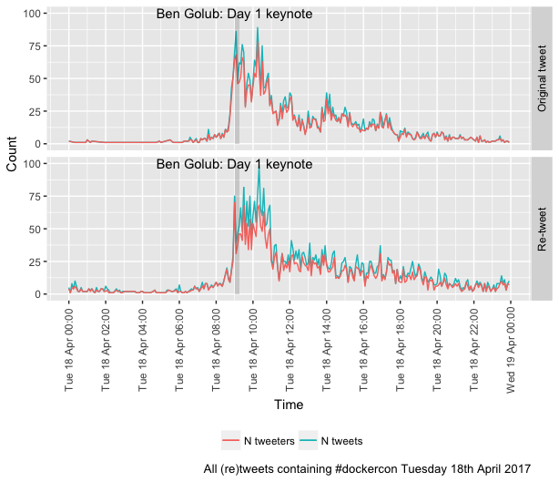

# tweetR: Experiments with twitter data visualisation

Makes extensive use of:

 * https://cran.r-project.org/web/packages/twitteR/index.html

To make comments or analysis requests, raise an issue: 
 
 * See the [code](https://github.com/dataknut/tweetR).
 
I can't guarantee to respond but it's worth a go.

Or better still, fork & DIY :-)

## tweetBluePlanet2: visualisation of tweeting behaviour around the BBC's Blue PLanet 2 programe (October - November 2017)

 * Latest [results](https://dataknut.github.io/tweetR/tweetRBluePlanet2_2017.html) - with missing data due to rate limiting :-(
 
## tweetDockerCon17: visualisation of tweeting behaviour at DockerCon 2017 USA (April) & EU (October).

We are collecting &amp; visualising #dockercon tweets for the entire week of these conferences, saving them to an archive and then running them through some R processing & analysis code. The chart below is a simple visualisation of the tweetFlow (TM :-) of tweets and re-tweets on Day 1 of the Austin 2017 conference with the first keynote session 'grey-lighted'.

For full results (to date) which include all days, more days, tweeing locations, zoomable charts and visualisations of tweetStreaks by the most prolific tweeters see:

 * Dockercon April 2017: Latest [results](https://dataknut.github.io/tweetDockerCon/tweetDockerCon.html) - be careful, some of the inline charts are quite big.
 * Dockercon EU October 2017: Latest [results](tweetDockerConEU_2017.html) - be careful, some of the inline charts are quite big.
 
