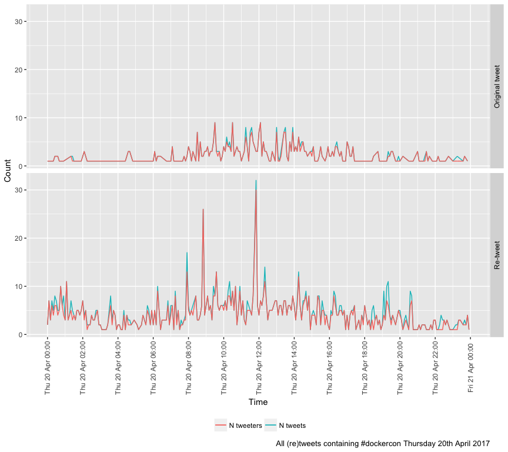

# #DockerCon 2017: Tweet Analysis
Ben Anderson (b.anderson@soton.ac.uk `@dataknut`)  
Last run at: `r Sys.time()`  


```
## [1] "Loading the following libraries using lb_myRequiredPackages: data.table"
## [2] "Loading the following libraries using lb_myRequiredPackages: lubridate" 
## [3] "Loading the following libraries using lb_myRequiredPackages: ggplot2"   
## [4] "Loading the following libraries using lb_myRequiredPackages: readr"     
## [5] "Loading the following libraries using lb_myRequiredPackages: plotly"    
## [6] "Loading the following libraries using lb_myRequiredPackages: knitr"
```

# Purpose

To extract and visualise tweets and re-tweets of `#dockercon` for 17 - 21 April, 2017 (DockerCon17).

Borrowing extensively from http://thinktostart.com/twitter-authentification-with-r/

We used the Twitter search API to extract 'all' tweets with the `#dockercon` hashtag. As the [Twitter search API documentation](https://dev.twitter.com/rest/public/search) (sort of) makes clear this may not be `all` such tweets but merely the `most relevant` (whatever that means) from within a `sample` (whatever that means). 

>"It allows queries against the indices of recent or popular Tweets and behaves similarly to, but not exactly like the Search feature available in Twitter mobile or web clients, such as Twitter.com search. The Twitter Search API searches against a sampling of recent Tweets published in the past 7 days." https://dev.twitter.com/rest/public/search, Accessed 12/5/2017

It is therefore possible that not quite all tweets have been extracted although it seems likely that we have captured most `human` tweeting which was our main intention. Future work should instead use the Twitter [streaming API](https://dev.twitter.com/streaming/overview).

# Load Data
Data should have been already downloaded using `collectData.R`. This produces a data table with the following variables (after some processing):


```
##  [1] "text"             "favorited"        "favoriteCount"   
##  [4] "replyToSN"        "created"          "truncated"       
##  [7] "replyToSID"       "id"               "replyToUID"      
## [10] "statusSource"     "screenName"       "retweetCount"    
## [13] "isRetweet"        "retweeted"        "longitude"       
## [16] "latitude"         "location"         "language"        
## [19] "profileImageURL"  "createdLocal"     "obsDateTimeMins" 
## [22] "obsDateTimeHours" "obsDateTime5m"    "obsDateTime10m"  
## [25] "obsDateTime15m"   "obsDate"          "isRetweetLab"
```

The table has 7,975 tweets (and 11,285 re-tweets) from 6,429 tweeters between 2017-04-16 19:01:03 and 2017-04-21 09:54:11 (Central District Time).

# Analysis

## Tweets and Tweeters over time


### Day 1 - Monday (Workshops)

This plot is zoomable - try it!

<div class="figure">
<!--html_preserve--><div id="35214323d0f0" style="width:864px;height:768px;" class="plotly html-widget"></div>
<script type="application/json" data-for="35214323d0f0">{"x":{"data":[{"x":[1492405200,1492405800,1492407000,1492407300,1492407600,1492407900,1492408200,1492409700,1492417800,1492420800,1492422600,1492422900,1492423500,1492424400,1492424700,1492425000,1492425300,1492425900,1492427100,1492427400,1492427700,1492429500,1492429800,1492430100,1492430400,1492430700,1492431600,1492431900,1492432500,1492432800,1492433100,1492433700,1492434000,1492434300,1492434600,1492434900,1492435200,1492435500,1492435800,1492436400,1492436700,1492437000,1492437300,1492437600,1492437900,1492438200,1492438500,1492438800,1492439100,1492439400,1492439700,1492440000,1492440300,1492440600,1492440900,1492441200,1492441500,1492441800,1492442100,1492442400,1492442700,1492443000,1492443300,1492443600,1492443900,1492444200,1492444500,1492444800,1492445100,1492445400,1492445700,1492446000,1492446300,1492446600,1492446900,1492447200,1492447500,1492447800,1492448100,1492448400,1492448700,1492449000,1492449300,1492449600,1492449900,1492450200,1492450500,1492450800,1492451100,1492451400,1492451700,1492452000,1492452300,1492452600,1492452900,1492453200,1492453500,1492453800,1492454100,1492454400,1492454700,1492455000,1492455300,1492455600,1492455900,1492456200,1492456500,1492456800,1492457100,1492457400,1492457700,1492458000,1492458300,1492458600,1492458900,1492459200,1492459500,1492459800,1492460100,1492460400,1492460700,1492461000,1492461300,1492461600,1492461900,1492462200,1492462500,1492462800,1492463100,1492463400,1492463700,1492464000,1492464300,1492464600,1492464900,1492465200,1492465500,1492465800,1492466100,1492466400,1492466700,1492467000,1492467300,1492467600,1492467900,1492468200,1492468500,1492468800,1492469100,1492469400,1492469700,1492470000,1492470300,1492470600,1492470900,1492471200,1492471500,1492471800,1492472100,1492472400,1492472700,1492473000,1492473300,1492473600,1492473900,1492474200,1492474500,1492474800,1492475100,1492475400,1492475700,1492476000,1492476300,1492476600,1492476900,1492477200,1492477500,1492477800,1492478100,1492478400,1492478700,1492479000,1492479300,1492479600,1492479900,1492480200,1492480500,1492480800,1492481100,1492481400,1492481700,1492482000,1492482300,1492482600,1492482900,1492483200,1492483500,1492483800,1492484100,1492484400,1492484700,1492485000,1492485600,1492485900,1492486200,1492486500,1492486800,1492487100,1492487400,1492487700,1492488300,1492488600,1492488900,1492490100,1492490700,1492491000],"y":[1,1,1,1,1,1,2,2,1,4,2,1,3,2,1,1,2,1,1,1,1,2,1,5,4,1,1,2,2,1,1,1,4,6,8,6,4,4,6,5,9,10,3,4,7,2,3,6,3,3,11,3,5,5,2,14,7,6,5,14,6,13,9,11,7,3,4,16,12,2,8,4,8,9,2,4,7,9,4,7,5,3,3,5,5,12,5,4,6,7,9,13,4,13,7,2,4,15,6,4,8,8,5,18,12,9,7,6,9,20,9,7,4,7,5,16,7,10,14,7,6,10,10,4,5,9,7,11,12,10,4,4,7,6,7,5,5,6,11,16,8,10,7,5,1,8,8,16,9,10,9,16,7,4,13,8,4,11,8,8,9,16,7,10,16,14,10,3,6,9,5,6,8,3,5,4,3,6,3,2,8,5,3,2,4,1,5,4,2,6,1,2,2,2,1,4,2,2,5,3,3,1,3,1,3,5,2,2,2,2,1,6,1,2,1,1],"text":["nTweets:  1<br />N tweets: N tweets<br />obsDateTime5m: 1492405200","nTweets:  1<br />N tweets: N tweets<br />obsDateTime5m: 1492405800","nTweets:  1<br />N tweets: N tweets<br />obsDateTime5m: 1492407000","nTweets:  1<br />N tweets: N tweets<br />obsDateTime5m: 1492407300","nTweets:  1<br />N tweets: N tweets<br />obsDateTime5m: 1492407600","nTweets:  1<br />N tweets: N tweets<br />obsDateTime5m: 1492407900","nTweets:  2<br />N tweets: N tweets<br />obsDateTime5m: 1492408200","nTweets:  2<br />N tweets: N tweets<br />obsDateTime5m: 1492409700","nTweets:  1<br />N tweets: N tweets<br />obsDateTime5m: 1492417800","nTweets:  4<br />N tweets: N tweets<br />obsDateTime5m: 1492420800","nTweets:  2<br />N tweets: N tweets<br />obsDateTime5m: 1492422600","nTweets:  1<br />N tweets: N tweets<br />obsDateTime5m: 1492422900","nTweets:  3<br />N tweets: N tweets<br />obsDateTime5m: 1492423500","nTweets:  2<br />N tweets: N tweets<br />obsDateTime5m: 1492424400","nTweets:  1<br />N tweets: N tweets<br />obsDateTime5m: 1492424700","nTweets:  1<br />N tweets: N tweets<br />obsDateTime5m: 1492425000","nTweets:  2<br />N tweets: N tweets<br />obsDateTime5m: 1492425300","nTweets:  1<br />N tweets: N tweets<br />obsDateTime5m: 1492425900","nTweets:  1<br />N tweets: N tweets<br />obsDateTime5m: 1492427100","nTweets:  1<br />N tweets: N tweets<br />obsDateTime5m: 1492427400","nTweets:  1<br />N tweets: N tweets<br />obsDateTime5m: 1492427700","nTweets:  2<br />N tweets: N tweets<br />obsDateTime5m: 1492429500","nTweets:  1<br />N tweets: N tweets<br />obsDateTime5m: 1492429800","nTweets:  5<br />N tweets: N tweets<br />obsDateTime5m: 1492430100","nTweets:  4<br />N tweets: N tweets<br />obsDateTime5m: 1492430400","nTweets:  1<br />N tweets: N tweets<br />obsDateTime5m: 1492430700","nTweets:  1<br />N tweets: N tweets<br />obsDateTime5m: 1492431600","nTweets:  2<br />N tweets: N tweets<br />obsDateTime5m: 1492431900","nTweets:  2<br />N tweets: N tweets<br />obsDateTime5m: 1492432500","nTweets:  1<br />N tweets: N tweets<br />obsDateTime5m: 1492432800","nTweets:  1<br />N tweets: N tweets<br />obsDateTime5m: 1492433100","nTweets:  1<br />N tweets: N tweets<br />obsDateTime5m: 1492433700","nTweets:  4<br />N tweets: N tweets<br />obsDateTime5m: 1492434000","nTweets:  6<br />N tweets: N tweets<br />obsDateTime5m: 1492434300","nTweets:  8<br />N tweets: N tweets<br />obsDateTime5m: 1492434600","nTweets:  6<br />N tweets: N tweets<br />obsDateTime5m: 1492434900","nTweets:  4<br />N tweets: N tweets<br />obsDateTime5m: 1492435200","nTweets:  4<br />N tweets: N tweets<br />obsDateTime5m: 1492435500","nTweets:  6<br />N tweets: N tweets<br />obsDateTime5m: 1492435800","nTweets:  5<br />N tweets: N tweets<br />obsDateTime5m: 1492436400","nTweets:  9<br />N tweets: N tweets<br />obsDateTime5m: 1492436700","nTweets: 10<br />N tweets: N tweets<br />obsDateTime5m: 1492437000","nTweets:  3<br />N tweets: N tweets<br />obsDateTime5m: 1492437300","nTweets:  4<br />N tweets: N tweets<br />obsDateTime5m: 1492437600","nTweets:  7<br />N tweets: N tweets<br />obsDateTime5m: 1492437900","nTweets:  2<br />N tweets: N tweets<br />obsDateTime5m: 1492438200","nTweets:  3<br />N tweets: N tweets<br />obsDateTime5m: 1492438500","nTweets:  6<br />N tweets: N tweets<br />obsDateTime5m: 1492438800","nTweets:  3<br />N tweets: N tweets<br />obsDateTime5m: 1492439100","nTweets:  3<br />N tweets: N tweets<br />obsDateTime5m: 1492439400","nTweets: 11<br />N tweets: N tweets<br />obsDateTime5m: 1492439700","nTweets:  3<br />N tweets: N tweets<br />obsDateTime5m: 1492440000","nTweets:  5<br />N tweets: N tweets<br />obsDateTime5m: 1492440300","nTweets:  5<br />N tweets: N tweets<br />obsDateTime5m: 1492440600","nTweets:  2<br />N tweets: N tweets<br />obsDateTime5m: 1492440900","nTweets: 14<br />N tweets: N tweets<br />obsDateTime5m: 1492441200","nTweets:  7<br />N tweets: N tweets<br />obsDateTime5m: 1492441500","nTweets:  6<br />N tweets: N tweets<br />obsDateTime5m: 1492441800","nTweets:  5<br />N tweets: N tweets<br />obsDateTime5m: 1492442100","nTweets: 14<br />N tweets: N tweets<br />obsDateTime5m: 1492442400","nTweets:  6<br />N tweets: N tweets<br />obsDateTime5m: 1492442700","nTweets: 13<br />N tweets: N tweets<br />obsDateTime5m: 1492443000","nTweets:  9<br />N tweets: N tweets<br />obsDateTime5m: 1492443300","nTweets: 11<br />N tweets: N tweets<br />obsDateTime5m: 1492443600","nTweets:  7<br />N tweets: N tweets<br />obsDateTime5m: 1492443900","nTweets:  3<br />N tweets: N tweets<br />obsDateTime5m: 1492444200","nTweets:  4<br />N tweets: N tweets<br />obsDateTime5m: 1492444500","nTweets: 16<br />N tweets: N tweets<br />obsDateTime5m: 1492444800","nTweets: 12<br />N tweets: N tweets<br />obsDateTime5m: 1492445100","nTweets:  2<br />N tweets: N tweets<br />obsDateTime5m: 1492445400","nTweets:  8<br />N tweets: N tweets<br />obsDateTime5m: 1492445700","nTweets:  4<br />N tweets: N tweets<br />obsDateTime5m: 1492446000","nTweets:  8<br />N tweets: N tweets<br />obsDateTime5m: 1492446300","nTweets:  9<br />N tweets: N tweets<br />obsDateTime5m: 1492446600","nTweets:  2<br />N tweets: N tweets<br />obsDateTime5m: 1492446900","nTweets:  4<br />N tweets: N tweets<br />obsDateTime5m: 1492447200","nTweets:  7<br />N tweets: N tweets<br />obsDateTime5m: 1492447500","nTweets:  9<br />N tweets: N tweets<br />obsDateTime5m: 1492447800","nTweets:  4<br />N tweets: N tweets<br />obsDateTime5m: 1492448100","nTweets:  7<br />N tweets: N tweets<br />obsDateTime5m: 1492448400","nTweets:  5<br />N tweets: N tweets<br />obsDateTime5m: 1492448700","nTweets:  3<br />N tweets: N tweets<br />obsDateTime5m: 1492449000","nTweets:  3<br />N tweets: N tweets<br />obsDateTime5m: 1492449300","nTweets:  5<br />N tweets: N tweets<br />obsDateTime5m: 1492449600","nTweets:  5<br />N tweets: N tweets<br />obsDateTime5m: 1492449900","nTweets: 12<br />N tweets: N tweets<br />obsDateTime5m: 1492450200","nTweets:  5<br />N tweets: N tweets<br />obsDateTime5m: 1492450500","nTweets:  4<br />N tweets: N tweets<br />obsDateTime5m: 1492450800","nTweets:  6<br />N tweets: N tweets<br />obsDateTime5m: 1492451100","nTweets:  7<br />N tweets: N tweets<br />obsDateTime5m: 1492451400","nTweets:  9<br />N tweets: N tweets<br />obsDateTime5m: 1492451700","nTweets: 13<br />N tweets: N tweets<br />obsDateTime5m: 1492452000","nTweets:  4<br />N tweets: N tweets<br />obsDateTime5m: 1492452300","nTweets: 13<br />N tweets: N tweets<br />obsDateTime5m: 1492452600","nTweets:  7<br />N tweets: N tweets<br />obsDateTime5m: 1492452900","nTweets:  2<br />N tweets: N tweets<br />obsDateTime5m: 1492453200","nTweets:  4<br />N tweets: N tweets<br />obsDateTime5m: 1492453500","nTweets: 15<br />N tweets: N tweets<br />obsDateTime5m: 1492453800","nTweets:  6<br />N tweets: N tweets<br />obsDateTime5m: 1492454100","nTweets:  4<br />N tweets: N tweets<br />obsDateTime5m: 1492454400","nTweets:  8<br />N tweets: N tweets<br />obsDateTime5m: 1492454700","nTweets:  8<br />N tweets: N tweets<br />obsDateTime5m: 1492455000","nTweets:  5<br />N tweets: N tweets<br />obsDateTime5m: 1492455300","nTweets: 18<br />N tweets: N tweets<br />obsDateTime5m: 1492455600","nTweets: 12<br />N tweets: N tweets<br />obsDateTime5m: 1492455900","nTweets:  9<br />N tweets: N tweets<br />obsDateTime5m: 1492456200","nTweets:  7<br />N tweets: N tweets<br />obsDateTime5m: 1492456500","nTweets:  6<br />N tweets: N tweets<br />obsDateTime5m: 1492456800","nTweets:  9<br />N tweets: N tweets<br />obsDateTime5m: 1492457100","nTweets: 20<br />N tweets: N tweets<br />obsDateTime5m: 1492457400","nTweets:  9<br />N tweets: N tweets<br />obsDateTime5m: 1492457700","nTweets:  7<br />N tweets: N tweets<br />obsDateTime5m: 1492458000","nTweets:  4<br />N tweets: N tweets<br />obsDateTime5m: 1492458300","nTweets:  7<br />N tweets: N tweets<br />obsDateTime5m: 1492458600","nTweets:  5<br />N tweets: N tweets<br />obsDateTime5m: 1492458900","nTweets: 16<br />N tweets: N tweets<br />obsDateTime5m: 1492459200","nTweets:  7<br />N tweets: N tweets<br />obsDateTime5m: 1492459500","nTweets: 10<br />N tweets: N tweets<br />obsDateTime5m: 1492459800","nTweets: 14<br />N tweets: N tweets<br />obsDateTime5m: 1492460100","nTweets:  7<br />N tweets: N tweets<br />obsDateTime5m: 1492460400","nTweets:  6<br />N tweets: N tweets<br />obsDateTime5m: 1492460700","nTweets: 10<br />N tweets: N tweets<br />obsDateTime5m: 1492461000","nTweets: 10<br />N tweets: N tweets<br />obsDateTime5m: 1492461300","nTweets:  4<br />N tweets: N tweets<br />obsDateTime5m: 1492461600","nTweets:  5<br />N tweets: N tweets<br />obsDateTime5m: 1492461900","nTweets:  9<br />N tweets: N tweets<br />obsDateTime5m: 1492462200","nTweets:  7<br />N tweets: N tweets<br />obsDateTime5m: 1492462500","nTweets: 11<br />N tweets: N tweets<br />obsDateTime5m: 1492462800","nTweets: 12<br />N tweets: N tweets<br />obsDateTime5m: 1492463100","nTweets: 10<br />N tweets: N tweets<br />obsDateTime5m: 1492463400","nTweets:  4<br />N tweets: N tweets<br />obsDateTime5m: 1492463700","nTweets:  4<br />N tweets: N tweets<br />obsDateTime5m: 1492464000","nTweets:  7<br />N tweets: N tweets<br />obsDateTime5m: 1492464300","nTweets:  6<br />N tweets: N tweets<br />obsDateTime5m: 1492464600","nTweets:  7<br />N tweets: N tweets<br />obsDateTime5m: 1492464900","nTweets:  5<br />N tweets: N tweets<br />obsDateTime5m: 1492465200","nTweets:  5<br />N tweets: N tweets<br />obsDateTime5m: 1492465500","nTweets:  6<br />N tweets: N tweets<br />obsDateTime5m: 1492465800","nTweets: 11<br />N tweets: N tweets<br />obsDateTime5m: 1492466100","nTweets: 16<br />N tweets: N tweets<br />obsDateTime5m: 1492466400","nTweets:  8<br />N tweets: N tweets<br />obsDateTime5m: 1492466700","nTweets: 10<br />N tweets: N tweets<br />obsDateTime5m: 1492467000","nTweets:  7<br />N tweets: N tweets<br />obsDateTime5m: 1492467300","nTweets:  5<br />N tweets: N tweets<br />obsDateTime5m: 1492467600","nTweets:  1<br />N tweets: N tweets<br />obsDateTime5m: 1492467900","nTweets:  8<br />N tweets: N tweets<br />obsDateTime5m: 1492468200","nTweets:  8<br />N tweets: N tweets<br />obsDateTime5m: 1492468500","nTweets: 16<br />N tweets: N tweets<br />obsDateTime5m: 1492468800","nTweets:  9<br />N tweets: N tweets<br />obsDateTime5m: 1492469100","nTweets: 10<br />N tweets: N tweets<br />obsDateTime5m: 1492469400","nTweets:  9<br />N tweets: N tweets<br />obsDateTime5m: 1492469700","nTweets: 16<br />N tweets: N tweets<br />obsDateTime5m: 1492470000","nTweets:  7<br />N tweets: N tweets<br />obsDateTime5m: 1492470300","nTweets:  4<br />N tweets: N tweets<br />obsDateTime5m: 1492470600","nTweets: 13<br />N tweets: N tweets<br />obsDateTime5m: 1492470900","nTweets:  8<br />N tweets: N tweets<br />obsDateTime5m: 1492471200","nTweets:  4<br />N tweets: N tweets<br />obsDateTime5m: 1492471500","nTweets: 11<br />N tweets: N tweets<br />obsDateTime5m: 1492471800","nTweets:  8<br />N tweets: N tweets<br />obsDateTime5m: 1492472100","nTweets:  8<br />N tweets: N tweets<br />obsDateTime5m: 1492472400","nTweets:  9<br />N tweets: N tweets<br />obsDateTime5m: 1492472700","nTweets: 16<br />N tweets: N tweets<br />obsDateTime5m: 1492473000","nTweets:  7<br />N tweets: N tweets<br />obsDateTime5m: 1492473300","nTweets: 10<br />N tweets: N tweets<br />obsDateTime5m: 1492473600","nTweets: 16<br />N tweets: N tweets<br />obsDateTime5m: 1492473900","nTweets: 14<br />N tweets: N tweets<br />obsDateTime5m: 1492474200","nTweets: 10<br />N tweets: N tweets<br />obsDateTime5m: 1492474500","nTweets:  3<br />N tweets: N tweets<br />obsDateTime5m: 1492474800","nTweets:  6<br />N tweets: N tweets<br />obsDateTime5m: 1492475100","nTweets:  9<br />N tweets: N tweets<br />obsDateTime5m: 1492475400","nTweets:  5<br />N tweets: N tweets<br />obsDateTime5m: 1492475700","nTweets:  6<br />N tweets: N tweets<br />obsDateTime5m: 1492476000","nTweets:  8<br />N tweets: N tweets<br />obsDateTime5m: 1492476300","nTweets:  3<br />N tweets: N tweets<br />obsDateTime5m: 1492476600","nTweets:  5<br />N tweets: N tweets<br />obsDateTime5m: 1492476900","nTweets:  4<br />N tweets: N tweets<br />obsDateTime5m: 1492477200","nTweets:  3<br />N tweets: N tweets<br />obsDateTime5m: 1492477500","nTweets:  6<br />N tweets: N tweets<br />obsDateTime5m: 1492477800","nTweets:  3<br />N tweets: N tweets<br />obsDateTime5m: 1492478100","nTweets:  2<br />N tweets: N tweets<br />obsDateTime5m: 1492478400","nTweets:  8<br />N tweets: N tweets<br />obsDateTime5m: 1492478700","nTweets:  5<br />N tweets: N tweets<br />obsDateTime5m: 1492479000","nTweets:  3<br />N tweets: N tweets<br />obsDateTime5m: 1492479300","nTweets:  2<br />N tweets: N tweets<br />obsDateTime5m: 1492479600","nTweets:  4<br />N tweets: N tweets<br />obsDateTime5m: 1492479900","nTweets:  1<br />N tweets: N tweets<br />obsDateTime5m: 1492480200","nTweets:  5<br />N tweets: N tweets<br />obsDateTime5m: 1492480500","nTweets:  4<br />N tweets: N tweets<br />obsDateTime5m: 1492480800","nTweets:  2<br />N tweets: N tweets<br />obsDateTime5m: 1492481100","nTweets:  6<br />N tweets: N tweets<br />obsDateTime5m: 1492481400","nTweets:  1<br />N tweets: N tweets<br />obsDateTime5m: 1492481700","nTweets:  2<br />N tweets: N tweets<br />obsDateTime5m: 1492482000","nTweets:  2<br />N tweets: N tweets<br />obsDateTime5m: 1492482300","nTweets:  2<br />N tweets: N tweets<br />obsDateTime5m: 1492482600","nTweets:  1<br />N tweets: N tweets<br />obsDateTime5m: 1492482900","nTweets:  4<br />N tweets: N tweets<br />obsDateTime5m: 1492483200","nTweets:  2<br />N tweets: N tweets<br />obsDateTime5m: 1492483500","nTweets:  2<br />N tweets: N tweets<br />obsDateTime5m: 1492483800","nTweets:  5<br />N tweets: N tweets<br />obsDateTime5m: 1492484100","nTweets:  3<br />N tweets: N tweets<br />obsDateTime5m: 1492484400","nTweets:  3<br />N tweets: N tweets<br />obsDateTime5m: 1492484700","nTweets:  1<br />N tweets: N tweets<br />obsDateTime5m: 1492485000","nTweets:  3<br />N tweets: N tweets<br />obsDateTime5m: 1492485600","nTweets:  1<br />N tweets: N tweets<br />obsDateTime5m: 1492485900","nTweets:  3<br />N tweets: N tweets<br />obsDateTime5m: 1492486200","nTweets:  5<br />N tweets: N tweets<br />obsDateTime5m: 1492486500","nTweets:  2<br />N tweets: N tweets<br />obsDateTime5m: 1492486800","nTweets:  2<br />N tweets: N tweets<br />obsDateTime5m: 1492487100","nTweets:  2<br />N tweets: N tweets<br />obsDateTime5m: 1492487400","nTweets:  2<br />N tweets: N tweets<br />obsDateTime5m: 1492487700","nTweets:  1<br />N tweets: N tweets<br />obsDateTime5m: 1492488300","nTweets:  6<br />N tweets: N tweets<br />obsDateTime5m: 1492488600","nTweets:  1<br />N tweets: N tweets<br />obsDateTime5m: 1492488900","nTweets:  2<br />N tweets: N tweets<br />obsDateTime5m: 1492490100","nTweets:  1<br />N tweets: N tweets<br />obsDateTime5m: 1492490700","nTweets:  1<br />N tweets: N tweets<br />obsDateTime5m: 1492491000"],"type":"scatter","mode":"lines","line":{"width":1.88976377952756,"color":"rgba(0,191,196,1)","dash":"solid"},"hoveron":"points","name":"N tweets","legendgroup":"N tweets","showlegend":true,"xaxis":"x","yaxis":"y","hoverinfo":"text","frame":null},{"x":[1492405200,1492405500,1492405800,1492406100,1492406700,1492407000,1492407600,1492407900,1492408200,1492408800,1492409100,1492409700,1492410300,1492410600,1492410900,1492411200,1492411500,1492411800,1492412400,1492413000,1492413300,1492413600,1492415400,1492416000,1492416300,1492416900,1492418100,1492418400,1492419600,1492420800,1492422900,1492423200,1492424700,1492425000,1492425300,1492425900,1492426200,1492426800,1492427100,1492427400,1492428000,1492428300,1492428900,1492429200,1492429500,1492429800,1492430100,1492430400,1492431000,1492431300,1492431600,1492431900,1492432200,1492432500,1492432800,1492433100,1492433400,1492433700,1492434000,1492434300,1492434600,1492434900,1492435200,1492435500,1492435800,1492436100,1492436400,1492436700,1492437000,1492437300,1492437900,1492438500,1492438800,1492439100,1492439400,1492439700,1492440000,1492440300,1492440600,1492440900,1492441200,1492441500,1492441800,1492442100,1492442400,1492442700,1492443000,1492443300,1492443600,1492443900,1492444200,1492444500,1492444800,1492445100,1492445400,1492445700,1492446000,1492446300,1492446600,1492446900,1492447200,1492447500,1492447800,1492448100,1492448400,1492448700,1492449000,1492449300,1492449600,1492449900,1492450200,1492450500,1492450800,1492451100,1492451400,1492451700,1492452000,1492452300,1492452600,1492452900,1492453200,1492453500,1492453800,1492454100,1492454400,1492454700,1492455000,1492455300,1492455600,1492455900,1492456200,1492456500,1492456800,1492457100,1492457400,1492457700,1492458000,1492458300,1492458600,1492458900,1492459200,1492459500,1492459800,1492460100,1492460400,1492460700,1492461000,1492461300,1492461600,1492461900,1492462200,1492462500,1492462800,1492463100,1492463400,1492463700,1492464000,1492464300,1492464600,1492464900,1492465200,1492465500,1492465800,1492466100,1492466400,1492466700,1492467000,1492467300,1492467600,1492467900,1492468200,1492468500,1492468800,1492469100,1492469400,1492469700,1492470000,1492470300,1492470600,1492470900,1492471200,1492471500,1492471800,1492472100,1492472400,1492472700,1492473000,1492473300,1492473600,1492473900,1492474200,1492474500,1492474800,1492475100,1492475400,1492475700,1492476000,1492476300,1492476600,1492476900,1492477200,1492477500,1492477800,1492478100,1492478400,1492478700,1492479000,1492479300,1492479600,1492479900,1492480200,1492480500,1492480800,1492481100,1492481400,1492481700,1492482000,1492482300,1492482600,1492482900,1492483200,1492483500,1492483800,1492484100,1492484400,1492484700,1492485000,1492485300,1492485600,1492485900,1492486200,1492486500,1492486800,1492487100,1492487400,1492487700,1492488000,1492488300,1492488600,1492488900,1492489200,1492489500,1492489800,1492490100,1492490400,1492490700,1492491000,1492491300],"y":[1,3,4,1,3,1,1,2,2,1,3,1,1,1,1,2,1,1,1,2,1,1,1,2,1,1,3,1,1,1,1,2,1,1,3,1,1,2,2,1,1,1,2,1,1,3,3,2,2,3,1,1,3,1,3,2,2,3,2,7,3,2,2,3,3,10,3,9,4,1,1,4,2,3,6,7,52,5,4,53,11,14,18,3,7,1,3,4,2,5,5,43,18,18,7,5,7,7,5,6,4,3,7,6,7,3,1,7,3,4,10,9,5,4,5,5,8,5,1,6,6,8,4,4,3,8,5,7,6,5,6,9,4,5,9,8,13,6,9,22,12,4,9,3,7,6,9,14,11,6,4,13,7,10,5,3,7,6,9,5,7,6,11,7,9,5,7,5,11,6,2,6,14,9,7,13,6,2,9,3,9,14,6,7,6,6,8,15,6,19,14,13,4,10,3,7,8,8,4,4,9,10,8,9,10,10,11,10,11,9,9,9,5,6,5,5,7,8,6,3,3,7,2,2,6,5,1,6,1,2,3,6,5,5,7,4,4,6,5,2,1,3,2,1,4,4,2,4],"text":["nTweets:  1<br />N tweets: N tweets<br />obsDateTime5m: 1492405200","nTweets:  3<br />N tweets: N tweets<br />obsDateTime5m: 1492405500","nTweets:  4<br />N tweets: N tweets<br />obsDateTime5m: 1492405800","nTweets:  1<br />N tweets: N tweets<br />obsDateTime5m: 1492406100","nTweets:  3<br />N tweets: N tweets<br />obsDateTime5m: 1492406700","nTweets:  1<br />N tweets: N tweets<br />obsDateTime5m: 1492407000","nTweets:  1<br />N tweets: N tweets<br />obsDateTime5m: 1492407600","nTweets:  2<br />N tweets: N tweets<br />obsDateTime5m: 1492407900","nTweets:  2<br />N tweets: N tweets<br />obsDateTime5m: 1492408200","nTweets:  1<br />N tweets: N tweets<br />obsDateTime5m: 1492408800","nTweets:  3<br />N tweets: N tweets<br />obsDateTime5m: 1492409100","nTweets:  1<br />N tweets: N tweets<br />obsDateTime5m: 1492409700","nTweets:  1<br />N tweets: N tweets<br />obsDateTime5m: 1492410300","nTweets:  1<br />N tweets: N tweets<br />obsDateTime5m: 1492410600","nTweets:  1<br />N tweets: N tweets<br />obsDateTime5m: 1492410900","nTweets:  2<br />N tweets: N tweets<br />obsDateTime5m: 1492411200","nTweets:  1<br />N tweets: N tweets<br />obsDateTime5m: 1492411500","nTweets:  1<br />N tweets: N tweets<br />obsDateTime5m: 1492411800","nTweets:  1<br />N tweets: N tweets<br />obsDateTime5m: 1492412400","nTweets:  2<br />N tweets: N tweets<br />obsDateTime5m: 1492413000","nTweets:  1<br />N tweets: N tweets<br />obsDateTime5m: 1492413300","nTweets:  1<br />N tweets: N tweets<br />obsDateTime5m: 1492413600","nTweets:  1<br />N tweets: N tweets<br />obsDateTime5m: 1492415400","nTweets:  2<br />N tweets: N tweets<br />obsDateTime5m: 1492416000","nTweets:  1<br />N tweets: N tweets<br />obsDateTime5m: 1492416300","nTweets:  1<br />N tweets: N tweets<br />obsDateTime5m: 1492416900","nTweets:  3<br />N tweets: N tweets<br />obsDateTime5m: 1492418100","nTweets:  1<br />N tweets: N tweets<br />obsDateTime5m: 1492418400","nTweets:  1<br />N tweets: N tweets<br />obsDateTime5m: 1492419600","nTweets:  1<br />N tweets: N tweets<br />obsDateTime5m: 1492420800","nTweets:  1<br />N tweets: N tweets<br />obsDateTime5m: 1492422900","nTweets:  2<br />N tweets: N tweets<br />obsDateTime5m: 1492423200","nTweets:  1<br />N tweets: N tweets<br />obsDateTime5m: 1492424700","nTweets:  1<br />N tweets: N tweets<br />obsDateTime5m: 1492425000","nTweets:  3<br />N tweets: N tweets<br />obsDateTime5m: 1492425300","nTweets:  1<br />N tweets: N tweets<br />obsDateTime5m: 1492425900","nTweets:  1<br />N tweets: N tweets<br />obsDateTime5m: 1492426200","nTweets:  2<br />N tweets: N tweets<br />obsDateTime5m: 1492426800","nTweets:  2<br />N tweets: N tweets<br />obsDateTime5m: 1492427100","nTweets:  1<br />N tweets: N tweets<br />obsDateTime5m: 1492427400","nTweets:  1<br />N tweets: N tweets<br />obsDateTime5m: 1492428000","nTweets:  1<br />N tweets: N tweets<br />obsDateTime5m: 1492428300","nTweets:  2<br />N tweets: N tweets<br />obsDateTime5m: 1492428900","nTweets:  1<br />N tweets: N tweets<br />obsDateTime5m: 1492429200","nTweets:  1<br />N tweets: N tweets<br />obsDateTime5m: 1492429500","nTweets:  3<br />N tweets: N tweets<br />obsDateTime5m: 1492429800","nTweets:  3<br />N tweets: N tweets<br />obsDateTime5m: 1492430100","nTweets:  2<br />N tweets: N tweets<br />obsDateTime5m: 1492430400","nTweets:  2<br />N tweets: N tweets<br />obsDateTime5m: 1492431000","nTweets:  3<br />N tweets: N tweets<br />obsDateTime5m: 1492431300","nTweets:  1<br />N tweets: N tweets<br />obsDateTime5m: 1492431600","nTweets:  1<br />N tweets: N tweets<br />obsDateTime5m: 1492431900","nTweets:  3<br />N tweets: N tweets<br />obsDateTime5m: 1492432200","nTweets:  1<br />N tweets: N tweets<br />obsDateTime5m: 1492432500","nTweets:  3<br />N tweets: N tweets<br />obsDateTime5m: 1492432800","nTweets:  2<br />N tweets: N tweets<br />obsDateTime5m: 1492433100","nTweets:  2<br />N tweets: N tweets<br />obsDateTime5m: 1492433400","nTweets:  3<br />N tweets: N tweets<br />obsDateTime5m: 1492433700","nTweets:  2<br />N tweets: N tweets<br />obsDateTime5m: 1492434000","nTweets:  7<br />N tweets: N tweets<br />obsDateTime5m: 1492434300","nTweets:  3<br />N tweets: N tweets<br />obsDateTime5m: 1492434600","nTweets:  2<br />N tweets: N tweets<br />obsDateTime5m: 1492434900","nTweets:  2<br />N tweets: N tweets<br />obsDateTime5m: 1492435200","nTweets:  3<br />N tweets: N tweets<br />obsDateTime5m: 1492435500","nTweets:  3<br />N tweets: N tweets<br />obsDateTime5m: 1492435800","nTweets: 10<br />N tweets: N tweets<br />obsDateTime5m: 1492436100","nTweets:  3<br />N tweets: N tweets<br />obsDateTime5m: 1492436400","nTweets:  9<br />N tweets: N tweets<br />obsDateTime5m: 1492436700","nTweets:  4<br />N tweets: N tweets<br />obsDateTime5m: 1492437000","nTweets:  1<br />N tweets: N tweets<br />obsDateTime5m: 1492437300","nTweets:  1<br />N tweets: N tweets<br />obsDateTime5m: 1492437900","nTweets:  4<br />N tweets: N tweets<br />obsDateTime5m: 1492438500","nTweets:  2<br />N tweets: N tweets<br />obsDateTime5m: 1492438800","nTweets:  3<br />N tweets: N tweets<br />obsDateTime5m: 1492439100","nTweets:  6<br />N tweets: N tweets<br />obsDateTime5m: 1492439400","nTweets:  7<br />N tweets: N tweets<br />obsDateTime5m: 1492439700","nTweets: 52<br />N tweets: N tweets<br />obsDateTime5m: 1492440000","nTweets:  5<br />N tweets: N tweets<br />obsDateTime5m: 1492440300","nTweets:  4<br />N tweets: N tweets<br />obsDateTime5m: 1492440600","nTweets: 53<br />N tweets: N tweets<br />obsDateTime5m: 1492440900","nTweets: 11<br />N tweets: N tweets<br />obsDateTime5m: 1492441200","nTweets: 14<br />N tweets: N tweets<br />obsDateTime5m: 1492441500","nTweets: 18<br />N tweets: N tweets<br />obsDateTime5m: 1492441800","nTweets:  3<br />N tweets: N tweets<br />obsDateTime5m: 1492442100","nTweets:  7<br />N tweets: N tweets<br />obsDateTime5m: 1492442400","nTweets:  1<br />N tweets: N tweets<br />obsDateTime5m: 1492442700","nTweets:  3<br />N tweets: N tweets<br />obsDateTime5m: 1492443000","nTweets:  4<br />N tweets: N tweets<br />obsDateTime5m: 1492443300","nTweets:  2<br />N tweets: N tweets<br />obsDateTime5m: 1492443600","nTweets:  5<br />N tweets: N tweets<br />obsDateTime5m: 1492443900","nTweets:  5<br />N tweets: N tweets<br />obsDateTime5m: 1492444200","nTweets: 43<br />N tweets: N tweets<br />obsDateTime5m: 1492444500","nTweets: 18<br />N tweets: N tweets<br />obsDateTime5m: 1492444800","nTweets: 18<br />N tweets: N tweets<br />obsDateTime5m: 1492445100","nTweets:  7<br />N tweets: N tweets<br />obsDateTime5m: 1492445400","nTweets:  5<br />N tweets: N tweets<br />obsDateTime5m: 1492445700","nTweets:  7<br />N tweets: N tweets<br />obsDateTime5m: 1492446000","nTweets:  7<br />N tweets: N tweets<br />obsDateTime5m: 1492446300","nTweets:  5<br />N tweets: N tweets<br />obsDateTime5m: 1492446600","nTweets:  6<br />N tweets: N tweets<br />obsDateTime5m: 1492446900","nTweets:  4<br />N tweets: N tweets<br />obsDateTime5m: 1492447200","nTweets:  3<br />N tweets: N tweets<br />obsDateTime5m: 1492447500","nTweets:  7<br />N tweets: N tweets<br />obsDateTime5m: 1492447800","nTweets:  6<br />N tweets: N tweets<br />obsDateTime5m: 1492448100","nTweets:  7<br />N tweets: N tweets<br />obsDateTime5m: 1492448400","nTweets:  3<br />N tweets: N tweets<br />obsDateTime5m: 1492448700","nTweets:  1<br />N tweets: N tweets<br />obsDateTime5m: 1492449000","nTweets:  7<br />N tweets: N tweets<br />obsDateTime5m: 1492449300","nTweets:  3<br />N tweets: N tweets<br />obsDateTime5m: 1492449600","nTweets:  4<br />N tweets: N tweets<br />obsDateTime5m: 1492449900","nTweets: 10<br />N tweets: N tweets<br />obsDateTime5m: 1492450200","nTweets:  9<br />N tweets: N tweets<br />obsDateTime5m: 1492450500","nTweets:  5<br />N tweets: N tweets<br />obsDateTime5m: 1492450800","nTweets:  4<br />N tweets: N tweets<br />obsDateTime5m: 1492451100","nTweets:  5<br />N tweets: N tweets<br />obsDateTime5m: 1492451400","nTweets:  5<br />N tweets: N tweets<br />obsDateTime5m: 1492451700","nTweets:  8<br />N tweets: N tweets<br />obsDateTime5m: 1492452000","nTweets:  5<br />N tweets: N tweets<br />obsDateTime5m: 1492452300","nTweets:  1<br />N tweets: N tweets<br />obsDateTime5m: 1492452600","nTweets:  6<br />N tweets: N tweets<br />obsDateTime5m: 1492452900","nTweets:  6<br />N tweets: N tweets<br />obsDateTime5m: 1492453200","nTweets:  8<br />N tweets: N tweets<br />obsDateTime5m: 1492453500","nTweets:  4<br />N tweets: N tweets<br />obsDateTime5m: 1492453800","nTweets:  4<br />N tweets: N tweets<br />obsDateTime5m: 1492454100","nTweets:  3<br />N tweets: N tweets<br />obsDateTime5m: 1492454400","nTweets:  8<br />N tweets: N tweets<br />obsDateTime5m: 1492454700","nTweets:  5<br />N tweets: N tweets<br />obsDateTime5m: 1492455000","nTweets:  7<br />N tweets: N tweets<br />obsDateTime5m: 1492455300","nTweets:  6<br />N tweets: N tweets<br />obsDateTime5m: 1492455600","nTweets:  5<br />N tweets: N tweets<br />obsDateTime5m: 1492455900","nTweets:  6<br />N tweets: N tweets<br />obsDateTime5m: 1492456200","nTweets:  9<br />N tweets: N tweets<br />obsDateTime5m: 1492456500","nTweets:  4<br />N tweets: N tweets<br />obsDateTime5m: 1492456800","nTweets:  5<br />N tweets: N tweets<br />obsDateTime5m: 1492457100","nTweets:  9<br />N tweets: N tweets<br />obsDateTime5m: 1492457400","nTweets:  8<br />N tweets: N tweets<br />obsDateTime5m: 1492457700","nTweets: 13<br />N tweets: N tweets<br />obsDateTime5m: 1492458000","nTweets:  6<br />N tweets: N tweets<br />obsDateTime5m: 1492458300","nTweets:  9<br />N tweets: N tweets<br />obsDateTime5m: 1492458600","nTweets: 22<br />N tweets: N tweets<br />obsDateTime5m: 1492458900","nTweets: 12<br />N tweets: N tweets<br />obsDateTime5m: 1492459200","nTweets:  4<br />N tweets: N tweets<br />obsDateTime5m: 1492459500","nTweets:  9<br />N tweets: N tweets<br />obsDateTime5m: 1492459800","nTweets:  3<br />N tweets: N tweets<br />obsDateTime5m: 1492460100","nTweets:  7<br />N tweets: N tweets<br />obsDateTime5m: 1492460400","nTweets:  6<br />N tweets: N tweets<br />obsDateTime5m: 1492460700","nTweets:  9<br />N tweets: N tweets<br />obsDateTime5m: 1492461000","nTweets: 14<br />N tweets: N tweets<br />obsDateTime5m: 1492461300","nTweets: 11<br />N tweets: N tweets<br />obsDateTime5m: 1492461600","nTweets:  6<br />N tweets: N tweets<br />obsDateTime5m: 1492461900","nTweets:  4<br />N tweets: N tweets<br />obsDateTime5m: 1492462200","nTweets: 13<br />N tweets: N tweets<br />obsDateTime5m: 1492462500","nTweets:  7<br />N tweets: N tweets<br />obsDateTime5m: 1492462800","nTweets: 10<br />N tweets: N tweets<br />obsDateTime5m: 1492463100","nTweets:  5<br />N tweets: N tweets<br />obsDateTime5m: 1492463400","nTweets:  3<br />N tweets: N tweets<br />obsDateTime5m: 1492463700","nTweets:  7<br />N tweets: N tweets<br />obsDateTime5m: 1492464000","nTweets:  6<br />N tweets: N tweets<br />obsDateTime5m: 1492464300","nTweets:  9<br />N tweets: N tweets<br />obsDateTime5m: 1492464600","nTweets:  5<br />N tweets: N tweets<br />obsDateTime5m: 1492464900","nTweets:  7<br />N tweets: N tweets<br />obsDateTime5m: 1492465200","nTweets:  6<br />N tweets: N tweets<br />obsDateTime5m: 1492465500","nTweets: 11<br />N tweets: N tweets<br />obsDateTime5m: 1492465800","nTweets:  7<br />N tweets: N tweets<br />obsDateTime5m: 1492466100","nTweets:  9<br />N tweets: N tweets<br />obsDateTime5m: 1492466400","nTweets:  5<br />N tweets: N tweets<br />obsDateTime5m: 1492466700","nTweets:  7<br />N tweets: N tweets<br />obsDateTime5m: 1492467000","nTweets:  5<br />N tweets: N tweets<br />obsDateTime5m: 1492467300","nTweets: 11<br />N tweets: N tweets<br />obsDateTime5m: 1492467600","nTweets:  6<br />N tweets: N tweets<br />obsDateTime5m: 1492467900","nTweets:  2<br />N tweets: N tweets<br />obsDateTime5m: 1492468200","nTweets:  6<br />N tweets: N tweets<br />obsDateTime5m: 1492468500","nTweets: 14<br />N tweets: N tweets<br />obsDateTime5m: 1492468800","nTweets:  9<br />N tweets: N tweets<br />obsDateTime5m: 1492469100","nTweets:  7<br />N tweets: N tweets<br />obsDateTime5m: 1492469400","nTweets: 13<br />N tweets: N tweets<br />obsDateTime5m: 1492469700","nTweets:  6<br />N tweets: N tweets<br />obsDateTime5m: 1492470000","nTweets:  2<br />N tweets: N tweets<br />obsDateTime5m: 1492470300","nTweets:  9<br />N tweets: N tweets<br />obsDateTime5m: 1492470600","nTweets:  3<br />N tweets: N tweets<br />obsDateTime5m: 1492470900","nTweets:  9<br />N tweets: N tweets<br />obsDateTime5m: 1492471200","nTweets: 14<br />N tweets: N tweets<br />obsDateTime5m: 1492471500","nTweets:  6<br />N tweets: N tweets<br />obsDateTime5m: 1492471800","nTweets:  7<br />N tweets: N tweets<br />obsDateTime5m: 1492472100","nTweets:  6<br />N tweets: N tweets<br />obsDateTime5m: 1492472400","nTweets:  6<br />N tweets: N tweets<br />obsDateTime5m: 1492472700","nTweets:  8<br />N tweets: N tweets<br />obsDateTime5m: 1492473000","nTweets: 15<br />N tweets: N tweets<br />obsDateTime5m: 1492473300","nTweets:  6<br />N tweets: N tweets<br />obsDateTime5m: 1492473600","nTweets: 19<br />N tweets: N tweets<br />obsDateTime5m: 1492473900","nTweets: 14<br />N tweets: N tweets<br />obsDateTime5m: 1492474200","nTweets: 13<br />N tweets: N tweets<br />obsDateTime5m: 1492474500","nTweets:  4<br />N tweets: N tweets<br />obsDateTime5m: 1492474800","nTweets: 10<br />N tweets: N tweets<br />obsDateTime5m: 1492475100","nTweets:  3<br />N tweets: N tweets<br />obsDateTime5m: 1492475400","nTweets:  7<br />N tweets: N tweets<br />obsDateTime5m: 1492475700","nTweets:  8<br />N tweets: N tweets<br />obsDateTime5m: 1492476000","nTweets:  8<br />N tweets: N tweets<br />obsDateTime5m: 1492476300","nTweets:  4<br />N tweets: N tweets<br />obsDateTime5m: 1492476600","nTweets:  4<br />N tweets: N tweets<br />obsDateTime5m: 1492476900","nTweets:  9<br />N tweets: N tweets<br />obsDateTime5m: 1492477200","nTweets: 10<br />N tweets: N tweets<br />obsDateTime5m: 1492477500","nTweets:  8<br />N tweets: N tweets<br />obsDateTime5m: 1492477800","nTweets:  9<br />N tweets: N tweets<br />obsDateTime5m: 1492478100","nTweets: 10<br />N tweets: N tweets<br />obsDateTime5m: 1492478400","nTweets: 10<br />N tweets: N tweets<br />obsDateTime5m: 1492478700","nTweets: 11<br />N tweets: N tweets<br />obsDateTime5m: 1492479000","nTweets: 10<br />N tweets: N tweets<br />obsDateTime5m: 1492479300","nTweets: 11<br />N tweets: N tweets<br />obsDateTime5m: 1492479600","nTweets:  9<br />N tweets: N tweets<br />obsDateTime5m: 1492479900","nTweets:  9<br />N tweets: N tweets<br />obsDateTime5m: 1492480200","nTweets:  9<br />N tweets: N tweets<br />obsDateTime5m: 1492480500","nTweets:  5<br />N tweets: N tweets<br />obsDateTime5m: 1492480800","nTweets:  6<br />N tweets: N tweets<br />obsDateTime5m: 1492481100","nTweets:  5<br />N tweets: N tweets<br />obsDateTime5m: 1492481400","nTweets:  5<br />N tweets: N tweets<br />obsDateTime5m: 1492481700","nTweets:  7<br />N tweets: N tweets<br />obsDateTime5m: 1492482000","nTweets:  8<br />N tweets: N tweets<br />obsDateTime5m: 1492482300","nTweets:  6<br />N tweets: N tweets<br />obsDateTime5m: 1492482600","nTweets:  3<br />N tweets: N tweets<br />obsDateTime5m: 1492482900","nTweets:  3<br />N tweets: N tweets<br />obsDateTime5m: 1492483200","nTweets:  7<br />N tweets: N tweets<br />obsDateTime5m: 1492483500","nTweets:  2<br />N tweets: N tweets<br />obsDateTime5m: 1492483800","nTweets:  2<br />N tweets: N tweets<br />obsDateTime5m: 1492484100","nTweets:  6<br />N tweets: N tweets<br />obsDateTime5m: 1492484400","nTweets:  5<br />N tweets: N tweets<br />obsDateTime5m: 1492484700","nTweets:  1<br />N tweets: N tweets<br />obsDateTime5m: 1492485000","nTweets:  6<br />N tweets: N tweets<br />obsDateTime5m: 1492485300","nTweets:  1<br />N tweets: N tweets<br />obsDateTime5m: 1492485600","nTweets:  2<br />N tweets: N tweets<br />obsDateTime5m: 1492485900","nTweets:  3<br />N tweets: N tweets<br />obsDateTime5m: 1492486200","nTweets:  6<br />N tweets: N tweets<br />obsDateTime5m: 1492486500","nTweets:  5<br />N tweets: N tweets<br />obsDateTime5m: 1492486800","nTweets:  5<br />N tweets: N tweets<br />obsDateTime5m: 1492487100","nTweets:  7<br />N tweets: N tweets<br />obsDateTime5m: 1492487400","nTweets:  4<br />N tweets: N tweets<br />obsDateTime5m: 1492487700","nTweets:  4<br />N tweets: N tweets<br />obsDateTime5m: 1492488000","nTweets:  6<br />N tweets: N tweets<br />obsDateTime5m: 1492488300","nTweets:  5<br />N tweets: N tweets<br />obsDateTime5m: 1492488600","nTweets:  2<br />N tweets: N tweets<br />obsDateTime5m: 1492488900","nTweets:  1<br />N tweets: N tweets<br />obsDateTime5m: 1492489200","nTweets:  3<br />N tweets: N tweets<br />obsDateTime5m: 1492489500","nTweets:  2<br />N tweets: N tweets<br />obsDateTime5m: 1492489800","nTweets:  1<br />N tweets: N tweets<br />obsDateTime5m: 1492490100","nTweets:  4<br />N tweets: N tweets<br />obsDateTime5m: 1492490400","nTweets:  4<br />N tweets: N tweets<br />obsDateTime5m: 1492490700","nTweets:  2<br />N tweets: N tweets<br />obsDateTime5m: 1492491000","nTweets:  4<br />N tweets: N tweets<br />obsDateTime5m: 1492491300"],"type":"scatter","mode":"lines","line":{"width":1.88976377952756,"color":"rgba(0,191,196,1)","dash":"solid"},"hoveron":"points","name":"N tweets","legendgroup":"N tweets","showlegend":false,"xaxis":"x","yaxis":"y2","hoverinfo":"text","frame":null},{"x":[1492405200,1492405800,1492407000,1492407300,1492407600,1492407900,1492408200,1492409700,1492417800,1492420800,1492422600,1492422900,1492423500,1492424400,1492424700,1492425000,1492425300,1492425900,1492427100,1492427400,1492427700,1492429500,1492429800,1492430100,1492430400,1492430700,1492431600,1492431900,1492432500,1492432800,1492433100,1492433700,1492434000,1492434300,1492434600,1492434900,1492435200,1492435500,1492435800,1492436400,1492436700,1492437000,1492437300,1492437600,1492437900,1492438200,1492438500,1492438800,1492439100,1492439400,1492439700,1492440000,1492440300,1492440600,1492440900,1492441200,1492441500,1492441800,1492442100,1492442400,1492442700,1492443000,1492443300,1492443600,1492443900,1492444200,1492444500,1492444800,1492445100,1492445400,1492445700,1492446000,1492446300,1492446600,1492446900,1492447200,1492447500,1492447800,1492448100,1492448400,1492448700,1492449000,1492449300,1492449600,1492449900,1492450200,1492450500,1492450800,1492451100,1492451400,1492451700,1492452000,1492452300,1492452600,1492452900,1492453200,1492453500,1492453800,1492454100,1492454400,1492454700,1492455000,1492455300,1492455600,1492455900,1492456200,1492456500,1492456800,1492457100,1492457400,1492457700,1492458000,1492458300,1492458600,1492458900,1492459200,1492459500,1492459800,1492460100,1492460400,1492460700,1492461000,1492461300,1492461600,1492461900,1492462200,1492462500,1492462800,1492463100,1492463400,1492463700,1492464000,1492464300,1492464600,1492464900,1492465200,1492465500,1492465800,1492466100,1492466400,1492466700,1492467000,1492467300,1492467600,1492467900,1492468200,1492468500,1492468800,1492469100,1492469400,1492469700,1492470000,1492470300,1492470600,1492470900,1492471200,1492471500,1492471800,1492472100,1492472400,1492472700,1492473000,1492473300,1492473600,1492473900,1492474200,1492474500,1492474800,1492475100,1492475400,1492475700,1492476000,1492476300,1492476600,1492476900,1492477200,1492477500,1492477800,1492478100,1492478400,1492478700,1492479000,1492479300,1492479600,1492479900,1492480200,1492480500,1492480800,1492481100,1492481400,1492481700,1492482000,1492482300,1492482600,1492482900,1492483200,1492483500,1492483800,1492484100,1492484400,1492484700,1492485000,1492485600,1492485900,1492486200,1492486500,1492486800,1492487100,1492487400,1492487700,1492488300,1492488600,1492488900,1492490100,1492490700,1492491000],"y":[1,1,1,1,1,1,2,2,1,4,2,1,3,2,1,1,2,1,1,1,1,2,1,5,4,1,1,2,2,1,1,1,3,5,6,6,4,4,6,5,9,10,3,4,6,2,3,6,3,3,11,3,5,5,2,14,6,6,5,12,6,13,9,11,6,3,4,14,12,2,7,4,7,8,2,4,7,9,4,7,5,2,3,5,5,12,5,4,6,7,9,11,4,12,7,2,4,8,6,4,8,8,4,12,12,8,6,6,8,9,6,4,3,7,5,10,4,6,12,5,5,8,9,3,5,8,6,11,11,10,4,3,7,6,6,5,5,6,9,8,8,9,7,5,1,6,7,13,9,9,9,15,7,4,11,7,4,11,7,7,8,12,5,8,12,13,8,3,6,8,3,6,8,3,5,4,3,6,3,2,7,5,3,2,4,1,4,4,2,4,1,2,2,2,1,4,2,2,5,3,3,1,3,1,3,5,2,2,2,2,1,6,1,2,1,1],"text":["nTweeters:  1<br />N tweeters: N tweeters<br />obsDateTime5m: 1492405200","nTweeters:  1<br />N tweeters: N tweeters<br />obsDateTime5m: 1492405800","nTweeters:  1<br />N tweeters: N tweeters<br />obsDateTime5m: 1492407000","nTweeters:  1<br />N tweeters: N tweeters<br />obsDateTime5m: 1492407300","nTweeters:  1<br />N tweeters: N tweeters<br />obsDateTime5m: 1492407600","nTweeters:  1<br />N tweeters: N tweeters<br />obsDateTime5m: 1492407900","nTweeters:  2<br />N tweeters: N tweeters<br />obsDateTime5m: 1492408200","nTweeters:  2<br />N tweeters: N tweeters<br />obsDateTime5m: 1492409700","nTweeters:  1<br />N tweeters: N tweeters<br />obsDateTime5m: 1492417800","nTweeters:  4<br />N tweeters: N tweeters<br />obsDateTime5m: 1492420800","nTweeters:  2<br />N tweeters: N tweeters<br />obsDateTime5m: 1492422600","nTweeters:  1<br />N tweeters: N tweeters<br />obsDateTime5m: 1492422900","nTweeters:  3<br />N tweeters: N tweeters<br />obsDateTime5m: 1492423500","nTweeters:  2<br />N tweeters: N tweeters<br />obsDateTime5m: 1492424400","nTweeters:  1<br />N tweeters: N tweeters<br />obsDateTime5m: 1492424700","nTweeters:  1<br />N tweeters: N tweeters<br />obsDateTime5m: 1492425000","nTweeters:  2<br />N tweeters: N tweeters<br />obsDateTime5m: 1492425300","nTweeters:  1<br />N tweeters: N tweeters<br />obsDateTime5m: 1492425900","nTweeters:  1<br />N tweeters: N tweeters<br />obsDateTime5m: 1492427100","nTweeters:  1<br />N tweeters: N tweeters<br />obsDateTime5m: 1492427400","nTweeters:  1<br />N tweeters: N tweeters<br />obsDateTime5m: 1492427700","nTweeters:  2<br />N tweeters: N tweeters<br />obsDateTime5m: 1492429500","nTweeters:  1<br />N tweeters: N tweeters<br />obsDateTime5m: 1492429800","nTweeters:  5<br />N tweeters: N tweeters<br />obsDateTime5m: 1492430100","nTweeters:  4<br />N tweeters: N tweeters<br />obsDateTime5m: 1492430400","nTweeters:  1<br />N tweeters: N tweeters<br />obsDateTime5m: 1492430700","nTweeters:  1<br />N tweeters: N tweeters<br />obsDateTime5m: 1492431600","nTweeters:  2<br />N tweeters: N tweeters<br />obsDateTime5m: 1492431900","nTweeters:  2<br />N tweeters: N tweeters<br />obsDateTime5m: 1492432500","nTweeters:  1<br />N tweeters: N tweeters<br />obsDateTime5m: 1492432800","nTweeters:  1<br />N tweeters: N tweeters<br />obsDateTime5m: 1492433100","nTweeters:  1<br />N tweeters: N tweeters<br />obsDateTime5m: 1492433700","nTweeters:  3<br />N tweeters: N tweeters<br />obsDateTime5m: 1492434000","nTweeters:  5<br />N tweeters: N tweeters<br />obsDateTime5m: 1492434300","nTweeters:  6<br />N tweeters: N tweeters<br />obsDateTime5m: 1492434600","nTweeters:  6<br />N tweeters: N tweeters<br />obsDateTime5m: 1492434900","nTweeters:  4<br />N tweeters: N tweeters<br />obsDateTime5m: 1492435200","nTweeters:  4<br />N tweeters: N tweeters<br />obsDateTime5m: 1492435500","nTweeters:  6<br />N tweeters: N tweeters<br />obsDateTime5m: 1492435800","nTweeters:  5<br />N tweeters: N tweeters<br />obsDateTime5m: 1492436400","nTweeters:  9<br />N tweeters: N tweeters<br />obsDateTime5m: 1492436700","nTweeters: 10<br />N tweeters: N tweeters<br />obsDateTime5m: 1492437000","nTweeters:  3<br />N tweeters: N tweeters<br />obsDateTime5m: 1492437300","nTweeters:  4<br />N tweeters: N tweeters<br />obsDateTime5m: 1492437600","nTweeters:  6<br />N tweeters: N tweeters<br />obsDateTime5m: 1492437900","nTweeters:  2<br />N tweeters: N tweeters<br />obsDateTime5m: 1492438200","nTweeters:  3<br />N tweeters: N tweeters<br />obsDateTime5m: 1492438500","nTweeters:  6<br />N tweeters: N tweeters<br />obsDateTime5m: 1492438800","nTweeters:  3<br />N tweeters: N tweeters<br />obsDateTime5m: 1492439100","nTweeters:  3<br />N tweeters: N tweeters<br />obsDateTime5m: 1492439400","nTweeters: 11<br />N tweeters: N tweeters<br />obsDateTime5m: 1492439700","nTweeters:  3<br />N tweeters: N tweeters<br />obsDateTime5m: 1492440000","nTweeters:  5<br />N tweeters: N tweeters<br />obsDateTime5m: 1492440300","nTweeters:  5<br />N tweeters: N tweeters<br />obsDateTime5m: 1492440600","nTweeters:  2<br />N tweeters: N tweeters<br />obsDateTime5m: 1492440900","nTweeters: 14<br />N tweeters: N tweeters<br />obsDateTime5m: 1492441200","nTweeters:  6<br />N tweeters: N tweeters<br />obsDateTime5m: 1492441500","nTweeters:  6<br />N tweeters: N tweeters<br />obsDateTime5m: 1492441800","nTweeters:  5<br />N tweeters: N tweeters<br />obsDateTime5m: 1492442100","nTweeters: 12<br />N tweeters: N tweeters<br />obsDateTime5m: 1492442400","nTweeters:  6<br />N tweeters: N tweeters<br />obsDateTime5m: 1492442700","nTweeters: 13<br />N tweeters: N tweeters<br />obsDateTime5m: 1492443000","nTweeters:  9<br />N tweeters: N tweeters<br />obsDateTime5m: 1492443300","nTweeters: 11<br />N tweeters: N tweeters<br />obsDateTime5m: 1492443600","nTweeters:  6<br />N tweeters: N tweeters<br />obsDateTime5m: 1492443900","nTweeters:  3<br />N tweeters: N tweeters<br />obsDateTime5m: 1492444200","nTweeters:  4<br />N tweeters: N tweeters<br />obsDateTime5m: 1492444500","nTweeters: 14<br />N tweeters: N tweeters<br />obsDateTime5m: 1492444800","nTweeters: 12<br />N tweeters: N tweeters<br />obsDateTime5m: 1492445100","nTweeters:  2<br />N tweeters: N tweeters<br />obsDateTime5m: 1492445400","nTweeters:  7<br />N tweeters: N tweeters<br />obsDateTime5m: 1492445700","nTweeters:  4<br />N tweeters: N tweeters<br />obsDateTime5m: 1492446000","nTweeters:  7<br />N tweeters: N tweeters<br />obsDateTime5m: 1492446300","nTweeters:  8<br />N tweeters: N tweeters<br />obsDateTime5m: 1492446600","nTweeters:  2<br />N tweeters: N tweeters<br />obsDateTime5m: 1492446900","nTweeters:  4<br />N tweeters: N tweeters<br />obsDateTime5m: 1492447200","nTweeters:  7<br />N tweeters: N tweeters<br />obsDateTime5m: 1492447500","nTweeters:  9<br />N tweeters: N tweeters<br />obsDateTime5m: 1492447800","nTweeters:  4<br />N tweeters: N tweeters<br />obsDateTime5m: 1492448100","nTweeters:  7<br />N tweeters: N tweeters<br />obsDateTime5m: 1492448400","nTweeters:  5<br />N tweeters: N tweeters<br />obsDateTime5m: 1492448700","nTweeters:  2<br />N tweeters: N tweeters<br />obsDateTime5m: 1492449000","nTweeters:  3<br />N tweeters: N tweeters<br />obsDateTime5m: 1492449300","nTweeters:  5<br />N tweeters: N tweeters<br />obsDateTime5m: 1492449600","nTweeters:  5<br />N tweeters: N tweeters<br />obsDateTime5m: 1492449900","nTweeters: 12<br />N tweeters: N tweeters<br />obsDateTime5m: 1492450200","nTweeters:  5<br />N tweeters: N tweeters<br />obsDateTime5m: 1492450500","nTweeters:  4<br />N tweeters: N tweeters<br />obsDateTime5m: 1492450800","nTweeters:  6<br />N tweeters: N tweeters<br />obsDateTime5m: 1492451100","nTweeters:  7<br />N tweeters: N tweeters<br />obsDateTime5m: 1492451400","nTweeters:  9<br />N tweeters: N tweeters<br />obsDateTime5m: 1492451700","nTweeters: 11<br />N tweeters: N tweeters<br />obsDateTime5m: 1492452000","nTweeters:  4<br />N tweeters: N tweeters<br />obsDateTime5m: 1492452300","nTweeters: 12<br />N tweeters: N tweeters<br />obsDateTime5m: 1492452600","nTweeters:  7<br />N tweeters: N tweeters<br />obsDateTime5m: 1492452900","nTweeters:  2<br />N tweeters: N tweeters<br />obsDateTime5m: 1492453200","nTweeters:  4<br />N tweeters: N tweeters<br />obsDateTime5m: 1492453500","nTweeters:  8<br />N tweeters: N tweeters<br />obsDateTime5m: 1492453800","nTweeters:  6<br />N tweeters: N tweeters<br />obsDateTime5m: 1492454100","nTweeters:  4<br />N tweeters: N tweeters<br />obsDateTime5m: 1492454400","nTweeters:  8<br />N tweeters: N tweeters<br />obsDateTime5m: 1492454700","nTweeters:  8<br />N tweeters: N tweeters<br />obsDateTime5m: 1492455000","nTweeters:  4<br />N tweeters: N tweeters<br />obsDateTime5m: 1492455300","nTweeters: 12<br />N tweeters: N tweeters<br />obsDateTime5m: 1492455600","nTweeters: 12<br />N tweeters: N tweeters<br />obsDateTime5m: 1492455900","nTweeters:  8<br />N tweeters: N tweeters<br />obsDateTime5m: 1492456200","nTweeters:  6<br />N tweeters: N tweeters<br />obsDateTime5m: 1492456500","nTweeters:  6<br />N tweeters: N tweeters<br />obsDateTime5m: 1492456800","nTweeters:  8<br />N tweeters: N tweeters<br />obsDateTime5m: 1492457100","nTweeters:  9<br />N tweeters: N tweeters<br />obsDateTime5m: 1492457400","nTweeters:  6<br />N tweeters: N tweeters<br />obsDateTime5m: 1492457700","nTweeters:  4<br />N tweeters: N tweeters<br />obsDateTime5m: 1492458000","nTweeters:  3<br />N tweeters: N tweeters<br />obsDateTime5m: 1492458300","nTweeters:  7<br />N tweeters: N tweeters<br />obsDateTime5m: 1492458600","nTweeters:  5<br />N tweeters: N tweeters<br />obsDateTime5m: 1492458900","nTweeters: 10<br />N tweeters: N tweeters<br />obsDateTime5m: 1492459200","nTweeters:  4<br />N tweeters: N tweeters<br />obsDateTime5m: 1492459500","nTweeters:  6<br />N tweeters: N tweeters<br />obsDateTime5m: 1492459800","nTweeters: 12<br />N tweeters: N tweeters<br />obsDateTime5m: 1492460100","nTweeters:  5<br />N tweeters: N tweeters<br />obsDateTime5m: 1492460400","nTweeters:  5<br />N tweeters: N tweeters<br />obsDateTime5m: 1492460700","nTweeters:  8<br />N tweeters: N tweeters<br />obsDateTime5m: 1492461000","nTweeters:  9<br />N tweeters: N tweeters<br />obsDateTime5m: 1492461300","nTweeters:  3<br />N tweeters: N tweeters<br />obsDateTime5m: 1492461600","nTweeters:  5<br />N tweeters: N tweeters<br />obsDateTime5m: 1492461900","nTweeters:  8<br />N tweeters: N tweeters<br />obsDateTime5m: 1492462200","nTweeters:  6<br />N tweeters: N tweeters<br />obsDateTime5m: 1492462500","nTweeters: 11<br />N tweeters: N tweeters<br />obsDateTime5m: 1492462800","nTweeters: 11<br />N tweeters: N tweeters<br />obsDateTime5m: 1492463100","nTweeters: 10<br />N tweeters: N tweeters<br />obsDateTime5m: 1492463400","nTweeters:  4<br />N tweeters: N tweeters<br />obsDateTime5m: 1492463700","nTweeters:  3<br />N tweeters: N tweeters<br />obsDateTime5m: 1492464000","nTweeters:  7<br />N tweeters: N tweeters<br />obsDateTime5m: 1492464300","nTweeters:  6<br />N tweeters: N tweeters<br />obsDateTime5m: 1492464600","nTweeters:  6<br />N tweeters: N tweeters<br />obsDateTime5m: 1492464900","nTweeters:  5<br />N tweeters: N tweeters<br />obsDateTime5m: 1492465200","nTweeters:  5<br />N tweeters: N tweeters<br />obsDateTime5m: 1492465500","nTweeters:  6<br />N tweeters: N tweeters<br />obsDateTime5m: 1492465800","nTweeters:  9<br />N tweeters: N tweeters<br />obsDateTime5m: 1492466100","nTweeters:  8<br />N tweeters: N tweeters<br />obsDateTime5m: 1492466400","nTweeters:  8<br />N tweeters: N tweeters<br />obsDateTime5m: 1492466700","nTweeters:  9<br />N tweeters: N tweeters<br />obsDateTime5m: 1492467000","nTweeters:  7<br />N tweeters: N tweeters<br />obsDateTime5m: 1492467300","nTweeters:  5<br />N tweeters: N tweeters<br />obsDateTime5m: 1492467600","nTweeters:  1<br />N tweeters: N tweeters<br />obsDateTime5m: 1492467900","nTweeters:  6<br />N tweeters: N tweeters<br />obsDateTime5m: 1492468200","nTweeters:  7<br />N tweeters: N tweeters<br />obsDateTime5m: 1492468500","nTweeters: 13<br />N tweeters: N tweeters<br />obsDateTime5m: 1492468800","nTweeters:  9<br />N tweeters: N tweeters<br />obsDateTime5m: 1492469100","nTweeters:  9<br />N tweeters: N tweeters<br />obsDateTime5m: 1492469400","nTweeters:  9<br />N tweeters: N tweeters<br />obsDateTime5m: 1492469700","nTweeters: 15<br />N tweeters: N tweeters<br />obsDateTime5m: 1492470000","nTweeters:  7<br />N tweeters: N tweeters<br />obsDateTime5m: 1492470300","nTweeters:  4<br />N tweeters: N tweeters<br />obsDateTime5m: 1492470600","nTweeters: 11<br />N tweeters: N tweeters<br />obsDateTime5m: 1492470900","nTweeters:  7<br />N tweeters: N tweeters<br />obsDateTime5m: 1492471200","nTweeters:  4<br />N tweeters: N tweeters<br />obsDateTime5m: 1492471500","nTweeters: 11<br />N tweeters: N tweeters<br />obsDateTime5m: 1492471800","nTweeters:  7<br />N tweeters: N tweeters<br />obsDateTime5m: 1492472100","nTweeters:  7<br />N tweeters: N tweeters<br />obsDateTime5m: 1492472400","nTweeters:  8<br />N tweeters: N tweeters<br />obsDateTime5m: 1492472700","nTweeters: 12<br />N tweeters: N tweeters<br />obsDateTime5m: 1492473000","nTweeters:  5<br />N tweeters: N tweeters<br />obsDateTime5m: 1492473300","nTweeters:  8<br />N tweeters: N tweeters<br />obsDateTime5m: 1492473600","nTweeters: 12<br />N tweeters: N tweeters<br />obsDateTime5m: 1492473900","nTweeters: 13<br />N tweeters: N tweeters<br />obsDateTime5m: 1492474200","nTweeters:  8<br />N tweeters: N tweeters<br />obsDateTime5m: 1492474500","nTweeters:  3<br />N tweeters: N tweeters<br />obsDateTime5m: 1492474800","nTweeters:  6<br />N tweeters: N tweeters<br />obsDateTime5m: 1492475100","nTweeters:  8<br />N tweeters: N tweeters<br />obsDateTime5m: 1492475400","nTweeters:  3<br />N tweeters: N tweeters<br />obsDateTime5m: 1492475700","nTweeters:  6<br />N tweeters: N tweeters<br />obsDateTime5m: 1492476000","nTweeters:  8<br />N tweeters: N tweeters<br />obsDateTime5m: 1492476300","nTweeters:  3<br />N tweeters: N tweeters<br />obsDateTime5m: 1492476600","nTweeters:  5<br />N tweeters: N tweeters<br />obsDateTime5m: 1492476900","nTweeters:  4<br />N tweeters: N tweeters<br />obsDateTime5m: 1492477200","nTweeters:  3<br />N tweeters: N tweeters<br />obsDateTime5m: 1492477500","nTweeters:  6<br />N tweeters: N tweeters<br />obsDateTime5m: 1492477800","nTweeters:  3<br />N tweeters: N tweeters<br />obsDateTime5m: 1492478100","nTweeters:  2<br />N tweeters: N tweeters<br />obsDateTime5m: 1492478400","nTweeters:  7<br />N tweeters: N tweeters<br />obsDateTime5m: 1492478700","nTweeters:  5<br />N tweeters: N tweeters<br />obsDateTime5m: 1492479000","nTweeters:  3<br />N tweeters: N tweeters<br />obsDateTime5m: 1492479300","nTweeters:  2<br />N tweeters: N tweeters<br />obsDateTime5m: 1492479600","nTweeters:  4<br />N tweeters: N tweeters<br />obsDateTime5m: 1492479900","nTweeters:  1<br />N tweeters: N tweeters<br />obsDateTime5m: 1492480200","nTweeters:  4<br />N tweeters: N tweeters<br />obsDateTime5m: 1492480500","nTweeters:  4<br />N tweeters: N tweeters<br />obsDateTime5m: 1492480800","nTweeters:  2<br />N tweeters: N tweeters<br />obsDateTime5m: 1492481100","nTweeters:  4<br />N tweeters: N tweeters<br />obsDateTime5m: 1492481400","nTweeters:  1<br />N tweeters: N tweeters<br />obsDateTime5m: 1492481700","nTweeters:  2<br />N tweeters: N tweeters<br />obsDateTime5m: 1492482000","nTweeters:  2<br />N tweeters: N tweeters<br />obsDateTime5m: 1492482300","nTweeters:  2<br />N tweeters: N tweeters<br />obsDateTime5m: 1492482600","nTweeters:  1<br />N tweeters: N tweeters<br />obsDateTime5m: 1492482900","nTweeters:  4<br />N tweeters: N tweeters<br />obsDateTime5m: 1492483200","nTweeters:  2<br />N tweeters: N tweeters<br />obsDateTime5m: 1492483500","nTweeters:  2<br />N tweeters: N tweeters<br />obsDateTime5m: 1492483800","nTweeters:  5<br />N tweeters: N tweeters<br />obsDateTime5m: 1492484100","nTweeters:  3<br />N tweeters: N tweeters<br />obsDateTime5m: 1492484400","nTweeters:  3<br />N tweeters: N tweeters<br />obsDateTime5m: 1492484700","nTweeters:  1<br />N tweeters: N tweeters<br />obsDateTime5m: 1492485000","nTweeters:  3<br />N tweeters: N tweeters<br />obsDateTime5m: 1492485600","nTweeters:  1<br />N tweeters: N tweeters<br />obsDateTime5m: 1492485900","nTweeters:  3<br />N tweeters: N tweeters<br />obsDateTime5m: 1492486200","nTweeters:  5<br />N tweeters: N tweeters<br />obsDateTime5m: 1492486500","nTweeters:  2<br />N tweeters: N tweeters<br />obsDateTime5m: 1492486800","nTweeters:  2<br />N tweeters: N tweeters<br />obsDateTime5m: 1492487100","nTweeters:  2<br />N tweeters: N tweeters<br />obsDateTime5m: 1492487400","nTweeters:  2<br />N tweeters: N tweeters<br />obsDateTime5m: 1492487700","nTweeters:  1<br />N tweeters: N tweeters<br />obsDateTime5m: 1492488300","nTweeters:  6<br />N tweeters: N tweeters<br />obsDateTime5m: 1492488600","nTweeters:  1<br />N tweeters: N tweeters<br />obsDateTime5m: 1492488900","nTweeters:  2<br />N tweeters: N tweeters<br />obsDateTime5m: 1492490100","nTweeters:  1<br />N tweeters: N tweeters<br />obsDateTime5m: 1492490700","nTweeters:  1<br />N tweeters: N tweeters<br />obsDateTime5m: 1492491000"],"type":"scatter","mode":"lines","line":{"width":1.88976377952756,"color":"rgba(248,118,109,1)","dash":"solid"},"hoveron":"points","name":"N tweeters","legendgroup":"N tweeters","showlegend":true,"xaxis":"x","yaxis":"y","hoverinfo":"text","frame":null},{"x":[1492405200,1492405500,1492405800,1492406100,1492406700,1492407000,1492407600,1492407900,1492408200,1492408800,1492409100,1492409700,1492410300,1492410600,1492410900,1492411200,1492411500,1492411800,1492412400,1492413000,1492413300,1492413600,1492415400,1492416000,1492416300,1492416900,1492418100,1492418400,1492419600,1492420800,1492422900,1492423200,1492424700,1492425000,1492425300,1492425900,1492426200,1492426800,1492427100,1492427400,1492428000,1492428300,1492428900,1492429200,1492429500,1492429800,1492430100,1492430400,1492431000,1492431300,1492431600,1492431900,1492432200,1492432500,1492432800,1492433100,1492433400,1492433700,1492434000,1492434300,1492434600,1492434900,1492435200,1492435500,1492435800,1492436100,1492436400,1492436700,1492437000,1492437300,1492437900,1492438500,1492438800,1492439100,1492439400,1492439700,1492440000,1492440300,1492440600,1492440900,1492441200,1492441500,1492441800,1492442100,1492442400,1492442700,1492443000,1492443300,1492443600,1492443900,1492444200,1492444500,1492444800,1492445100,1492445400,1492445700,1492446000,1492446300,1492446600,1492446900,1492447200,1492447500,1492447800,1492448100,1492448400,1492448700,1492449000,1492449300,1492449600,1492449900,1492450200,1492450500,1492450800,1492451100,1492451400,1492451700,1492452000,1492452300,1492452600,1492452900,1492453200,1492453500,1492453800,1492454100,1492454400,1492454700,1492455000,1492455300,1492455600,1492455900,1492456200,1492456500,1492456800,1492457100,1492457400,1492457700,1492458000,1492458300,1492458600,1492458900,1492459200,1492459500,1492459800,1492460100,1492460400,1492460700,1492461000,1492461300,1492461600,1492461900,1492462200,1492462500,1492462800,1492463100,1492463400,1492463700,1492464000,1492464300,1492464600,1492464900,1492465200,1492465500,1492465800,1492466100,1492466400,1492466700,1492467000,1492467300,1492467600,1492467900,1492468200,1492468500,1492468800,1492469100,1492469400,1492469700,1492470000,1492470300,1492470600,1492470900,1492471200,1492471500,1492471800,1492472100,1492472400,1492472700,1492473000,1492473300,1492473600,1492473900,1492474200,1492474500,1492474800,1492475100,1492475400,1492475700,1492476000,1492476300,1492476600,1492476900,1492477200,1492477500,1492477800,1492478100,1492478400,1492478700,1492479000,1492479300,1492479600,1492479900,1492480200,1492480500,1492480800,1492481100,1492481400,1492481700,1492482000,1492482300,1492482600,1492482900,1492483200,1492483500,1492483800,1492484100,1492484400,1492484700,1492485000,1492485300,1492485600,1492485900,1492486200,1492486500,1492486800,1492487100,1492487400,1492487700,1492488000,1492488300,1492488600,1492488900,1492489200,1492489500,1492489800,1492490100,1492490400,1492490700,1492491000,1492491300],"y":[1,3,4,1,3,1,1,2,1,1,3,1,1,1,1,2,1,1,1,2,1,1,1,2,1,1,2,1,1,1,1,2,1,1,3,1,1,2,2,1,1,1,2,1,1,3,3,2,2,3,1,1,3,1,2,2,2,2,2,7,3,2,2,3,3,7,3,9,4,1,1,4,2,3,6,7,52,5,4,48,9,11,18,3,6,1,3,3,2,5,4,43,15,15,6,5,6,7,5,5,4,3,6,6,6,3,1,7,3,4,10,7,5,4,5,5,8,4,1,5,6,8,4,4,3,8,4,7,5,5,5,9,4,5,9,8,13,6,9,19,11,3,7,3,5,5,7,12,9,6,4,9,7,10,5,3,7,6,9,5,7,5,8,6,8,4,7,5,9,5,2,6,12,7,7,13,6,2,9,2,8,8,6,5,6,6,7,10,6,17,13,11,4,9,3,7,7,6,4,2,7,9,8,8,10,10,8,10,9,9,7,8,5,6,4,5,5,7,5,3,3,7,2,2,4,5,1,4,1,2,3,5,4,5,5,4,4,6,4,2,1,3,2,1,4,4,2,3],"text":["nTweeters:  1<br />N tweeters: N tweeters<br />obsDateTime5m: 1492405200","nTweeters:  3<br />N tweeters: N tweeters<br />obsDateTime5m: 1492405500","nTweeters:  4<br />N tweeters: N tweeters<br />obsDateTime5m: 1492405800","nTweeters:  1<br />N tweeters: N tweeters<br />obsDateTime5m: 1492406100","nTweeters:  3<br />N tweeters: N tweeters<br />obsDateTime5m: 1492406700","nTweeters:  1<br />N tweeters: N tweeters<br />obsDateTime5m: 1492407000","nTweeters:  1<br />N tweeters: N tweeters<br />obsDateTime5m: 1492407600","nTweeters:  2<br />N tweeters: N tweeters<br />obsDateTime5m: 1492407900","nTweeters:  1<br />N tweeters: N tweeters<br />obsDateTime5m: 1492408200","nTweeters:  1<br />N tweeters: N tweeters<br />obsDateTime5m: 1492408800","nTweeters:  3<br />N tweeters: N tweeters<br />obsDateTime5m: 1492409100","nTweeters:  1<br />N tweeters: N tweeters<br />obsDateTime5m: 1492409700","nTweeters:  1<br />N tweeters: N tweeters<br />obsDateTime5m: 1492410300","nTweeters:  1<br />N tweeters: N tweeters<br />obsDateTime5m: 1492410600","nTweeters:  1<br />N tweeters: N tweeters<br />obsDateTime5m: 1492410900","nTweeters:  2<br />N tweeters: N tweeters<br />obsDateTime5m: 1492411200","nTweeters:  1<br />N tweeters: N tweeters<br />obsDateTime5m: 1492411500","nTweeters:  1<br />N tweeters: N tweeters<br />obsDateTime5m: 1492411800","nTweeters:  1<br />N tweeters: N tweeters<br />obsDateTime5m: 1492412400","nTweeters:  2<br />N tweeters: N tweeters<br />obsDateTime5m: 1492413000","nTweeters:  1<br />N tweeters: N tweeters<br />obsDateTime5m: 1492413300","nTweeters:  1<br />N tweeters: N tweeters<br />obsDateTime5m: 1492413600","nTweeters:  1<br />N tweeters: N tweeters<br />obsDateTime5m: 1492415400","nTweeters:  2<br />N tweeters: N tweeters<br />obsDateTime5m: 1492416000","nTweeters:  1<br />N tweeters: N tweeters<br />obsDateTime5m: 1492416300","nTweeters:  1<br />N tweeters: N tweeters<br />obsDateTime5m: 1492416900","nTweeters:  2<br />N tweeters: N tweeters<br />obsDateTime5m: 1492418100","nTweeters:  1<br />N tweeters: N tweeters<br />obsDateTime5m: 1492418400","nTweeters:  1<br />N tweeters: N tweeters<br />obsDateTime5m: 1492419600","nTweeters:  1<br />N tweeters: N tweeters<br />obsDateTime5m: 1492420800","nTweeters:  1<br />N tweeters: N tweeters<br />obsDateTime5m: 1492422900","nTweeters:  2<br />N tweeters: N tweeters<br />obsDateTime5m: 1492423200","nTweeters:  1<br />N tweeters: N tweeters<br />obsDateTime5m: 1492424700","nTweeters:  1<br />N tweeters: N tweeters<br />obsDateTime5m: 1492425000","nTweeters:  3<br />N tweeters: N tweeters<br />obsDateTime5m: 1492425300","nTweeters:  1<br />N tweeters: N tweeters<br />obsDateTime5m: 1492425900","nTweeters:  1<br />N tweeters: N tweeters<br />obsDateTime5m: 1492426200","nTweeters:  2<br />N tweeters: N tweeters<br />obsDateTime5m: 1492426800","nTweeters:  2<br />N tweeters: N tweeters<br />obsDateTime5m: 1492427100","nTweeters:  1<br />N tweeters: N tweeters<br />obsDateTime5m: 1492427400","nTweeters:  1<br />N tweeters: N tweeters<br />obsDateTime5m: 1492428000","nTweeters:  1<br />N tweeters: N tweeters<br />obsDateTime5m: 1492428300","nTweeters:  2<br />N tweeters: N tweeters<br />obsDateTime5m: 1492428900","nTweeters:  1<br />N tweeters: N tweeters<br />obsDateTime5m: 1492429200","nTweeters:  1<br />N tweeters: N tweeters<br />obsDateTime5m: 1492429500","nTweeters:  3<br />N tweeters: N tweeters<br />obsDateTime5m: 1492429800","nTweeters:  3<br />N tweeters: N tweeters<br />obsDateTime5m: 1492430100","nTweeters:  2<br />N tweeters: N tweeters<br />obsDateTime5m: 1492430400","nTweeters:  2<br />N tweeters: N tweeters<br />obsDateTime5m: 1492431000","nTweeters:  3<br />N tweeters: N tweeters<br />obsDateTime5m: 1492431300","nTweeters:  1<br />N tweeters: N tweeters<br />obsDateTime5m: 1492431600","nTweeters:  1<br />N tweeters: N tweeters<br />obsDateTime5m: 1492431900","nTweeters:  3<br />N tweeters: N tweeters<br />obsDateTime5m: 1492432200","nTweeters:  1<br />N tweeters: N tweeters<br />obsDateTime5m: 1492432500","nTweeters:  2<br />N tweeters: N tweeters<br />obsDateTime5m: 1492432800","nTweeters:  2<br />N tweeters: N tweeters<br />obsDateTime5m: 1492433100","nTweeters:  2<br />N tweeters: N tweeters<br />obsDateTime5m: 1492433400","nTweeters:  2<br />N tweeters: N tweeters<br />obsDateTime5m: 1492433700","nTweeters:  2<br />N tweeters: N tweeters<br />obsDateTime5m: 1492434000","nTweeters:  7<br />N tweeters: N tweeters<br />obsDateTime5m: 1492434300","nTweeters:  3<br />N tweeters: N tweeters<br />obsDateTime5m: 1492434600","nTweeters:  2<br />N tweeters: N tweeters<br />obsDateTime5m: 1492434900","nTweeters:  2<br />N tweeters: N tweeters<br />obsDateTime5m: 1492435200","nTweeters:  3<br />N tweeters: N tweeters<br />obsDateTime5m: 1492435500","nTweeters:  3<br />N tweeters: N tweeters<br />obsDateTime5m: 1492435800","nTweeters:  7<br />N tweeters: N tweeters<br />obsDateTime5m: 1492436100","nTweeters:  3<br />N tweeters: N tweeters<br />obsDateTime5m: 1492436400","nTweeters:  9<br />N tweeters: N tweeters<br />obsDateTime5m: 1492436700","nTweeters:  4<br />N tweeters: N tweeters<br />obsDateTime5m: 1492437000","nTweeters:  1<br />N tweeters: N tweeters<br />obsDateTime5m: 1492437300","nTweeters:  1<br />N tweeters: N tweeters<br />obsDateTime5m: 1492437900","nTweeters:  4<br />N tweeters: N tweeters<br />obsDateTime5m: 1492438500","nTweeters:  2<br />N tweeters: N tweeters<br />obsDateTime5m: 1492438800","nTweeters:  3<br />N tweeters: N tweeters<br />obsDateTime5m: 1492439100","nTweeters:  6<br />N tweeters: N tweeters<br />obsDateTime5m: 1492439400","nTweeters:  7<br />N tweeters: N tweeters<br />obsDateTime5m: 1492439700","nTweeters: 52<br />N tweeters: N tweeters<br />obsDateTime5m: 1492440000","nTweeters:  5<br />N tweeters: N tweeters<br />obsDateTime5m: 1492440300","nTweeters:  4<br />N tweeters: N tweeters<br />obsDateTime5m: 1492440600","nTweeters: 48<br />N tweeters: N tweeters<br />obsDateTime5m: 1492440900","nTweeters:  9<br />N tweeters: N tweeters<br />obsDateTime5m: 1492441200","nTweeters: 11<br />N tweeters: N tweeters<br />obsDateTime5m: 1492441500","nTweeters: 18<br />N tweeters: N tweeters<br />obsDateTime5m: 1492441800","nTweeters:  3<br />N tweeters: N tweeters<br />obsDateTime5m: 1492442100","nTweeters:  6<br />N tweeters: N tweeters<br />obsDateTime5m: 1492442400","nTweeters:  1<br />N tweeters: N tweeters<br />obsDateTime5m: 1492442700","nTweeters:  3<br />N tweeters: N tweeters<br />obsDateTime5m: 1492443000","nTweeters:  3<br />N tweeters: N tweeters<br />obsDateTime5m: 1492443300","nTweeters:  2<br />N tweeters: N tweeters<br />obsDateTime5m: 1492443600","nTweeters:  5<br />N tweeters: N tweeters<br />obsDateTime5m: 1492443900","nTweeters:  4<br />N tweeters: N tweeters<br />obsDateTime5m: 1492444200","nTweeters: 43<br />N tweeters: N tweeters<br />obsDateTime5m: 1492444500","nTweeters: 15<br />N tweeters: N tweeters<br />obsDateTime5m: 1492444800","nTweeters: 15<br />N tweeters: N tweeters<br />obsDateTime5m: 1492445100","nTweeters:  6<br />N tweeters: N tweeters<br />obsDateTime5m: 1492445400","nTweeters:  5<br />N tweeters: N tweeters<br />obsDateTime5m: 1492445700","nTweeters:  6<br />N tweeters: N tweeters<br />obsDateTime5m: 1492446000","nTweeters:  7<br />N tweeters: N tweeters<br />obsDateTime5m: 1492446300","nTweeters:  5<br />N tweeters: N tweeters<br />obsDateTime5m: 1492446600","nTweeters:  5<br />N tweeters: N tweeters<br />obsDateTime5m: 1492446900","nTweeters:  4<br />N tweeters: N tweeters<br />obsDateTime5m: 1492447200","nTweeters:  3<br />N tweeters: N tweeters<br />obsDateTime5m: 1492447500","nTweeters:  6<br />N tweeters: N tweeters<br />obsDateTime5m: 1492447800","nTweeters:  6<br />N tweeters: N tweeters<br />obsDateTime5m: 1492448100","nTweeters:  6<br />N tweeters: N tweeters<br />obsDateTime5m: 1492448400","nTweeters:  3<br />N tweeters: N tweeters<br />obsDateTime5m: 1492448700","nTweeters:  1<br />N tweeters: N tweeters<br />obsDateTime5m: 1492449000","nTweeters:  7<br />N tweeters: N tweeters<br />obsDateTime5m: 1492449300","nTweeters:  3<br />N tweeters: N tweeters<br />obsDateTime5m: 1492449600","nTweeters:  4<br />N tweeters: N tweeters<br />obsDateTime5m: 1492449900","nTweeters: 10<br />N tweeters: N tweeters<br />obsDateTime5m: 1492450200","nTweeters:  7<br />N tweeters: N tweeters<br />obsDateTime5m: 1492450500","nTweeters:  5<br />N tweeters: N tweeters<br />obsDateTime5m: 1492450800","nTweeters:  4<br />N tweeters: N tweeters<br />obsDateTime5m: 1492451100","nTweeters:  5<br />N tweeters: N tweeters<br />obsDateTime5m: 1492451400","nTweeters:  5<br />N tweeters: N tweeters<br />obsDateTime5m: 1492451700","nTweeters:  8<br />N tweeters: N tweeters<br />obsDateTime5m: 1492452000","nTweeters:  4<br />N tweeters: N tweeters<br />obsDateTime5m: 1492452300","nTweeters:  1<br />N tweeters: N tweeters<br />obsDateTime5m: 1492452600","nTweeters:  5<br />N tweeters: N tweeters<br />obsDateTime5m: 1492452900","nTweeters:  6<br />N tweeters: N tweeters<br />obsDateTime5m: 1492453200","nTweeters:  8<br />N tweeters: N tweeters<br />obsDateTime5m: 1492453500","nTweeters:  4<br />N tweeters: N tweeters<br />obsDateTime5m: 1492453800","nTweeters:  4<br />N tweeters: N tweeters<br />obsDateTime5m: 1492454100","nTweeters:  3<br />N tweeters: N tweeters<br />obsDateTime5m: 1492454400","nTweeters:  8<br />N tweeters: N tweeters<br />obsDateTime5m: 1492454700","nTweeters:  4<br />N tweeters: N tweeters<br />obsDateTime5m: 1492455000","nTweeters:  7<br />N tweeters: N tweeters<br />obsDateTime5m: 1492455300","nTweeters:  5<br />N tweeters: N tweeters<br />obsDateTime5m: 1492455600","nTweeters:  5<br />N tweeters: N tweeters<br />obsDateTime5m: 1492455900","nTweeters:  5<br />N tweeters: N tweeters<br />obsDateTime5m: 1492456200","nTweeters:  9<br />N tweeters: N tweeters<br />obsDateTime5m: 1492456500","nTweeters:  4<br />N tweeters: N tweeters<br />obsDateTime5m: 1492456800","nTweeters:  5<br />N tweeters: N tweeters<br />obsDateTime5m: 1492457100","nTweeters:  9<br />N tweeters: N tweeters<br />obsDateTime5m: 1492457400","nTweeters:  8<br />N tweeters: N tweeters<br />obsDateTime5m: 1492457700","nTweeters: 13<br />N tweeters: N tweeters<br />obsDateTime5m: 1492458000","nTweeters:  6<br />N tweeters: N tweeters<br />obsDateTime5m: 1492458300","nTweeters:  9<br />N tweeters: N tweeters<br />obsDateTime5m: 1492458600","nTweeters: 19<br />N tweeters: N tweeters<br />obsDateTime5m: 1492458900","nTweeters: 11<br />N tweeters: N tweeters<br />obsDateTime5m: 1492459200","nTweeters:  3<br />N tweeters: N tweeters<br />obsDateTime5m: 1492459500","nTweeters:  7<br />N tweeters: N tweeters<br />obsDateTime5m: 1492459800","nTweeters:  3<br />N tweeters: N tweeters<br />obsDateTime5m: 1492460100","nTweeters:  5<br />N tweeters: N tweeters<br />obsDateTime5m: 1492460400","nTweeters:  5<br />N tweeters: N tweeters<br />obsDateTime5m: 1492460700","nTweeters:  7<br />N tweeters: N tweeters<br />obsDateTime5m: 1492461000","nTweeters: 12<br />N tweeters: N tweeters<br />obsDateTime5m: 1492461300","nTweeters:  9<br />N tweeters: N tweeters<br />obsDateTime5m: 1492461600","nTweeters:  6<br />N tweeters: N tweeters<br />obsDateTime5m: 1492461900","nTweeters:  4<br />N tweeters: N tweeters<br />obsDateTime5m: 1492462200","nTweeters:  9<br />N tweeters: N tweeters<br />obsDateTime5m: 1492462500","nTweeters:  7<br />N tweeters: N tweeters<br />obsDateTime5m: 1492462800","nTweeters: 10<br />N tweeters: N tweeters<br />obsDateTime5m: 1492463100","nTweeters:  5<br />N tweeters: N tweeters<br />obsDateTime5m: 1492463400","nTweeters:  3<br />N tweeters: N tweeters<br />obsDateTime5m: 1492463700","nTweeters:  7<br />N tweeters: N tweeters<br />obsDateTime5m: 1492464000","nTweeters:  6<br />N tweeters: N tweeters<br />obsDateTime5m: 1492464300","nTweeters:  9<br />N tweeters: N tweeters<br />obsDateTime5m: 1492464600","nTweeters:  5<br />N tweeters: N tweeters<br />obsDateTime5m: 1492464900","nTweeters:  7<br />N tweeters: N tweeters<br />obsDateTime5m: 1492465200","nTweeters:  5<br />N tweeters: N tweeters<br />obsDateTime5m: 1492465500","nTweeters:  8<br />N tweeters: N tweeters<br />obsDateTime5m: 1492465800","nTweeters:  6<br />N tweeters: N tweeters<br />obsDateTime5m: 1492466100","nTweeters:  8<br />N tweeters: N tweeters<br />obsDateTime5m: 1492466400","nTweeters:  4<br />N tweeters: N tweeters<br />obsDateTime5m: 1492466700","nTweeters:  7<br />N tweeters: N tweeters<br />obsDateTime5m: 1492467000","nTweeters:  5<br />N tweeters: N tweeters<br />obsDateTime5m: 1492467300","nTweeters:  9<br />N tweeters: N tweeters<br />obsDateTime5m: 1492467600","nTweeters:  5<br />N tweeters: N tweeters<br />obsDateTime5m: 1492467900","nTweeters:  2<br />N tweeters: N tweeters<br />obsDateTime5m: 1492468200","nTweeters:  6<br />N tweeters: N tweeters<br />obsDateTime5m: 1492468500","nTweeters: 12<br />N tweeters: N tweeters<br />obsDateTime5m: 1492468800","nTweeters:  7<br />N tweeters: N tweeters<br />obsDateTime5m: 1492469100","nTweeters:  7<br />N tweeters: N tweeters<br />obsDateTime5m: 1492469400","nTweeters: 13<br />N tweeters: N tweeters<br />obsDateTime5m: 1492469700","nTweeters:  6<br />N tweeters: N tweeters<br />obsDateTime5m: 1492470000","nTweeters:  2<br />N tweeters: N tweeters<br />obsDateTime5m: 1492470300","nTweeters:  9<br />N tweeters: N tweeters<br />obsDateTime5m: 1492470600","nTweeters:  2<br />N tweeters: N tweeters<br />obsDateTime5m: 1492470900","nTweeters:  8<br />N tweeters: N tweeters<br />obsDateTime5m: 1492471200","nTweeters:  8<br />N tweeters: N tweeters<br />obsDateTime5m: 1492471500","nTweeters:  6<br />N tweeters: N tweeters<br />obsDateTime5m: 1492471800","nTweeters:  5<br />N tweeters: N tweeters<br />obsDateTime5m: 1492472100","nTweeters:  6<br />N tweeters: N tweeters<br />obsDateTime5m: 1492472400","nTweeters:  6<br />N tweeters: N tweeters<br />obsDateTime5m: 1492472700","nTweeters:  7<br />N tweeters: N tweeters<br />obsDateTime5m: 1492473000","nTweeters: 10<br />N tweeters: N tweeters<br />obsDateTime5m: 1492473300","nTweeters:  6<br />N tweeters: N tweeters<br />obsDateTime5m: 1492473600","nTweeters: 17<br />N tweeters: N tweeters<br />obsDateTime5m: 1492473900","nTweeters: 13<br />N tweeters: N tweeters<br />obsDateTime5m: 1492474200","nTweeters: 11<br />N tweeters: N tweeters<br />obsDateTime5m: 1492474500","nTweeters:  4<br />N tweeters: N tweeters<br />obsDateTime5m: 1492474800","nTweeters:  9<br />N tweeters: N tweeters<br />obsDateTime5m: 1492475100","nTweeters:  3<br />N tweeters: N tweeters<br />obsDateTime5m: 1492475400","nTweeters:  7<br />N tweeters: N tweeters<br />obsDateTime5m: 1492475700","nTweeters:  7<br />N tweeters: N tweeters<br />obsDateTime5m: 1492476000","nTweeters:  6<br />N tweeters: N tweeters<br />obsDateTime5m: 1492476300","nTweeters:  4<br />N tweeters: N tweeters<br />obsDateTime5m: 1492476600","nTweeters:  2<br />N tweeters: N tweeters<br />obsDateTime5m: 1492476900","nTweeters:  7<br />N tweeters: N tweeters<br />obsDateTime5m: 1492477200","nTweeters:  9<br />N tweeters: N tweeters<br />obsDateTime5m: 1492477500","nTweeters:  8<br />N tweeters: N tweeters<br />obsDateTime5m: 1492477800","nTweeters:  8<br />N tweeters: N tweeters<br />obsDateTime5m: 1492478100","nTweeters: 10<br />N tweeters: N tweeters<br />obsDateTime5m: 1492478400","nTweeters: 10<br />N tweeters: N tweeters<br />obsDateTime5m: 1492478700","nTweeters:  8<br />N tweeters: N tweeters<br />obsDateTime5m: 1492479000","nTweeters: 10<br />N tweeters: N tweeters<br />obsDateTime5m: 1492479300","nTweeters:  9<br />N tweeters: N tweeters<br />obsDateTime5m: 1492479600","nTweeters:  9<br />N tweeters: N tweeters<br />obsDateTime5m: 1492479900","nTweeters:  7<br />N tweeters: N tweeters<br />obsDateTime5m: 1492480200","nTweeters:  8<br />N tweeters: N tweeters<br />obsDateTime5m: 1492480500","nTweeters:  5<br />N tweeters: N tweeters<br />obsDateTime5m: 1492480800","nTweeters:  6<br />N tweeters: N tweeters<br />obsDateTime5m: 1492481100","nTweeters:  4<br />N tweeters: N tweeters<br />obsDateTime5m: 1492481400","nTweeters:  5<br />N tweeters: N tweeters<br />obsDateTime5m: 1492481700","nTweeters:  5<br />N tweeters: N tweeters<br />obsDateTime5m: 1492482000","nTweeters:  7<br />N tweeters: N tweeters<br />obsDateTime5m: 1492482300","nTweeters:  5<br />N tweeters: N tweeters<br />obsDateTime5m: 1492482600","nTweeters:  3<br />N tweeters: N tweeters<br />obsDateTime5m: 1492482900","nTweeters:  3<br />N tweeters: N tweeters<br />obsDateTime5m: 1492483200","nTweeters:  7<br />N tweeters: N tweeters<br />obsDateTime5m: 1492483500","nTweeters:  2<br />N tweeters: N tweeters<br />obsDateTime5m: 1492483800","nTweeters:  2<br />N tweeters: N tweeters<br />obsDateTime5m: 1492484100","nTweeters:  4<br />N tweeters: N tweeters<br />obsDateTime5m: 1492484400","nTweeters:  5<br />N tweeters: N tweeters<br />obsDateTime5m: 1492484700","nTweeters:  1<br />N tweeters: N tweeters<br />obsDateTime5m: 1492485000","nTweeters:  4<br />N tweeters: N tweeters<br />obsDateTime5m: 1492485300","nTweeters:  1<br />N tweeters: N tweeters<br />obsDateTime5m: 1492485600","nTweeters:  2<br />N tweeters: N tweeters<br />obsDateTime5m: 1492485900","nTweeters:  3<br />N tweeters: N tweeters<br />obsDateTime5m: 1492486200","nTweeters:  5<br />N tweeters: N tweeters<br />obsDateTime5m: 1492486500","nTweeters:  4<br />N tweeters: N tweeters<br />obsDateTime5m: 1492486800","nTweeters:  5<br />N tweeters: N tweeters<br />obsDateTime5m: 1492487100","nTweeters:  5<br />N tweeters: N tweeters<br />obsDateTime5m: 1492487400","nTweeters:  4<br />N tweeters: N tweeters<br />obsDateTime5m: 1492487700","nTweeters:  4<br />N tweeters: N tweeters<br />obsDateTime5m: 1492488000","nTweeters:  6<br />N tweeters: N tweeters<br />obsDateTime5m: 1492488300","nTweeters:  4<br />N tweeters: N tweeters<br />obsDateTime5m: 1492488600","nTweeters:  2<br />N tweeters: N tweeters<br />obsDateTime5m: 1492488900","nTweeters:  1<br />N tweeters: N tweeters<br />obsDateTime5m: 1492489200","nTweeters:  3<br />N tweeters: N tweeters<br />obsDateTime5m: 1492489500","nTweeters:  2<br />N tweeters: N tweeters<br />obsDateTime5m: 1492489800","nTweeters:  1<br />N tweeters: N tweeters<br />obsDateTime5m: 1492490100","nTweeters:  4<br />N tweeters: N tweeters<br />obsDateTime5m: 1492490400","nTweeters:  4<br />N tweeters: N tweeters<br />obsDateTime5m: 1492490700","nTweeters:  2<br />N tweeters: N tweeters<br />obsDateTime5m: 1492491000","nTweeters:  3<br />N tweeters: N tweeters<br />obsDateTime5m: 1492491300"],"type":"scatter","mode":"lines","line":{"width":1.88976377952756,"color":"rgba(248,118,109,1)","dash":"solid"},"hoveron":"points","name":"N tweeters","legendgroup":"N tweeters","showlegend":false,"xaxis":"x","yaxis":"y2","hoverinfo":"text","frame":null}],"layout":{"margin":{"t":35.9086757990868,"r":19.261104192611,"b":120,"l":37.2602739726027},"plot_bgcolor":"rgba(235,235,235,1)","paper_bgcolor":"rgba(255,255,255,1)","font":{"color":"rgba(0,0,0,1)","family":"","size":14.6118721461187},"xaxis":{"domain":[0,1],"type":"linear","autorange":false,"tickmode":"array","range":[1492400895,1492495605],"ticktext":["Mon 17 Apr 00:00","Mon 17 Apr 02:00","Mon 17 Apr 04:00","Mon 17 Apr 06:00","Mon 17 Apr 08:00","Mon 17 Apr 10:00","Mon 17 Apr 12:00","Mon 17 Apr 14:00","Mon 17 Apr 16:00","Mon 17 Apr 18:00","Mon 17 Apr 20:00","Mon 17 Apr 22:00","Tue 18 Apr 00:00"],"tickvals":[1492405200,1492412400,1492419600,1492426800,1492434000,1492441200,1492448400,1492455600,1492462800,1492470000,1492477200,1492484400,1492491600],"ticks":"outside","tickcolor":"rgba(51,51,51,1)","ticklen":3.65296803652968,"tickwidth":0.66417600664176,"showticklabels":true,"tickfont":{"color":"rgba(77,77,77,1)","family":"","size":11.689497716895},"tickangle":-90,"showline":false,"linecolor":null,"linewidth":0,"showgrid":true,"gridcolor":"rgba(255,255,255,1)","gridwidth":0.66417600664176,"zeroline":false,"anchor":"y2","title":"","titlefont":{"color":"rgba(0,0,0,1)","family":"","size":14.6118721461187},"hoverformat":".2f"},"annotations":[{"text":"Time","x":0.5,"y":-0.102026255707763,"showarrow":false,"ax":0,"ay":0,"font":{"color":"rgba(0,0,0,1)","family":"","size":14.6118721461187},"xref":"paper","yref":"paper","textangle":-0,"xanchor":"center","yanchor":"top","annotationType":"axis"},{"text":"Count","x":-0.019660071029934,"y":0.5,"showarrow":false,"ax":0,"ay":0,"font":{"color":"rgba(0,0,0,1)","family":"","size":14.6118721461187},"xref":"paper","yref":"paper","textangle":-90,"xanchor":"right","yanchor":"center","annotationType":"axis"},{"text":"Original tweet","x":1,"y":0.753567351598174,"showarrow":false,"ax":0,"ay":0,"font":{"color":"rgba(0,0,0,1)","family":"","size":11.9551681195517},"xref":"paper","yref":"paper","textangle":-90,"xanchor":"left","yanchor":"middle"},{"text":"Re-tweet","x":1,"y":0.246432648401826,"showarrow":false,"ax":0,"ay":0,"font":{"color":"rgba(0,0,0,1)","family":"","size":11.9551681195517},"xref":"paper","yref":"paper","textangle":-90,"xanchor":"left","yanchor":"middle"}],"yaxis":{"domain":[0.507134703196347,1],"type":"linear","autorange":false,"tickmode":"array","range":[-1.6,55.6],"ticktext":["0","20","40"],"tickvals":[0,20,40],"ticks":"outside","tickcolor":"rgba(51,51,51,1)","ticklen":3.65296803652968,"tickwidth":0.66417600664176,"showticklabels":true,"tickfont":{"color":"rgba(77,77,77,1)","family":"","size":11.689497716895},"tickangle":-0,"showline":false,"linecolor":null,"linewidth":0,"showgrid":true,"gridcolor":"rgba(255,255,255,1)","gridwidth":0.66417600664176,"zeroline":false,"anchor":"x","title":"","titlefont":{"color":"rgba(0,0,0,1)","family":"","size":14.6118721461187},"hoverformat":".2f"},"shapes":[{"type":"rect","fillcolor":null,"line":{"color":null,"width":0,"linetype":[]},"yref":"paper","xref":"paper","x0":0,"x1":1,"y0":0.507134703196347,"y1":1},{"type":"rect","fillcolor":"rgba(217,217,217,1)","line":{"color":"transparent","width":0.66417600664176,"linetype":"solid"},"yref":"paper","xref":"paper","x0":1,"x1":1.02887139107612,"y0":0.507134703196347,"y1":1},{"type":"rect","fillcolor":null,"line":{"color":null,"width":0,"linetype":[]},"yref":"paper","xref":"paper","x0":0,"x1":1,"y0":0,"y1":0.492865296803653},{"type":"rect","fillcolor":"rgba(217,217,217,1)","line":{"color":"transparent","width":0.66417600664176,"linetype":"solid"},"yref":"paper","xref":"paper","x0":1,"x1":1.02887139107612,"y0":0,"y1":0.492865296803653}],"yaxis2":{"type":"linear","autorange":false,"tickmode":"array","range":[-1.6,55.6],"ticktext":["0","20","40"],"tickvals":[0,20,40],"ticks":"outside","tickcolor":"rgba(51,51,51,1)","ticklen":3.65296803652968,"tickwidth":0.66417600664176,"showticklabels":true,"tickfont":{"color":"rgba(77,77,77,1)","family":"","size":11.689497716895},"tickangle":-0,"showline":false,"linecolor":null,"linewidth":0,"showgrid":true,"domain":[0,0.492865296803653],"gridcolor":"rgba(255,255,255,1)","gridwidth":0.66417600664176,"zeroline":false,"anchor":"x","title":"","titlefont":{"color":"rgba(0,0,0,1)","family":"","size":14.6118721461187},"hoverformat":".2f"},"showlegend":true,"legend":{"bgcolor":"rgba(255,255,255,1)","bordercolor":"transparent","borderwidth":1.88976377952756,"font":{"color":"rgba(0,0,0,1)","family":"","size":11.689497716895},"y":1},"hovermode":"closest"},"source":"A","attrs":{"35211963987d":{"y":{},"colour":{},"x":{},"type":"ggplotly"},"352159b04390":{"y":{},"colour":{},"x":{}}},"cur_data":"35211963987d","visdat":{"35211963987d":["function (y) ","x"],"352159b04390":["function (y) ","x"]},"config":{"modeBarButtonsToAdd":[{"name":"Collaborate","icon":{"width":1000,"ascent":500,"descent":-50,"path":"M487 375c7-10 9-23 5-36l-79-259c-3-12-11-23-22-31-11-8-22-12-35-12l-263 0c-15 0-29 5-43 15-13 10-23 23-28 37-5 13-5 25-1 37 0 0 0 3 1 7 1 5 1 8 1 11 0 2 0 4-1 6 0 3-1 5-1 6 1 2 2 4 3 6 1 2 2 4 4 6 2 3 4 5 5 7 5 7 9 16 13 26 4 10 7 19 9 26 0 2 0 5 0 9-1 4-1 6 0 8 0 2 2 5 4 8 3 3 5 5 5 7 4 6 8 15 12 26 4 11 7 19 7 26 1 1 0 4 0 9-1 4-1 7 0 8 1 2 3 5 6 8 4 4 6 6 6 7 4 5 8 13 13 24 4 11 7 20 7 28 1 1 0 4 0 7-1 3-1 6-1 7 0 2 1 4 3 6 1 1 3 4 5 6 2 3 3 5 5 6 1 2 3 5 4 9 2 3 3 7 5 10 1 3 2 6 4 10 2 4 4 7 6 9 2 3 4 5 7 7 3 2 7 3 11 3 3 0 8 0 13-1l0-1c7 2 12 2 14 2l218 0c14 0 25-5 32-16 8-10 10-23 6-37l-79-259c-7-22-13-37-20-43-7-7-19-10-37-10l-248 0c-5 0-9-2-11-5-2-3-2-7 0-12 4-13 18-20 41-20l264 0c5 0 10 2 16 5 5 3 8 6 10 11l85 282c2 5 2 10 2 17 7-3 13-7 17-13z m-304 0c-1-3-1-5 0-7 1-1 3-2 6-2l174 0c2 0 4 1 7 2 2 2 4 4 5 7l6 18c0 3 0 5-1 7-1 1-3 2-6 2l-173 0c-3 0-5-1-8-2-2-2-4-4-4-7z m-24-73c-1-3-1-5 0-7 2-2 3-2 6-2l174 0c2 0 5 0 7 2 3 2 4 4 5 7l6 18c1 2 0 5-1 6-1 2-3 3-5 3l-174 0c-3 0-5-1-7-3-3-1-4-4-5-6z"},"click":"function(gd) { \n        // is this being viewed in RStudio?\n        if (location.search == '?viewer_pane=1') {\n          alert('To learn about plotly for collaboration, visit:\\n https://cpsievert.github.io/plotly_book/plot-ly-for-collaboration.html');\n        } else {\n          window.open('https://cpsievert.github.io/plotly_book/plot-ly-for-collaboration.html', '_blank');\n        }\n      }"}],"cloud":false},"highlight":{"on":"plotly_click","persistent":false,"dynamic":false,"selectize":false,"opacityDim":0.2,"selected":{"opacity":1}},"base_url":"https://plot.ly"},"evals":["config.modeBarButtonsToAdd.0.click"],"jsHooks":{"render":[{"code":"function(el, x) { var ctConfig = crosstalk.var('plotlyCrosstalkOpts').set({\"on\":\"plotly_click\",\"persistent\":false,\"dynamic\":false,\"selectize\":false,\"opacityDim\":0.2,\"selected\":{\"opacity\":1}}); }","data":null}]}}</script><!--/html_preserve-->
<p class="caption">All (re)tweets containing #dockercon Monday 17th April 2017</p>
</div>

### Day 2 - Tuesday (Main Day 1)

This plot is zoomable - try it!

<div class="figure">
<!--html_preserve--><div id="352150edfbf5" style="width:864px;height:768px;" class="plotly html-widget"></div>
<script type="application/json" data-for="352150edfbf5">{"x":{"data":[{"x":[1492491600,1492492800,1492493400,1492494600,1492494900,1492495200,1492495800,1492496100,1492498500,1492499700,1492502100,1492502700,1492503000,1492503300,1492506300,1492506600,1492506900,1492507500,1492508100,1492508700,1492509300,1492509600,1492511400,1492512000,1492512900,1492513500,1492513800,1492514100,1492514400,1492515000,1492515300,1492515600,1492515900,1492516500,1492516800,1492517100,1492517400,1492517700,1492518000,1492518300,1492518600,1492518900,1492519200,1492519500,1492519800,1492520100,1492520400,1492520700,1492521000,1492521300,1492521600,1492521900,1492522200,1492522500,1492522800,1492523100,1492523400,1492523700,1492524000,1492524300,1492524600,1492524900,1492525200,1492525500,1492525800,1492526100,1492526400,1492526700,1492527000,1492527300,1492527600,1492527900,1492528200,1492528500,1492528800,1492529100,1492529400,1492529700,1492530000,1492530300,1492530600,1492530900,1492531200,1492531500,1492531800,1492532100,1492532400,1492532700,1492533000,1492533300,1492533600,1492533900,1492534200,1492534500,1492534800,1492535100,1492535400,1492535700,1492536000,1492536300,1492536600,1492536900,1492537200,1492537500,1492537800,1492538100,1492538400,1492538700,1492539000,1492539300,1492539600,1492539900,1492540200,1492540500,1492540800,1492541100,1492541400,1492541700,1492542000,1492542300,1492542600,1492542900,1492543200,1492543500,1492543800,1492544100,1492544400,1492544700,1492545000,1492545300,1492545600,1492545900,1492546200,1492546500,1492546800,1492547100,1492547400,1492547700,1492548000,1492548300,1492548600,1492548900,1492549200,1492549500,1492549800,1492550100,1492550400,1492550700,1492551000,1492551300,1492551600,1492551900,1492552200,1492552500,1492552800,1492553100,1492553400,1492553700,1492554000,1492554300,1492554600,1492554900,1492555200,1492555500,1492555800,1492556100,1492556400,1492556700,1492557000,1492557300,1492557600,1492557900,1492558200,1492558500,1492558800,1492559100,1492559400,1492559700,1492560000,1492560300,1492560600,1492560900,1492561200,1492561500,1492561800,1492562100,1492562400,1492562700,1492563000,1492563300,1492563600,1492563900,1492564200,1492564500,1492564800,1492565100,1492565400,1492565700,1492566000,1492566300,1492566600,1492566900,1492567200,1492567500,1492567800,1492568100,1492568400,1492568700,1492569000,1492569300,1492569600,1492569900,1492570200,1492570500,1492570800,1492571100,1492571400,1492571700,1492572000,1492572300,1492572600,1492572900,1492573200,1492573500,1492573800,1492574400,1492574700,1492575000,1492575300,1492575600,1492575900,1492576200,1492576500,1492576800,1492577100,1492577400,1492577700],"y":[2,1,1,1,1,3,1,2,1,1,1,1,1,1,1,1,1,1,1,1,2,1,3,1,1,1,1,2,2,2,5,3,1,4,1,1,4,3,4,4,2,11,3,5,4,7,5,7,8,4,8,5,11,9,13,23,43,51,70,86,48,62,61,76,70,29,46,54,49,33,47,64,59,89,65,42,75,43,43,50,54,30,37,24,24,25,18,18,31,23,33,36,28,27,39,37,21,22,17,13,22,10,19,14,8,12,25,16,13,21,19,19,14,12,9,28,19,26,39,27,38,19,28,21,22,17,20,16,23,22,28,24,14,24,16,15,15,17,14,15,9,13,19,10,12,11,17,13,19,18,10,15,12,24,20,13,18,23,13,20,14,10,8,7,7,2,10,9,9,12,6,9,8,7,4,3,5,9,7,4,6,8,4,7,9,3,2,7,8,5,9,6,6,9,8,4,6,2,7,3,5,5,4,4,4,7,4,5,3,3,3,4,5,4,3,2,5,1,6,2,2,3,1,2,1,2,2,2,3,3,6,2,3,1,2,2,1],"text":["nTweets:  2<br />N tweets: N tweets<br />obsDateTime5m: 1492491600","nTweets:  1<br />N tweets: N tweets<br />obsDateTime5m: 1492492800","nTweets:  1<br />N tweets: N tweets<br />obsDateTime5m: 1492493400","nTweets:  1<br />N tweets: N tweets<br />obsDateTime5m: 1492494600","nTweets:  1<br />N tweets: N tweets<br />obsDateTime5m: 1492494900","nTweets:  3<br />N tweets: N tweets<br />obsDateTime5m: 1492495200","nTweets:  1<br />N tweets: N tweets<br />obsDateTime5m: 1492495800","nTweets:  2<br />N tweets: N tweets<br />obsDateTime5m: 1492496100","nTweets:  1<br />N tweets: N tweets<br />obsDateTime5m: 1492498500","nTweets:  1<br />N tweets: N tweets<br />obsDateTime5m: 1492499700","nTweets:  1<br />N tweets: N tweets<br />obsDateTime5m: 1492502100","nTweets:  1<br />N tweets: N tweets<br />obsDateTime5m: 1492502700","nTweets:  1<br />N tweets: N tweets<br />obsDateTime5m: 1492503000","nTweets:  1<br />N tweets: N tweets<br />obsDateTime5m: 1492503300","nTweets:  1<br />N tweets: N tweets<br />obsDateTime5m: 1492506300","nTweets:  1<br />N tweets: N tweets<br />obsDateTime5m: 1492506600","nTweets:  1<br />N tweets: N tweets<br />obsDateTime5m: 1492506900","nTweets:  1<br />N tweets: N tweets<br />obsDateTime5m: 1492507500","nTweets:  1<br />N tweets: N tweets<br />obsDateTime5m: 1492508100","nTweets:  1<br />N tweets: N tweets<br />obsDateTime5m: 1492508700","nTweets:  2<br />N tweets: N tweets<br />obsDateTime5m: 1492509300","nTweets:  1<br />N tweets: N tweets<br />obsDateTime5m: 1492509600","nTweets:  3<br />N tweets: N tweets<br />obsDateTime5m: 1492511400","nTweets:  1<br />N tweets: N tweets<br />obsDateTime5m: 1492512000","nTweets:  1<br />N tweets: N tweets<br />obsDateTime5m: 1492512900","nTweets:  1<br />N tweets: N tweets<br />obsDateTime5m: 1492513500","nTweets:  1<br />N tweets: N tweets<br />obsDateTime5m: 1492513800","nTweets:  2<br />N tweets: N tweets<br />obsDateTime5m: 1492514100","nTweets:  2<br />N tweets: N tweets<br />obsDateTime5m: 1492514400","nTweets:  2<br />N tweets: N tweets<br />obsDateTime5m: 1492515000","nTweets:  5<br />N tweets: N tweets<br />obsDateTime5m: 1492515300","nTweets:  3<br />N tweets: N tweets<br />obsDateTime5m: 1492515600","nTweets:  1<br />N tweets: N tweets<br />obsDateTime5m: 1492515900","nTweets:  4<br />N tweets: N tweets<br />obsDateTime5m: 1492516500","nTweets:  1<br />N tweets: N tweets<br />obsDateTime5m: 1492516800","nTweets:  1<br />N tweets: N tweets<br />obsDateTime5m: 1492517100","nTweets:  4<br />N tweets: N tweets<br />obsDateTime5m: 1492517400","nTweets:  3<br />N tweets: N tweets<br />obsDateTime5m: 1492517700","nTweets:  4<br />N tweets: N tweets<br />obsDateTime5m: 1492518000","nTweets:  4<br />N tweets: N tweets<br />obsDateTime5m: 1492518300","nTweets:  2<br />N tweets: N tweets<br />obsDateTime5m: 1492518600","nTweets: 11<br />N tweets: N tweets<br />obsDateTime5m: 1492518900","nTweets:  3<br />N tweets: N tweets<br />obsDateTime5m: 1492519200","nTweets:  5<br />N tweets: N tweets<br />obsDateTime5m: 1492519500","nTweets:  4<br />N tweets: N tweets<br />obsDateTime5m: 1492519800","nTweets:  7<br />N tweets: N tweets<br />obsDateTime5m: 1492520100","nTweets:  5<br />N tweets: N tweets<br />obsDateTime5m: 1492520400","nTweets:  7<br />N tweets: N tweets<br />obsDateTime5m: 1492520700","nTweets:  8<br />N tweets: N tweets<br />obsDateTime5m: 1492521000","nTweets:  4<br />N tweets: N tweets<br />obsDateTime5m: 1492521300","nTweets:  8<br />N tweets: N tweets<br />obsDateTime5m: 1492521600","nTweets:  5<br />N tweets: N tweets<br />obsDateTime5m: 1492521900","nTweets: 11<br />N tweets: N tweets<br />obsDateTime5m: 1492522200","nTweets:  9<br />N tweets: N tweets<br />obsDateTime5m: 1492522500","nTweets: 13<br />N tweets: N tweets<br />obsDateTime5m: 1492522800","nTweets: 23<br />N tweets: N tweets<br />obsDateTime5m: 1492523100","nTweets: 43<br />N tweets: N tweets<br />obsDateTime5m: 1492523400","nTweets: 51<br />N tweets: N tweets<br />obsDateTime5m: 1492523700","nTweets: 70<br />N tweets: N tweets<br />obsDateTime5m: 1492524000","nTweets: 86<br />N tweets: N tweets<br />obsDateTime5m: 1492524300","nTweets: 48<br />N tweets: N tweets<br />obsDateTime5m: 1492524600","nTweets: 62<br />N tweets: N tweets<br />obsDateTime5m: 1492524900","nTweets: 61<br />N tweets: N tweets<br />obsDateTime5m: 1492525200","nTweets: 76<br />N tweets: N tweets<br />obsDateTime5m: 1492525500","nTweets: 70<br />N tweets: N tweets<br />obsDateTime5m: 1492525800","nTweets: 29<br />N tweets: N tweets<br />obsDateTime5m: 1492526100","nTweets: 46<br />N tweets: N tweets<br />obsDateTime5m: 1492526400","nTweets: 54<br />N tweets: N tweets<br />obsDateTime5m: 1492526700","nTweets: 49<br />N tweets: N tweets<br />obsDateTime5m: 1492527000","nTweets: 33<br />N tweets: N tweets<br />obsDateTime5m: 1492527300","nTweets: 47<br />N tweets: N tweets<br />obsDateTime5m: 1492527600","nTweets: 64<br />N tweets: N tweets<br />obsDateTime5m: 1492527900","nTweets: 59<br />N tweets: N tweets<br />obsDateTime5m: 1492528200","nTweets: 89<br />N tweets: N tweets<br />obsDateTime5m: 1492528500","nTweets: 65<br />N tweets: N tweets<br />obsDateTime5m: 1492528800","nTweets: 42<br />N tweets: N tweets<br />obsDateTime5m: 1492529100","nTweets: 75<br />N tweets: N tweets<br />obsDateTime5m: 1492529400","nTweets: 43<br />N tweets: N tweets<br />obsDateTime5m: 1492529700","nTweets: 43<br />N tweets: N tweets<br />obsDateTime5m: 1492530000","nTweets: 50<br />N tweets: N tweets<br />obsDateTime5m: 1492530300","nTweets: 54<br />N tweets: N tweets<br />obsDateTime5m: 1492530600","nTweets: 30<br />N tweets: N tweets<br />obsDateTime5m: 1492530900","nTweets: 37<br />N tweets: N tweets<br />obsDateTime5m: 1492531200","nTweets: 24<br />N tweets: N tweets<br />obsDateTime5m: 1492531500","nTweets: 24<br />N tweets: N tweets<br />obsDateTime5m: 1492531800","nTweets: 25<br />N tweets: N tweets<br />obsDateTime5m: 1492532100","nTweets: 18<br />N tweets: N tweets<br />obsDateTime5m: 1492532400","nTweets: 18<br />N tweets: N tweets<br />obsDateTime5m: 1492532700","nTweets: 31<br />N tweets: N tweets<br />obsDateTime5m: 1492533000","nTweets: 23<br />N tweets: N tweets<br />obsDateTime5m: 1492533300","nTweets: 33<br />N tweets: N tweets<br />obsDateTime5m: 1492533600","nTweets: 36<br />N tweets: N tweets<br />obsDateTime5m: 1492533900","nTweets: 28<br />N tweets: N tweets<br />obsDateTime5m: 1492534200","nTweets: 27<br />N tweets: N tweets<br />obsDateTime5m: 1492534500","nTweets: 39<br />N tweets: N tweets<br />obsDateTime5m: 1492534800","nTweets: 37<br />N tweets: N tweets<br />obsDateTime5m: 1492535100","nTweets: 21<br />N tweets: N tweets<br />obsDateTime5m: 1492535400","nTweets: 22<br />N tweets: N tweets<br />obsDateTime5m: 1492535700","nTweets: 17<br />N tweets: N tweets<br />obsDateTime5m: 1492536000","nTweets: 13<br />N tweets: N tweets<br />obsDateTime5m: 1492536300","nTweets: 22<br />N tweets: N tweets<br />obsDateTime5m: 1492536600","nTweets: 10<br />N tweets: N tweets<br />obsDateTime5m: 1492536900","nTweets: 19<br />N tweets: N tweets<br />obsDateTime5m: 1492537200","nTweets: 14<br />N tweets: N tweets<br />obsDateTime5m: 1492537500","nTweets:  8<br />N tweets: N tweets<br />obsDateTime5m: 1492537800","nTweets: 12<br />N tweets: N tweets<br />obsDateTime5m: 1492538100","nTweets: 25<br />N tweets: N tweets<br />obsDateTime5m: 1492538400","nTweets: 16<br />N tweets: N tweets<br />obsDateTime5m: 1492538700","nTweets: 13<br />N tweets: N tweets<br />obsDateTime5m: 1492539000","nTweets: 21<br />N tweets: N tweets<br />obsDateTime5m: 1492539300","nTweets: 19<br />N tweets: N tweets<br />obsDateTime5m: 1492539600","nTweets: 19<br />N tweets: N tweets<br />obsDateTime5m: 1492539900","nTweets: 14<br />N tweets: N tweets<br />obsDateTime5m: 1492540200","nTweets: 12<br />N tweets: N tweets<br />obsDateTime5m: 1492540500","nTweets:  9<br />N tweets: N tweets<br />obsDateTime5m: 1492540800","nTweets: 28<br />N tweets: N tweets<br />obsDateTime5m: 1492541100","nTweets: 19<br />N tweets: N tweets<br />obsDateTime5m: 1492541400","nTweets: 26<br />N tweets: N tweets<br />obsDateTime5m: 1492541700","nTweets: 39<br />N tweets: N tweets<br />obsDateTime5m: 1492542000","nTweets: 27<br />N tweets: N tweets<br />obsDateTime5m: 1492542300","nTweets: 38<br />N tweets: N tweets<br />obsDateTime5m: 1492542600","nTweets: 19<br />N tweets: N tweets<br />obsDateTime5m: 1492542900","nTweets: 28<br />N tweets: N tweets<br />obsDateTime5m: 1492543200","nTweets: 21<br />N tweets: N tweets<br />obsDateTime5m: 1492543500","nTweets: 22<br />N tweets: N tweets<br />obsDateTime5m: 1492543800","nTweets: 17<br />N tweets: N tweets<br />obsDateTime5m: 1492544100","nTweets: 20<br />N tweets: N tweets<br />obsDateTime5m: 1492544400","nTweets: 16<br />N tweets: N tweets<br />obsDateTime5m: 1492544700","nTweets: 23<br />N tweets: N tweets<br />obsDateTime5m: 1492545000","nTweets: 22<br />N tweets: N tweets<br />obsDateTime5m: 1492545300","nTweets: 28<br />N tweets: N tweets<br />obsDateTime5m: 1492545600","nTweets: 24<br />N tweets: N tweets<br />obsDateTime5m: 1492545900","nTweets: 14<br />N tweets: N tweets<br />obsDateTime5m: 1492546200","nTweets: 24<br />N tweets: N tweets<br />obsDateTime5m: 1492546500","nTweets: 16<br />N tweets: N tweets<br />obsDateTime5m: 1492546800","nTweets: 15<br />N tweets: N tweets<br />obsDateTime5m: 1492547100","nTweets: 15<br />N tweets: N tweets<br />obsDateTime5m: 1492547400","nTweets: 17<br />N tweets: N tweets<br />obsDateTime5m: 1492547700","nTweets: 14<br />N tweets: N tweets<br />obsDateTime5m: 1492548000","nTweets: 15<br />N tweets: N tweets<br />obsDateTime5m: 1492548300","nTweets:  9<br />N tweets: N tweets<br />obsDateTime5m: 1492548600","nTweets: 13<br />N tweets: N tweets<br />obsDateTime5m: 1492548900","nTweets: 19<br />N tweets: N tweets<br />obsDateTime5m: 1492549200","nTweets: 10<br />N tweets: N tweets<br />obsDateTime5m: 1492549500","nTweets: 12<br />N tweets: N tweets<br />obsDateTime5m: 1492549800","nTweets: 11<br />N tweets: N tweets<br />obsDateTime5m: 1492550100","nTweets: 17<br />N tweets: N tweets<br />obsDateTime5m: 1492550400","nTweets: 13<br />N tweets: N tweets<br />obsDateTime5m: 1492550700","nTweets: 19<br />N tweets: N tweets<br />obsDateTime5m: 1492551000","nTweets: 18<br />N tweets: N tweets<br />obsDateTime5m: 1492551300","nTweets: 10<br />N tweets: N tweets<br />obsDateTime5m: 1492551600","nTweets: 15<br />N tweets: N tweets<br />obsDateTime5m: 1492551900","nTweets: 12<br />N tweets: N tweets<br />obsDateTime5m: 1492552200","nTweets: 24<br />N tweets: N tweets<br />obsDateTime5m: 1492552500","nTweets: 20<br />N tweets: N tweets<br />obsDateTime5m: 1492552800","nTweets: 13<br />N tweets: N tweets<br />obsDateTime5m: 1492553100","nTweets: 18<br />N tweets: N tweets<br />obsDateTime5m: 1492553400","nTweets: 23<br />N tweets: N tweets<br />obsDateTime5m: 1492553700","nTweets: 13<br />N tweets: N tweets<br />obsDateTime5m: 1492554000","nTweets: 20<br />N tweets: N tweets<br />obsDateTime5m: 1492554300","nTweets: 14<br />N tweets: N tweets<br />obsDateTime5m: 1492554600","nTweets: 10<br />N tweets: N tweets<br />obsDateTime5m: 1492554900","nTweets:  8<br />N tweets: N tweets<br />obsDateTime5m: 1492555200","nTweets:  7<br />N tweets: N tweets<br />obsDateTime5m: 1492555500","nTweets:  7<br />N tweets: N tweets<br />obsDateTime5m: 1492555800","nTweets:  2<br />N tweets: N tweets<br />obsDateTime5m: 1492556100","nTweets: 10<br />N tweets: N tweets<br />obsDateTime5m: 1492556400","nTweets:  9<br />N tweets: N tweets<br />obsDateTime5m: 1492556700","nTweets:  9<br />N tweets: N tweets<br />obsDateTime5m: 1492557000","nTweets: 12<br />N tweets: N tweets<br />obsDateTime5m: 1492557300","nTweets:  6<br />N tweets: N tweets<br />obsDateTime5m: 1492557600","nTweets:  9<br />N tweets: N tweets<br />obsDateTime5m: 1492557900","nTweets:  8<br />N tweets: N tweets<br />obsDateTime5m: 1492558200","nTweets:  7<br />N tweets: N tweets<br />obsDateTime5m: 1492558500","nTweets:  4<br />N tweets: N tweets<br />obsDateTime5m: 1492558800","nTweets:  3<br />N tweets: N tweets<br />obsDateTime5m: 1492559100","nTweets:  5<br />N tweets: N tweets<br />obsDateTime5m: 1492559400","nTweets:  9<br />N tweets: N tweets<br />obsDateTime5m: 1492559700","nTweets:  7<br />N tweets: N tweets<br />obsDateTime5m: 1492560000","nTweets:  4<br />N tweets: N tweets<br />obsDateTime5m: 1492560300","nTweets:  6<br />N tweets: N tweets<br />obsDateTime5m: 1492560600","nTweets:  8<br />N tweets: N tweets<br />obsDateTime5m: 1492560900","nTweets:  4<br />N tweets: N tweets<br />obsDateTime5m: 1492561200","nTweets:  7<br />N tweets: N tweets<br />obsDateTime5m: 1492561500","nTweets:  9<br />N tweets: N tweets<br />obsDateTime5m: 1492561800","nTweets:  3<br />N tweets: N tweets<br />obsDateTime5m: 1492562100","nTweets:  2<br />N tweets: N tweets<br />obsDateTime5m: 1492562400","nTweets:  7<br />N tweets: N tweets<br />obsDateTime5m: 1492562700","nTweets:  8<br />N tweets: N tweets<br />obsDateTime5m: 1492563000","nTweets:  5<br />N tweets: N tweets<br />obsDateTime5m: 1492563300","nTweets:  9<br />N tweets: N tweets<br />obsDateTime5m: 1492563600","nTweets:  6<br />N tweets: N tweets<br />obsDateTime5m: 1492563900","nTweets:  6<br />N tweets: N tweets<br />obsDateTime5m: 1492564200","nTweets:  9<br />N tweets: N tweets<br />obsDateTime5m: 1492564500","nTweets:  8<br />N tweets: N tweets<br />obsDateTime5m: 1492564800","nTweets:  4<br />N tweets: N tweets<br />obsDateTime5m: 1492565100","nTweets:  6<br />N tweets: N tweets<br />obsDateTime5m: 1492565400","nTweets:  2<br />N tweets: N tweets<br />obsDateTime5m: 1492565700","nTweets:  7<br />N tweets: N tweets<br />obsDateTime5m: 1492566000","nTweets:  3<br />N tweets: N tweets<br />obsDateTime5m: 1492566300","nTweets:  5<br />N tweets: N tweets<br />obsDateTime5m: 1492566600","nTweets:  5<br />N tweets: N tweets<br />obsDateTime5m: 1492566900","nTweets:  4<br />N tweets: N tweets<br />obsDateTime5m: 1492567200","nTweets:  4<br />N tweets: N tweets<br />obsDateTime5m: 1492567500","nTweets:  4<br />N tweets: N tweets<br />obsDateTime5m: 1492567800","nTweets:  7<br />N tweets: N tweets<br />obsDateTime5m: 1492568100","nTweets:  4<br />N tweets: N tweets<br />obsDateTime5m: 1492568400","nTweets:  5<br />N tweets: N tweets<br />obsDateTime5m: 1492568700","nTweets:  3<br />N tweets: N tweets<br />obsDateTime5m: 1492569000","nTweets:  3<br />N tweets: N tweets<br />obsDateTime5m: 1492569300","nTweets:  3<br />N tweets: N tweets<br />obsDateTime5m: 1492569600","nTweets:  4<br />N tweets: N tweets<br />obsDateTime5m: 1492569900","nTweets:  5<br />N tweets: N tweets<br />obsDateTime5m: 1492570200","nTweets:  4<br />N tweets: N tweets<br />obsDateTime5m: 1492570500","nTweets:  3<br />N tweets: N tweets<br />obsDateTime5m: 1492570800","nTweets:  2<br />N tweets: N tweets<br />obsDateTime5m: 1492571100","nTweets:  5<br />N tweets: N tweets<br />obsDateTime5m: 1492571400","nTweets:  1<br />N tweets: N tweets<br />obsDateTime5m: 1492571700","nTweets:  6<br />N tweets: N tweets<br />obsDateTime5m: 1492572000","nTweets:  2<br />N tweets: N tweets<br />obsDateTime5m: 1492572300","nTweets:  2<br />N tweets: N tweets<br />obsDateTime5m: 1492572600","nTweets:  3<br />N tweets: N tweets<br />obsDateTime5m: 1492572900","nTweets:  1<br />N tweets: N tweets<br />obsDateTime5m: 1492573200","nTweets:  2<br />N tweets: N tweets<br />obsDateTime5m: 1492573500","nTweets:  1<br />N tweets: N tweets<br />obsDateTime5m: 1492573800","nTweets:  2<br />N tweets: N tweets<br />obsDateTime5m: 1492574400","nTweets:  2<br />N tweets: N tweets<br />obsDateTime5m: 1492574700","nTweets:  2<br />N tweets: N tweets<br />obsDateTime5m: 1492575000","nTweets:  3<br />N tweets: N tweets<br />obsDateTime5m: 1492575300","nTweets:  3<br />N tweets: N tweets<br />obsDateTime5m: 1492575600","nTweets:  6<br />N tweets: N tweets<br />obsDateTime5m: 1492575900","nTweets:  2<br />N tweets: N tweets<br />obsDateTime5m: 1492576200","nTweets:  3<br />N tweets: N tweets<br />obsDateTime5m: 1492576500","nTweets:  1<br />N tweets: N tweets<br />obsDateTime5m: 1492576800","nTweets:  2<br />N tweets: N tweets<br />obsDateTime5m: 1492577100","nTweets:  2<br />N tweets: N tweets<br />obsDateTime5m: 1492577400","nTweets:  1<br />N tweets: N tweets<br />obsDateTime5m: 1492577700"],"type":"scatter","mode":"lines","line":{"width":1.88976377952756,"color":"rgba(0,191,196,1)","dash":"solid"},"hoveron":"points","name":"N tweets","legendgroup":"N tweets","showlegend":true,"xaxis":"x","yaxis":"y","hoverinfo":"text","frame":null},{"x":[1492491600,1492491900,1492492200,1492492500,1492492800,1492493400,1492493700,1492494000,1492494300,1492494600,1492494900,1492495200,1492495500,1492495800,1492496100,1492496400,1492496700,1492497000,1492497300,1492497600,1492497900,1492498200,1492498500,1492498800,1492499100,1492499400,1492499700,1492500300,1492500900,1492501200,1492501500,1492501800,1492502100,1492502400,1492502700,1492503300,1492503600,1492503900,1492504200,1492504500,1492504800,1492505400,1492505700,1492506000,1492506300,1492507500,1492508100,1492508400,1492508700,1492509300,1492510200,1492510500,1492510800,1492511100,1492511700,1492512000,1492512600,1492512900,1492513200,1492513500,1492513800,1492514100,1492514400,1492514700,1492515000,1492515300,1492515600,1492515900,1492516200,1492516500,1492516800,1492517100,1492517400,1492517700,1492518000,1492518300,1492518600,1492518900,1492519200,1492519500,1492519800,1492520400,1492520700,1492521000,1492521300,1492521600,1492521900,1492522200,1492522500,1492522800,1492523100,1492523400,1492523700,1492524000,1492524300,1492524600,1492524900,1492525200,1492525500,1492525800,1492526100,1492526400,1492526700,1492527000,1492527300,1492527600,1492527900,1492528200,1492528500,1492528800,1492529100,1492529400,1492529700,1492530000,1492530300,1492530600,1492530900,1492531200,1492531500,1492531800,1492532100,1492532400,1492532700,1492533000,1492533300,1492533600,1492533900,1492534200,1492534500,1492534800,1492535100,1492535400,1492535700,1492536000,1492536300,1492536600,1492536900,1492537200,1492537500,1492537800,1492538100,1492538400,1492538700,1492539000,1492539300,1492539600,1492539900,1492540200,1492540500,1492540800,1492541100,1492541400,1492541700,1492542000,1492542300,1492542600,1492542900,1492543200,1492543500,1492543800,1492544100,1492544400,1492544700,1492545000,1492545300,1492545600,1492545900,1492546200,1492546500,1492546800,1492547100,1492547400,1492547700,1492548000,1492548300,1492548600,1492548900,1492549200,1492549500,1492549800,1492550100,1492550400,1492550700,1492551000,1492551300,1492551600,1492551900,1492552200,1492552500,1492552800,1492553100,1492553400,1492553700,1492554000,1492554300,1492554600,1492554900,1492555200,1492555500,1492555800,1492556100,1492556400,1492556700,1492557000,1492557300,1492557600,1492557900,1492558200,1492558500,1492558800,1492559100,1492559400,1492559700,1492560000,1492560300,1492560600,1492560900,1492561200,1492561500,1492561800,1492562100,1492562400,1492562700,1492563000,1492563300,1492563600,1492563900,1492564200,1492564500,1492564800,1492565100,1492565400,1492565700,1492566000,1492566300,1492566600,1492566900,1492567200,1492567500,1492567800,1492568100,1492568400,1492568700,1492569000,1492569300,1492569600,1492569900,1492570200,1492570500,1492570800,1492571100,1492571400,1492571700,1492572000,1492572300,1492572600,1492572900,1492573200,1492573500,1492573800,1492574100,1492574400,1492574700,1492575000,1492575300,1492575600,1492575900,1492576200,1492576500,1492576800,1492577100,1492577400,1492577700],"y":[5,1,8,4,10,2,2,5,2,2,2,2,4,3,4,2,1,5,2,2,4,4,2,6,4,3,1,1,4,2,3,1,2,2,2,2,2,2,2,2,1,1,2,2,1,1,2,3,1,1,1,1,3,3,2,2,4,1,7,2,1,1,2,1,2,3,4,3,6,4,5,2,5,9,4,8,8,4,5,7,5,9,7,8,8,6,10,15,20,13,9,19,29,75,39,46,52,66,48,82,44,71,52,75,44,60,71,55,76,98,65,60,81,52,54,64,68,26,21,37,38,22,11,22,31,25,25,23,30,22,41,35,26,33,27,34,19,31,32,28,22,24,39,18,28,26,30,22,27,16,34,24,37,23,20,19,23,31,33,14,14,12,16,24,25,28,20,9,21,20,16,11,23,30,20,16,24,23,7,16,16,25,25,20,16,16,21,22,37,12,15,12,17,28,26,26,17,18,8,19,10,14,11,21,14,13,16,15,20,25,18,13,16,23,20,12,10,17,13,9,11,13,11,7,7,8,19,14,6,9,16,14,5,8,7,6,8,12,9,11,6,3,5,4,9,11,3,6,2,4,7,10,7,9,7,2,8,2,9,6,2,4,7,2,8,8,8,14,8,11,3,8,10],"text":["nTweets:  5<br />N tweets: N tweets<br />obsDateTime5m: 1492491600","nTweets:  1<br />N tweets: N tweets<br />obsDateTime5m: 1492491900","nTweets:  8<br />N tweets: N tweets<br />obsDateTime5m: 1492492200","nTweets:  4<br />N tweets: N tweets<br />obsDateTime5m: 1492492500","nTweets: 10<br />N tweets: N tweets<br />obsDateTime5m: 1492492800","nTweets:  2<br />N tweets: N tweets<br />obsDateTime5m: 1492493400","nTweets:  2<br />N tweets: N tweets<br />obsDateTime5m: 1492493700","nTweets:  5<br />N tweets: N tweets<br />obsDateTime5m: 1492494000","nTweets:  2<br />N tweets: N tweets<br />obsDateTime5m: 1492494300","nTweets:  2<br />N tweets: N tweets<br />obsDateTime5m: 1492494600","nTweets:  2<br />N tweets: N tweets<br />obsDateTime5m: 1492494900","nTweets:  2<br />N tweets: N tweets<br />obsDateTime5m: 1492495200","nTweets:  4<br />N tweets: N tweets<br />obsDateTime5m: 1492495500","nTweets:  3<br />N tweets: N tweets<br />obsDateTime5m: 1492495800","nTweets:  4<br />N tweets: N tweets<br />obsDateTime5m: 1492496100","nTweets:  2<br />N tweets: N tweets<br />obsDateTime5m: 1492496400","nTweets:  1<br />N tweets: N tweets<br />obsDateTime5m: 1492496700","nTweets:  5<br />N tweets: N tweets<br />obsDateTime5m: 1492497000","nTweets:  2<br />N tweets: N tweets<br />obsDateTime5m: 1492497300","nTweets:  2<br />N tweets: N tweets<br />obsDateTime5m: 1492497600","nTweets:  4<br />N tweets: N tweets<br />obsDateTime5m: 1492497900","nTweets:  4<br />N tweets: N tweets<br />obsDateTime5m: 1492498200","nTweets:  2<br />N tweets: N tweets<br />obsDateTime5m: 1492498500","nTweets:  6<br />N tweets: N tweets<br />obsDateTime5m: 1492498800","nTweets:  4<br />N tweets: N tweets<br />obsDateTime5m: 1492499100","nTweets:  3<br />N tweets: N tweets<br />obsDateTime5m: 1492499400","nTweets:  1<br />N tweets: N tweets<br />obsDateTime5m: 1492499700","nTweets:  1<br />N tweets: N tweets<br />obsDateTime5m: 1492500300","nTweets:  4<br />N tweets: N tweets<br />obsDateTime5m: 1492500900","nTweets:  2<br />N tweets: N tweets<br />obsDateTime5m: 1492501200","nTweets:  3<br />N tweets: N tweets<br />obsDateTime5m: 1492501500","nTweets:  1<br />N tweets: N tweets<br />obsDateTime5m: 1492501800","nTweets:  2<br />N tweets: N tweets<br />obsDateTime5m: 1492502100","nTweets:  2<br />N tweets: N tweets<br />obsDateTime5m: 1492502400","nTweets:  2<br />N tweets: N tweets<br />obsDateTime5m: 1492502700","nTweets:  2<br />N tweets: N tweets<br />obsDateTime5m: 1492503300","nTweets:  2<br />N tweets: N tweets<br />obsDateTime5m: 1492503600","nTweets:  2<br />N tweets: N tweets<br />obsDateTime5m: 1492503900","nTweets:  2<br />N tweets: N tweets<br />obsDateTime5m: 1492504200","nTweets:  2<br />N tweets: N tweets<br />obsDateTime5m: 1492504500","nTweets:  1<br />N tweets: N tweets<br />obsDateTime5m: 1492504800","nTweets:  1<br />N tweets: N tweets<br />obsDateTime5m: 1492505400","nTweets:  2<br />N tweets: N tweets<br />obsDateTime5m: 1492505700","nTweets:  2<br />N tweets: N tweets<br />obsDateTime5m: 1492506000","nTweets:  1<br />N tweets: N tweets<br />obsDateTime5m: 1492506300","nTweets:  1<br />N tweets: N tweets<br />obsDateTime5m: 1492507500","nTweets:  2<br />N tweets: N tweets<br />obsDateTime5m: 1492508100","nTweets:  3<br />N tweets: N tweets<br />obsDateTime5m: 1492508400","nTweets:  1<br />N tweets: N tweets<br />obsDateTime5m: 1492508700","nTweets:  1<br />N tweets: N tweets<br />obsDateTime5m: 1492509300","nTweets:  1<br />N tweets: N tweets<br />obsDateTime5m: 1492510200","nTweets:  1<br />N tweets: N tweets<br />obsDateTime5m: 1492510500","nTweets:  3<br />N tweets: N tweets<br />obsDateTime5m: 1492510800","nTweets:  3<br />N tweets: N tweets<br />obsDateTime5m: 1492511100","nTweets:  2<br />N tweets: N tweets<br />obsDateTime5m: 1492511700","nTweets:  2<br />N tweets: N tweets<br />obsDateTime5m: 1492512000","nTweets:  4<br />N tweets: N tweets<br />obsDateTime5m: 1492512600","nTweets:  1<br />N tweets: N tweets<br />obsDateTime5m: 1492512900","nTweets:  7<br />N tweets: N tweets<br />obsDateTime5m: 1492513200","nTweets:  2<br />N tweets: N tweets<br />obsDateTime5m: 1492513500","nTweets:  1<br />N tweets: N tweets<br />obsDateTime5m: 1492513800","nTweets:  1<br />N tweets: N tweets<br />obsDateTime5m: 1492514100","nTweets:  2<br />N tweets: N tweets<br />obsDateTime5m: 1492514400","nTweets:  1<br />N tweets: N tweets<br />obsDateTime5m: 1492514700","nTweets:  2<br />N tweets: N tweets<br />obsDateTime5m: 1492515000","nTweets:  3<br />N tweets: N tweets<br />obsDateTime5m: 1492515300","nTweets:  4<br />N tweets: N tweets<br />obsDateTime5m: 1492515600","nTweets:  3<br />N tweets: N tweets<br />obsDateTime5m: 1492515900","nTweets:  6<br />N tweets: N tweets<br />obsDateTime5m: 1492516200","nTweets:  4<br />N tweets: N tweets<br />obsDateTime5m: 1492516500","nTweets:  5<br />N tweets: N tweets<br />obsDateTime5m: 1492516800","nTweets:  2<br />N tweets: N tweets<br />obsDateTime5m: 1492517100","nTweets:  5<br />N tweets: N tweets<br />obsDateTime5m: 1492517400","nTweets:  9<br />N tweets: N tweets<br />obsDateTime5m: 1492517700","nTweets:  4<br />N tweets: N tweets<br />obsDateTime5m: 1492518000","nTweets:  8<br />N tweets: N tweets<br />obsDateTime5m: 1492518300","nTweets:  8<br />N tweets: N tweets<br />obsDateTime5m: 1492518600","nTweets:  4<br />N tweets: N tweets<br />obsDateTime5m: 1492518900","nTweets:  5<br />N tweets: N tweets<br />obsDateTime5m: 1492519200","nTweets:  7<br />N tweets: N tweets<br />obsDateTime5m: 1492519500","nTweets:  5<br />N tweets: N tweets<br />obsDateTime5m: 1492519800","nTweets:  9<br />N tweets: N tweets<br />obsDateTime5m: 1492520400","nTweets:  7<br />N tweets: N tweets<br />obsDateTime5m: 1492520700","nTweets:  8<br />N tweets: N tweets<br />obsDateTime5m: 1492521000","nTweets:  8<br />N tweets: N tweets<br />obsDateTime5m: 1492521300","nTweets:  6<br />N tweets: N tweets<br />obsDateTime5m: 1492521600","nTweets: 10<br />N tweets: N tweets<br />obsDateTime5m: 1492521900","nTweets: 15<br />N tweets: N tweets<br />obsDateTime5m: 1492522200","nTweets: 20<br />N tweets: N tweets<br />obsDateTime5m: 1492522500","nTweets: 13<br />N tweets: N tweets<br />obsDateTime5m: 1492522800","nTweets:  9<br />N tweets: N tweets<br />obsDateTime5m: 1492523100","nTweets: 19<br />N tweets: N tweets<br />obsDateTime5m: 1492523400","nTweets: 29<br />N tweets: N tweets<br />obsDateTime5m: 1492523700","nTweets: 75<br />N tweets: N tweets<br />obsDateTime5m: 1492524000","nTweets: 39<br />N tweets: N tweets<br />obsDateTime5m: 1492524300","nTweets: 46<br />N tweets: N tweets<br />obsDateTime5m: 1492524600","nTweets: 52<br />N tweets: N tweets<br />obsDateTime5m: 1492524900","nTweets: 66<br />N tweets: N tweets<br />obsDateTime5m: 1492525200","nTweets: 48<br />N tweets: N tweets<br />obsDateTime5m: 1492525500","nTweets: 82<br />N tweets: N tweets<br />obsDateTime5m: 1492525800","nTweets: 44<br />N tweets: N tweets<br />obsDateTime5m: 1492526100","nTweets: 71<br />N tweets: N tweets<br />obsDateTime5m: 1492526400","nTweets: 52<br />N tweets: N tweets<br />obsDateTime5m: 1492526700","nTweets: 75<br />N tweets: N tweets<br />obsDateTime5m: 1492527000","nTweets: 44<br />N tweets: N tweets<br />obsDateTime5m: 1492527300","nTweets: 60<br />N tweets: N tweets<br />obsDateTime5m: 1492527600","nTweets: 71<br />N tweets: N tweets<br />obsDateTime5m: 1492527900","nTweets: 55<br />N tweets: N tweets<br />obsDateTime5m: 1492528200","nTweets: 76<br />N tweets: N tweets<br />obsDateTime5m: 1492528500","nTweets: 98<br />N tweets: N tweets<br />obsDateTime5m: 1492528800","nTweets: 65<br />N tweets: N tweets<br />obsDateTime5m: 1492529100","nTweets: 60<br />N tweets: N tweets<br />obsDateTime5m: 1492529400","nTweets: 81<br />N tweets: N tweets<br />obsDateTime5m: 1492529700","nTweets: 52<br />N tweets: N tweets<br />obsDateTime5m: 1492530000","nTweets: 54<br />N tweets: N tweets<br />obsDateTime5m: 1492530300","nTweets: 64<br />N tweets: N tweets<br />obsDateTime5m: 1492530600","nTweets: 68<br />N tweets: N tweets<br />obsDateTime5m: 1492530900","nTweets: 26<br />N tweets: N tweets<br />obsDateTime5m: 1492531200","nTweets: 21<br />N tweets: N tweets<br />obsDateTime5m: 1492531500","nTweets: 37<br />N tweets: N tweets<br />obsDateTime5m: 1492531800","nTweets: 38<br />N tweets: N tweets<br />obsDateTime5m: 1492532100","nTweets: 22<br />N tweets: N tweets<br />obsDateTime5m: 1492532400","nTweets: 11<br />N tweets: N tweets<br />obsDateTime5m: 1492532700","nTweets: 22<br />N tweets: N tweets<br />obsDateTime5m: 1492533000","nTweets: 31<br />N tweets: N tweets<br />obsDateTime5m: 1492533300","nTweets: 25<br />N tweets: N tweets<br />obsDateTime5m: 1492533600","nTweets: 25<br />N tweets: N tweets<br />obsDateTime5m: 1492533900","nTweets: 23<br />N tweets: N tweets<br />obsDateTime5m: 1492534200","nTweets: 30<br />N tweets: N tweets<br />obsDateTime5m: 1492534500","nTweets: 22<br />N tweets: N tweets<br />obsDateTime5m: 1492534800","nTweets: 41<br />N tweets: N tweets<br />obsDateTime5m: 1492535100","nTweets: 35<br />N tweets: N tweets<br />obsDateTime5m: 1492535400","nTweets: 26<br />N tweets: N tweets<br />obsDateTime5m: 1492535700","nTweets: 33<br />N tweets: N tweets<br />obsDateTime5m: 1492536000","nTweets: 27<br />N tweets: N tweets<br />obsDateTime5m: 1492536300","nTweets: 34<br />N tweets: N tweets<br />obsDateTime5m: 1492536600","nTweets: 19<br />N tweets: N tweets<br />obsDateTime5m: 1492536900","nTweets: 31<br />N tweets: N tweets<br />obsDateTime5m: 1492537200","nTweets: 32<br />N tweets: N tweets<br />obsDateTime5m: 1492537500","nTweets: 28<br />N tweets: N tweets<br />obsDateTime5m: 1492537800","nTweets: 22<br />N tweets: N tweets<br />obsDateTime5m: 1492538100","nTweets: 24<br />N tweets: N tweets<br />obsDateTime5m: 1492538400","nTweets: 39<br />N tweets: N tweets<br />obsDateTime5m: 1492538700","nTweets: 18<br />N tweets: N tweets<br />obsDateTime5m: 1492539000","nTweets: 28<br />N tweets: N tweets<br />obsDateTime5m: 1492539300","nTweets: 26<br />N tweets: N tweets<br />obsDateTime5m: 1492539600","nTweets: 30<br />N tweets: N tweets<br />obsDateTime5m: 1492539900","nTweets: 22<br />N tweets: N tweets<br />obsDateTime5m: 1492540200","nTweets: 27<br />N tweets: N tweets<br />obsDateTime5m: 1492540500","nTweets: 16<br />N tweets: N tweets<br />obsDateTime5m: 1492540800","nTweets: 34<br />N tweets: N tweets<br />obsDateTime5m: 1492541100","nTweets: 24<br />N tweets: N tweets<br />obsDateTime5m: 1492541400","nTweets: 37<br />N tweets: N tweets<br />obsDateTime5m: 1492541700","nTweets: 23<br />N tweets: N tweets<br />obsDateTime5m: 1492542000","nTweets: 20<br />N tweets: N tweets<br />obsDateTime5m: 1492542300","nTweets: 19<br />N tweets: N tweets<br />obsDateTime5m: 1492542600","nTweets: 23<br />N tweets: N tweets<br />obsDateTime5m: 1492542900","nTweets: 31<br />N tweets: N tweets<br />obsDateTime5m: 1492543200","nTweets: 33<br />N tweets: N tweets<br />obsDateTime5m: 1492543500","nTweets: 14<br />N tweets: N tweets<br />obsDateTime5m: 1492543800","nTweets: 14<br />N tweets: N tweets<br />obsDateTime5m: 1492544100","nTweets: 12<br />N tweets: N tweets<br />obsDateTime5m: 1492544400","nTweets: 16<br />N tweets: N tweets<br />obsDateTime5m: 1492544700","nTweets: 24<br />N tweets: N tweets<br />obsDateTime5m: 1492545000","nTweets: 25<br />N tweets: N tweets<br />obsDateTime5m: 1492545300","nTweets: 28<br />N tweets: N tweets<br />obsDateTime5m: 1492545600","nTweets: 20<br />N tweets: N tweets<br />obsDateTime5m: 1492545900","nTweets:  9<br />N tweets: N tweets<br />obsDateTime5m: 1492546200","nTweets: 21<br />N tweets: N tweets<br />obsDateTime5m: 1492546500","nTweets: 20<br />N tweets: N tweets<br />obsDateTime5m: 1492546800","nTweets: 16<br />N tweets: N tweets<br />obsDateTime5m: 1492547100","nTweets: 11<br />N tweets: N tweets<br />obsDateTime5m: 1492547400","nTweets: 23<br />N tweets: N tweets<br />obsDateTime5m: 1492547700","nTweets: 30<br />N tweets: N tweets<br />obsDateTime5m: 1492548000","nTweets: 20<br />N tweets: N tweets<br />obsDateTime5m: 1492548300","nTweets: 16<br />N tweets: N tweets<br />obsDateTime5m: 1492548600","nTweets: 24<br />N tweets: N tweets<br />obsDateTime5m: 1492548900","nTweets: 23<br />N tweets: N tweets<br />obsDateTime5m: 1492549200","nTweets:  7<br />N tweets: N tweets<br />obsDateTime5m: 1492549500","nTweets: 16<br />N tweets: N tweets<br />obsDateTime5m: 1492549800","nTweets: 16<br />N tweets: N tweets<br />obsDateTime5m: 1492550100","nTweets: 25<br />N tweets: N tweets<br />obsDateTime5m: 1492550400","nTweets: 25<br />N tweets: N tweets<br />obsDateTime5m: 1492550700","nTweets: 20<br />N tweets: N tweets<br />obsDateTime5m: 1492551000","nTweets: 16<br />N tweets: N tweets<br />obsDateTime5m: 1492551300","nTweets: 16<br />N tweets: N tweets<br />obsDateTime5m: 1492551600","nTweets: 21<br />N tweets: N tweets<br />obsDateTime5m: 1492551900","nTweets: 22<br />N tweets: N tweets<br />obsDateTime5m: 1492552200","nTweets: 37<br />N tweets: N tweets<br />obsDateTime5m: 1492552500","nTweets: 12<br />N tweets: N tweets<br />obsDateTime5m: 1492552800","nTweets: 15<br />N tweets: N tweets<br />obsDateTime5m: 1492553100","nTweets: 12<br />N tweets: N tweets<br />obsDateTime5m: 1492553400","nTweets: 17<br />N tweets: N tweets<br />obsDateTime5m: 1492553700","nTweets: 28<br />N tweets: N tweets<br />obsDateTime5m: 1492554000","nTweets: 26<br />N tweets: N tweets<br />obsDateTime5m: 1492554300","nTweets: 26<br />N tweets: N tweets<br />obsDateTime5m: 1492554600","nTweets: 17<br />N tweets: N tweets<br />obsDateTime5m: 1492554900","nTweets: 18<br />N tweets: N tweets<br />obsDateTime5m: 1492555200","nTweets:  8<br />N tweets: N tweets<br />obsDateTime5m: 1492555500","nTweets: 19<br />N tweets: N tweets<br />obsDateTime5m: 1492555800","nTweets: 10<br />N tweets: N tweets<br />obsDateTime5m: 1492556100","nTweets: 14<br />N tweets: N tweets<br />obsDateTime5m: 1492556400","nTweets: 11<br />N tweets: N tweets<br />obsDateTime5m: 1492556700","nTweets: 21<br />N tweets: N tweets<br />obsDateTime5m: 1492557000","nTweets: 14<br />N tweets: N tweets<br />obsDateTime5m: 1492557300","nTweets: 13<br />N tweets: N tweets<br />obsDateTime5m: 1492557600","nTweets: 16<br />N tweets: N tweets<br />obsDateTime5m: 1492557900","nTweets: 15<br />N tweets: N tweets<br />obsDateTime5m: 1492558200","nTweets: 20<br />N tweets: N tweets<br />obsDateTime5m: 1492558500","nTweets: 25<br />N tweets: N tweets<br />obsDateTime5m: 1492558800","nTweets: 18<br />N tweets: N tweets<br />obsDateTime5m: 1492559100","nTweets: 13<br />N tweets: N tweets<br />obsDateTime5m: 1492559400","nTweets: 16<br />N tweets: N tweets<br />obsDateTime5m: 1492559700","nTweets: 23<br />N tweets: N tweets<br />obsDateTime5m: 1492560000","nTweets: 20<br />N tweets: N tweets<br />obsDateTime5m: 1492560300","nTweets: 12<br />N tweets: N tweets<br />obsDateTime5m: 1492560600","nTweets: 10<br />N tweets: N tweets<br />obsDateTime5m: 1492560900","nTweets: 17<br />N tweets: N tweets<br />obsDateTime5m: 1492561200","nTweets: 13<br />N tweets: N tweets<br />obsDateTime5m: 1492561500","nTweets:  9<br />N tweets: N tweets<br />obsDateTime5m: 1492561800","nTweets: 11<br />N tweets: N tweets<br />obsDateTime5m: 1492562100","nTweets: 13<br />N tweets: N tweets<br />obsDateTime5m: 1492562400","nTweets: 11<br />N tweets: N tweets<br />obsDateTime5m: 1492562700","nTweets:  7<br />N tweets: N tweets<br />obsDateTime5m: 1492563000","nTweets:  7<br />N tweets: N tweets<br />obsDateTime5m: 1492563300","nTweets:  8<br />N tweets: N tweets<br />obsDateTime5m: 1492563600","nTweets: 19<br />N tweets: N tweets<br />obsDateTime5m: 1492563900","nTweets: 14<br />N tweets: N tweets<br />obsDateTime5m: 1492564200","nTweets:  6<br />N tweets: N tweets<br />obsDateTime5m: 1492564500","nTweets:  9<br />N tweets: N tweets<br />obsDateTime5m: 1492564800","nTweets: 16<br />N tweets: N tweets<br />obsDateTime5m: 1492565100","nTweets: 14<br />N tweets: N tweets<br />obsDateTime5m: 1492565400","nTweets:  5<br />N tweets: N tweets<br />obsDateTime5m: 1492565700","nTweets:  8<br />N tweets: N tweets<br />obsDateTime5m: 1492566000","nTweets:  7<br />N tweets: N tweets<br />obsDateTime5m: 1492566300","nTweets:  6<br />N tweets: N tweets<br />obsDateTime5m: 1492566600","nTweets:  8<br />N tweets: N tweets<br />obsDateTime5m: 1492566900","nTweets: 12<br />N tweets: N tweets<br />obsDateTime5m: 1492567200","nTweets:  9<br />N tweets: N tweets<br />obsDateTime5m: 1492567500","nTweets: 11<br />N tweets: N tweets<br />obsDateTime5m: 1492567800","nTweets:  6<br />N tweets: N tweets<br />obsDateTime5m: 1492568100","nTweets:  3<br />N tweets: N tweets<br />obsDateTime5m: 1492568400","nTweets:  5<br />N tweets: N tweets<br />obsDateTime5m: 1492568700","nTweets:  4<br />N tweets: N tweets<br />obsDateTime5m: 1492569000","nTweets:  9<br />N tweets: N tweets<br />obsDateTime5m: 1492569300","nTweets: 11<br />N tweets: N tweets<br />obsDateTime5m: 1492569600","nTweets:  3<br />N tweets: N tweets<br />obsDateTime5m: 1492569900","nTweets:  6<br />N tweets: N tweets<br />obsDateTime5m: 1492570200","nTweets:  2<br />N tweets: N tweets<br />obsDateTime5m: 1492570500","nTweets:  4<br />N tweets: N tweets<br />obsDateTime5m: 1492570800","nTweets:  7<br />N tweets: N tweets<br />obsDateTime5m: 1492571100","nTweets: 10<br />N tweets: N tweets<br />obsDateTime5m: 1492571400","nTweets:  7<br />N tweets: N tweets<br />obsDateTime5m: 1492571700","nTweets:  9<br />N tweets: N tweets<br />obsDateTime5m: 1492572000","nTweets:  7<br />N tweets: N tweets<br />obsDateTime5m: 1492572300","nTweets:  2<br />N tweets: N tweets<br />obsDateTime5m: 1492572600","nTweets:  8<br />N tweets: N tweets<br />obsDateTime5m: 1492572900","nTweets:  2<br />N tweets: N tweets<br />obsDateTime5m: 1492573200","nTweets:  9<br />N tweets: N tweets<br />obsDateTime5m: 1492573500","nTweets:  6<br />N tweets: N tweets<br />obsDateTime5m: 1492573800","nTweets:  2<br />N tweets: N tweets<br />obsDateTime5m: 1492574100","nTweets:  4<br />N tweets: N tweets<br />obsDateTime5m: 1492574400","nTweets:  7<br />N tweets: N tweets<br />obsDateTime5m: 1492574700","nTweets:  2<br />N tweets: N tweets<br />obsDateTime5m: 1492575000","nTweets:  8<br />N tweets: N tweets<br />obsDateTime5m: 1492575300","nTweets:  8<br />N tweets: N tweets<br />obsDateTime5m: 1492575600","nTweets:  8<br />N tweets: N tweets<br />obsDateTime5m: 1492575900","nTweets: 14<br />N tweets: N tweets<br />obsDateTime5m: 1492576200","nTweets:  8<br />N tweets: N tweets<br />obsDateTime5m: 1492576500","nTweets: 11<br />N tweets: N tweets<br />obsDateTime5m: 1492576800","nTweets:  3<br />N tweets: N tweets<br />obsDateTime5m: 1492577100","nTweets:  8<br />N tweets: N tweets<br />obsDateTime5m: 1492577400","nTweets: 10<br />N tweets: N tweets<br />obsDateTime5m: 1492577700"],"type":"scatter","mode":"lines","line":{"width":1.88976377952756,"color":"rgba(0,191,196,1)","dash":"solid"},"hoveron":"points","name":"N tweets","legendgroup":"N tweets","showlegend":false,"xaxis":"x","yaxis":"y2","hoverinfo":"text","frame":null},{"x":[1492491600,1492492800,1492493400,1492494600,1492494900,1492495200,1492495800,1492496100,1492498500,1492499700,1492502100,1492502700,1492503000,1492503300,1492506300,1492506600,1492506900,1492507500,1492508100,1492508700,1492509300,1492509600,1492511400,1492512000,1492512900,1492513500,1492513800,1492514100,1492514400,1492515000,1492515300,1492515600,1492515900,1492516500,1492516800,1492517100,1492517400,1492517700,1492518000,1492518300,1492518600,1492518900,1492519200,1492519500,1492519800,1492520100,1492520400,1492520700,1492521000,1492521300,1492521600,1492521900,1492522200,1492522500,1492522800,1492523100,1492523400,1492523700,1492524000,1492524300,1492524600,1492524900,1492525200,1492525500,1492525800,1492526100,1492526400,1492526700,1492527000,1492527300,1492527600,1492527900,1492528200,1492528500,1492528800,1492529100,1492529400,1492529700,1492530000,1492530300,1492530600,1492530900,1492531200,1492531500,1492531800,1492532100,1492532400,1492532700,1492533000,1492533300,1492533600,1492533900,1492534200,1492534500,1492534800,1492535100,1492535400,1492535700,1492536000,1492536300,1492536600,1492536900,1492537200,1492537500,1492537800,1492538100,1492538400,1492538700,1492539000,1492539300,1492539600,1492539900,1492540200,1492540500,1492540800,1492541100,1492541400,1492541700,1492542000,1492542300,1492542600,1492542900,1492543200,1492543500,1492543800,1492544100,1492544400,1492544700,1492545000,1492545300,1492545600,1492545900,1492546200,1492546500,1492546800,1492547100,1492547400,1492547700,1492548000,1492548300,1492548600,1492548900,1492549200,1492549500,1492549800,1492550100,1492550400,1492550700,1492551000,1492551300,1492551600,1492551900,1492552200,1492552500,1492552800,1492553100,1492553400,1492553700,1492554000,1492554300,1492554600,1492554900,1492555200,1492555500,1492555800,1492556100,1492556400,1492556700,1492557000,1492557300,1492557600,1492557900,1492558200,1492558500,1492558800,1492559100,1492559400,1492559700,1492560000,1492560300,1492560600,1492560900,1492561200,1492561500,1492561800,1492562100,1492562400,1492562700,1492563000,1492563300,1492563600,1492563900,1492564200,1492564500,1492564800,1492565100,1492565400,1492565700,1492566000,1492566300,1492566600,1492566900,1492567200,1492567500,1492567800,1492568100,1492568400,1492568700,1492569000,1492569300,1492569600,1492569900,1492570200,1492570500,1492570800,1492571100,1492571400,1492571700,1492572000,1492572300,1492572600,1492572900,1492573200,1492573500,1492573800,1492574400,1492574700,1492575000,1492575300,1492575600,1492575900,1492576200,1492576500,1492576800,1492577100,1492577400,1492577700],"y":[2,1,1,1,1,3,1,2,1,1,1,1,1,1,1,1,1,1,1,1,2,1,3,1,1,1,1,2,2,2,3,3,1,3,1,1,4,3,4,4,2,7,3,5,4,7,5,6,8,4,7,5,11,9,10,21,36,51,64,68,46,47,51,66,63,28,41,45,45,32,44,54,51,78,56,37,63,38,40,47,50,29,34,23,24,25,14,18,29,19,27,30,24,26,34,36,18,21,17,13,20,10,18,14,7,12,20,12,13,19,19,18,12,12,9,27,17,18,34,23,29,18,23,21,18,17,20,16,23,21,22,20,13,23,15,13,15,15,12,12,9,11,10,10,12,11,15,13,15,15,10,14,12,24,13,12,18,22,12,17,11,10,8,7,7,2,5,8,7,11,5,8,7,7,4,3,4,9,6,4,4,6,4,7,5,3,2,7,8,5,8,6,6,9,8,3,5,2,6,3,5,5,4,4,4,6,4,5,3,3,3,4,5,4,3,2,5,1,6,2,2,3,1,2,1,2,2,2,3,3,4,2,3,1,2,2,1],"text":["nTweeters:  2<br />N tweeters: N tweeters<br />obsDateTime5m: 1492491600","nTweeters:  1<br />N tweeters: N tweeters<br />obsDateTime5m: 1492492800","nTweeters:  1<br />N tweeters: N tweeters<br />obsDateTime5m: 1492493400","nTweeters:  1<br />N tweeters: N tweeters<br />obsDateTime5m: 1492494600","nTweeters:  1<br />N tweeters: N tweeters<br />obsDateTime5m: 1492494900","nTweeters:  3<br />N tweeters: N tweeters<br />obsDateTime5m: 1492495200","nTweeters:  1<br />N tweeters: N tweeters<br />obsDateTime5m: 1492495800","nTweeters:  2<br />N tweeters: N tweeters<br />obsDateTime5m: 1492496100","nTweeters:  1<br />N tweeters: N tweeters<br />obsDateTime5m: 1492498500","nTweeters:  1<br />N tweeters: N tweeters<br />obsDateTime5m: 1492499700","nTweeters:  1<br />N tweeters: N tweeters<br />obsDateTime5m: 1492502100","nTweeters:  1<br />N tweeters: N tweeters<br />obsDateTime5m: 1492502700","nTweeters:  1<br />N tweeters: N tweeters<br />obsDateTime5m: 1492503000","nTweeters:  1<br />N tweeters: N tweeters<br />obsDateTime5m: 1492503300","nTweeters:  1<br />N tweeters: N tweeters<br />obsDateTime5m: 1492506300","nTweeters:  1<br />N tweeters: N tweeters<br />obsDateTime5m: 1492506600","nTweeters:  1<br />N tweeters: N tweeters<br />obsDateTime5m: 1492506900","nTweeters:  1<br />N tweeters: N tweeters<br />obsDateTime5m: 1492507500","nTweeters:  1<br />N tweeters: N tweeters<br />obsDateTime5m: 1492508100","nTweeters:  1<br />N tweeters: N tweeters<br />obsDateTime5m: 1492508700","nTweeters:  2<br />N tweeters: N tweeters<br />obsDateTime5m: 1492509300","nTweeters:  1<br />N tweeters: N tweeters<br />obsDateTime5m: 1492509600","nTweeters:  3<br />N tweeters: N tweeters<br />obsDateTime5m: 1492511400","nTweeters:  1<br />N tweeters: N tweeters<br />obsDateTime5m: 1492512000","nTweeters:  1<br />N tweeters: N tweeters<br />obsDateTime5m: 1492512900","nTweeters:  1<br />N tweeters: N tweeters<br />obsDateTime5m: 1492513500","nTweeters:  1<br />N tweeters: N tweeters<br />obsDateTime5m: 1492513800","nTweeters:  2<br />N tweeters: N tweeters<br />obsDateTime5m: 1492514100","nTweeters:  2<br />N tweeters: N tweeters<br />obsDateTime5m: 1492514400","nTweeters:  2<br />N tweeters: N tweeters<br />obsDateTime5m: 1492515000","nTweeters:  3<br />N tweeters: N tweeters<br />obsDateTime5m: 1492515300","nTweeters:  3<br />N tweeters: N tweeters<br />obsDateTime5m: 1492515600","nTweeters:  1<br />N tweeters: N tweeters<br />obsDateTime5m: 1492515900","nTweeters:  3<br />N tweeters: N tweeters<br />obsDateTime5m: 1492516500","nTweeters:  1<br />N tweeters: N tweeters<br />obsDateTime5m: 1492516800","nTweeters:  1<br />N tweeters: N tweeters<br />obsDateTime5m: 1492517100","nTweeters:  4<br />N tweeters: N tweeters<br />obsDateTime5m: 1492517400","nTweeters:  3<br />N tweeters: N tweeters<br />obsDateTime5m: 1492517700","nTweeters:  4<br />N tweeters: N tweeters<br />obsDateTime5m: 1492518000","nTweeters:  4<br />N tweeters: N tweeters<br />obsDateTime5m: 1492518300","nTweeters:  2<br />N tweeters: N tweeters<br />obsDateTime5m: 1492518600","nTweeters:  7<br />N tweeters: N tweeters<br />obsDateTime5m: 1492518900","nTweeters:  3<br />N tweeters: N tweeters<br />obsDateTime5m: 1492519200","nTweeters:  5<br />N tweeters: N tweeters<br />obsDateTime5m: 1492519500","nTweeters:  4<br />N tweeters: N tweeters<br />obsDateTime5m: 1492519800","nTweeters:  7<br />N tweeters: N tweeters<br />obsDateTime5m: 1492520100","nTweeters:  5<br />N tweeters: N tweeters<br />obsDateTime5m: 1492520400","nTweeters:  6<br />N tweeters: N tweeters<br />obsDateTime5m: 1492520700","nTweeters:  8<br />N tweeters: N tweeters<br />obsDateTime5m: 1492521000","nTweeters:  4<br />N tweeters: N tweeters<br />obsDateTime5m: 1492521300","nTweeters:  7<br />N tweeters: N tweeters<br />obsDateTime5m: 1492521600","nTweeters:  5<br />N tweeters: N tweeters<br />obsDateTime5m: 1492521900","nTweeters: 11<br />N tweeters: N tweeters<br />obsDateTime5m: 1492522200","nTweeters:  9<br />N tweeters: N tweeters<br />obsDateTime5m: 1492522500","nTweeters: 10<br />N tweeters: N tweeters<br />obsDateTime5m: 1492522800","nTweeters: 21<br />N tweeters: N tweeters<br />obsDateTime5m: 1492523100","nTweeters: 36<br />N tweeters: N tweeters<br />obsDateTime5m: 1492523400","nTweeters: 51<br />N tweeters: N tweeters<br />obsDateTime5m: 1492523700","nTweeters: 64<br />N tweeters: N tweeters<br />obsDateTime5m: 1492524000","nTweeters: 68<br />N tweeters: N tweeters<br />obsDateTime5m: 1492524300","nTweeters: 46<br />N tweeters: N tweeters<br />obsDateTime5m: 1492524600","nTweeters: 47<br />N tweeters: N tweeters<br />obsDateTime5m: 1492524900","nTweeters: 51<br />N tweeters: N tweeters<br />obsDateTime5m: 1492525200","nTweeters: 66<br />N tweeters: N tweeters<br />obsDateTime5m: 1492525500","nTweeters: 63<br />N tweeters: N tweeters<br />obsDateTime5m: 1492525800","nTweeters: 28<br />N tweeters: N tweeters<br />obsDateTime5m: 1492526100","nTweeters: 41<br />N tweeters: N tweeters<br />obsDateTime5m: 1492526400","nTweeters: 45<br />N tweeters: N tweeters<br />obsDateTime5m: 1492526700","nTweeters: 45<br />N tweeters: N tweeters<br />obsDateTime5m: 1492527000","nTweeters: 32<br />N tweeters: N tweeters<br />obsDateTime5m: 1492527300","nTweeters: 44<br />N tweeters: N tweeters<br />obsDateTime5m: 1492527600","nTweeters: 54<br />N tweeters: N tweeters<br />obsDateTime5m: 1492527900","nTweeters: 51<br />N tweeters: N tweeters<br />obsDateTime5m: 1492528200","nTweeters: 78<br />N tweeters: N tweeters<br />obsDateTime5m: 1492528500","nTweeters: 56<br />N tweeters: N tweeters<br />obsDateTime5m: 1492528800","nTweeters: 37<br />N tweeters: N tweeters<br />obsDateTime5m: 1492529100","nTweeters: 63<br />N tweeters: N tweeters<br />obsDateTime5m: 1492529400","nTweeters: 38<br />N tweeters: N tweeters<br />obsDateTime5m: 1492529700","nTweeters: 40<br />N tweeters: N tweeters<br />obsDateTime5m: 1492530000","nTweeters: 47<br />N tweeters: N tweeters<br />obsDateTime5m: 1492530300","nTweeters: 50<br />N tweeters: N tweeters<br />obsDateTime5m: 1492530600","nTweeters: 29<br />N tweeters: N tweeters<br />obsDateTime5m: 1492530900","nTweeters: 34<br />N tweeters: N tweeters<br />obsDateTime5m: 1492531200","nTweeters: 23<br />N tweeters: N tweeters<br />obsDateTime5m: 1492531500","nTweeters: 24<br />N tweeters: N tweeters<br />obsDateTime5m: 1492531800","nTweeters: 25<br />N tweeters: N tweeters<br />obsDateTime5m: 1492532100","nTweeters: 14<br />N tweeters: N tweeters<br />obsDateTime5m: 1492532400","nTweeters: 18<br />N tweeters: N tweeters<br />obsDateTime5m: 1492532700","nTweeters: 29<br />N tweeters: N tweeters<br />obsDateTime5m: 1492533000","nTweeters: 19<br />N tweeters: N tweeters<br />obsDateTime5m: 1492533300","nTweeters: 27<br />N tweeters: N tweeters<br />obsDateTime5m: 1492533600","nTweeters: 30<br />N tweeters: N tweeters<br />obsDateTime5m: 1492533900","nTweeters: 24<br />N tweeters: N tweeters<br />obsDateTime5m: 1492534200","nTweeters: 26<br />N tweeters: N tweeters<br />obsDateTime5m: 1492534500","nTweeters: 34<br />N tweeters: N tweeters<br />obsDateTime5m: 1492534800","nTweeters: 36<br />N tweeters: N tweeters<br />obsDateTime5m: 1492535100","nTweeters: 18<br />N tweeters: N tweeters<br />obsDateTime5m: 1492535400","nTweeters: 21<br />N tweeters: N tweeters<br />obsDateTime5m: 1492535700","nTweeters: 17<br />N tweeters: N tweeters<br />obsDateTime5m: 1492536000","nTweeters: 13<br />N tweeters: N tweeters<br />obsDateTime5m: 1492536300","nTweeters: 20<br />N tweeters: N tweeters<br />obsDateTime5m: 1492536600","nTweeters: 10<br />N tweeters: N tweeters<br />obsDateTime5m: 1492536900","nTweeters: 18<br />N tweeters: N tweeters<br />obsDateTime5m: 1492537200","nTweeters: 14<br />N tweeters: N tweeters<br />obsDateTime5m: 1492537500","nTweeters:  7<br />N tweeters: N tweeters<br />obsDateTime5m: 1492537800","nTweeters: 12<br />N tweeters: N tweeters<br />obsDateTime5m: 1492538100","nTweeters: 20<br />N tweeters: N tweeters<br />obsDateTime5m: 1492538400","nTweeters: 12<br />N tweeters: N tweeters<br />obsDateTime5m: 1492538700","nTweeters: 13<br />N tweeters: N tweeters<br />obsDateTime5m: 1492539000","nTweeters: 19<br />N tweeters: N tweeters<br />obsDateTime5m: 1492539300","nTweeters: 19<br />N tweeters: N tweeters<br />obsDateTime5m: 1492539600","nTweeters: 18<br />N tweeters: N tweeters<br />obsDateTime5m: 1492539900","nTweeters: 12<br />N tweeters: N tweeters<br />obsDateTime5m: 1492540200","nTweeters: 12<br />N tweeters: N tweeters<br />obsDateTime5m: 1492540500","nTweeters:  9<br />N tweeters: N tweeters<br />obsDateTime5m: 1492540800","nTweeters: 27<br />N tweeters: N tweeters<br />obsDateTime5m: 1492541100","nTweeters: 17<br />N tweeters: N tweeters<br />obsDateTime5m: 1492541400","nTweeters: 18<br />N tweeters: N tweeters<br />obsDateTime5m: 1492541700","nTweeters: 34<br />N tweeters: N tweeters<br />obsDateTime5m: 1492542000","nTweeters: 23<br />N tweeters: N tweeters<br />obsDateTime5m: 1492542300","nTweeters: 29<br />N tweeters: N tweeters<br />obsDateTime5m: 1492542600","nTweeters: 18<br />N tweeters: N tweeters<br />obsDateTime5m: 1492542900","nTweeters: 23<br />N tweeters: N tweeters<br />obsDateTime5m: 1492543200","nTweeters: 21<br />N tweeters: N tweeters<br />obsDateTime5m: 1492543500","nTweeters: 18<br />N tweeters: N tweeters<br />obsDateTime5m: 1492543800","nTweeters: 17<br />N tweeters: N tweeters<br />obsDateTime5m: 1492544100","nTweeters: 20<br />N tweeters: N tweeters<br />obsDateTime5m: 1492544400","nTweeters: 16<br />N tweeters: N tweeters<br />obsDateTime5m: 1492544700","nTweeters: 23<br />N tweeters: N tweeters<br />obsDateTime5m: 1492545000","nTweeters: 21<br />N tweeters: N tweeters<br />obsDateTime5m: 1492545300","nTweeters: 22<br />N tweeters: N tweeters<br />obsDateTime5m: 1492545600","nTweeters: 20<br />N tweeters: N tweeters<br />obsDateTime5m: 1492545900","nTweeters: 13<br />N tweeters: N tweeters<br />obsDateTime5m: 1492546200","nTweeters: 23<br />N tweeters: N tweeters<br />obsDateTime5m: 1492546500","nTweeters: 15<br />N tweeters: N tweeters<br />obsDateTime5m: 1492546800","nTweeters: 13<br />N tweeters: N tweeters<br />obsDateTime5m: 1492547100","nTweeters: 15<br />N tweeters: N tweeters<br />obsDateTime5m: 1492547400","nTweeters: 15<br />N tweeters: N tweeters<br />obsDateTime5m: 1492547700","nTweeters: 12<br />N tweeters: N tweeters<br />obsDateTime5m: 1492548000","nTweeters: 12<br />N tweeters: N tweeters<br />obsDateTime5m: 1492548300","nTweeters:  9<br />N tweeters: N tweeters<br />obsDateTime5m: 1492548600","nTweeters: 11<br />N tweeters: N tweeters<br />obsDateTime5m: 1492548900","nTweeters: 10<br />N tweeters: N tweeters<br />obsDateTime5m: 1492549200","nTweeters: 10<br />N tweeters: N tweeters<br />obsDateTime5m: 1492549500","nTweeters: 12<br />N tweeters: N tweeters<br />obsDateTime5m: 1492549800","nTweeters: 11<br />N tweeters: N tweeters<br />obsDateTime5m: 1492550100","nTweeters: 15<br />N tweeters: N tweeters<br />obsDateTime5m: 1492550400","nTweeters: 13<br />N tweeters: N tweeters<br />obsDateTime5m: 1492550700","nTweeters: 15<br />N tweeters: N tweeters<br />obsDateTime5m: 1492551000","nTweeters: 15<br />N tweeters: N tweeters<br />obsDateTime5m: 1492551300","nTweeters: 10<br />N tweeters: N tweeters<br />obsDateTime5m: 1492551600","nTweeters: 14<br />N tweeters: N tweeters<br />obsDateTime5m: 1492551900","nTweeters: 12<br />N tweeters: N tweeters<br />obsDateTime5m: 1492552200","nTweeters: 24<br />N tweeters: N tweeters<br />obsDateTime5m: 1492552500","nTweeters: 13<br />N tweeters: N tweeters<br />obsDateTime5m: 1492552800","nTweeters: 12<br />N tweeters: N tweeters<br />obsDateTime5m: 1492553100","nTweeters: 18<br />N tweeters: N tweeters<br />obsDateTime5m: 1492553400","nTweeters: 22<br />N tweeters: N tweeters<br />obsDateTime5m: 1492553700","nTweeters: 12<br />N tweeters: N tweeters<br />obsDateTime5m: 1492554000","nTweeters: 17<br />N tweeters: N tweeters<br />obsDateTime5m: 1492554300","nTweeters: 11<br />N tweeters: N tweeters<br />obsDateTime5m: 1492554600","nTweeters: 10<br />N tweeters: N tweeters<br />obsDateTime5m: 1492554900","nTweeters:  8<br />N tweeters: N tweeters<br />obsDateTime5m: 1492555200","nTweeters:  7<br />N tweeters: N tweeters<br />obsDateTime5m: 1492555500","nTweeters:  7<br />N tweeters: N tweeters<br />obsDateTime5m: 1492555800","nTweeters:  2<br />N tweeters: N tweeters<br />obsDateTime5m: 1492556100","nTweeters:  5<br />N tweeters: N tweeters<br />obsDateTime5m: 1492556400","nTweeters:  8<br />N tweeters: N tweeters<br />obsDateTime5m: 1492556700","nTweeters:  7<br />N tweeters: N tweeters<br />obsDateTime5m: 1492557000","nTweeters: 11<br />N tweeters: N tweeters<br />obsDateTime5m: 1492557300","nTweeters:  5<br />N tweeters: N tweeters<br />obsDateTime5m: 1492557600","nTweeters:  8<br />N tweeters: N tweeters<br />obsDateTime5m: 1492557900","nTweeters:  7<br />N tweeters: N tweeters<br />obsDateTime5m: 1492558200","nTweeters:  7<br />N tweeters: N tweeters<br />obsDateTime5m: 1492558500","nTweeters:  4<br />N tweeters: N tweeters<br />obsDateTime5m: 1492558800","nTweeters:  3<br />N tweeters: N tweeters<br />obsDateTime5m: 1492559100","nTweeters:  4<br />N tweeters: N tweeters<br />obsDateTime5m: 1492559400","nTweeters:  9<br />N tweeters: N tweeters<br />obsDateTime5m: 1492559700","nTweeters:  6<br />N tweeters: N tweeters<br />obsDateTime5m: 1492560000","nTweeters:  4<br />N tweeters: N tweeters<br />obsDateTime5m: 1492560300","nTweeters:  4<br />N tweeters: N tweeters<br />obsDateTime5m: 1492560600","nTweeters:  6<br />N tweeters: N tweeters<br />obsDateTime5m: 1492560900","nTweeters:  4<br />N tweeters: N tweeters<br />obsDateTime5m: 1492561200","nTweeters:  7<br />N tweeters: N tweeters<br />obsDateTime5m: 1492561500","nTweeters:  5<br />N tweeters: N tweeters<br />obsDateTime5m: 1492561800","nTweeters:  3<br />N tweeters: N tweeters<br />obsDateTime5m: 1492562100","nTweeters:  2<br />N tweeters: N tweeters<br />obsDateTime5m: 1492562400","nTweeters:  7<br />N tweeters: N tweeters<br />obsDateTime5m: 1492562700","nTweeters:  8<br />N tweeters: N tweeters<br />obsDateTime5m: 1492563000","nTweeters:  5<br />N tweeters: N tweeters<br />obsDateTime5m: 1492563300","nTweeters:  8<br />N tweeters: N tweeters<br />obsDateTime5m: 1492563600","nTweeters:  6<br />N tweeters: N tweeters<br />obsDateTime5m: 1492563900","nTweeters:  6<br />N tweeters: N tweeters<br />obsDateTime5m: 1492564200","nTweeters:  9<br />N tweeters: N tweeters<br />obsDateTime5m: 1492564500","nTweeters:  8<br />N tweeters: N tweeters<br />obsDateTime5m: 1492564800","nTweeters:  3<br />N tweeters: N tweeters<br />obsDateTime5m: 1492565100","nTweeters:  5<br />N tweeters: N tweeters<br />obsDateTime5m: 1492565400","nTweeters:  2<br />N tweeters: N tweeters<br />obsDateTime5m: 1492565700","nTweeters:  6<br />N tweeters: N tweeters<br />obsDateTime5m: 1492566000","nTweeters:  3<br />N tweeters: N tweeters<br />obsDateTime5m: 1492566300","nTweeters:  5<br />N tweeters: N tweeters<br />obsDateTime5m: 1492566600","nTweeters:  5<br />N tweeters: N tweeters<br />obsDateTime5m: 1492566900","nTweeters:  4<br />N tweeters: N tweeters<br />obsDateTime5m: 1492567200","nTweeters:  4<br />N tweeters: N tweeters<br />obsDateTime5m: 1492567500","nTweeters:  4<br />N tweeters: N tweeters<br />obsDateTime5m: 1492567800","nTweeters:  6<br />N tweeters: N tweeters<br />obsDateTime5m: 1492568100","nTweeters:  4<br />N tweeters: N tweeters<br />obsDateTime5m: 1492568400","nTweeters:  5<br />N tweeters: N tweeters<br />obsDateTime5m: 1492568700","nTweeters:  3<br />N tweeters: N tweeters<br />obsDateTime5m: 1492569000","nTweeters:  3<br />N tweeters: N tweeters<br />obsDateTime5m: 1492569300","nTweeters:  3<br />N tweeters: N tweeters<br />obsDateTime5m: 1492569600","nTweeters:  4<br />N tweeters: N tweeters<br />obsDateTime5m: 1492569900","nTweeters:  5<br />N tweeters: N tweeters<br />obsDateTime5m: 1492570200","nTweeters:  4<br />N tweeters: N tweeters<br />obsDateTime5m: 1492570500","nTweeters:  3<br />N tweeters: N tweeters<br />obsDateTime5m: 1492570800","nTweeters:  2<br />N tweeters: N tweeters<br />obsDateTime5m: 1492571100","nTweeters:  5<br />N tweeters: N tweeters<br />obsDateTime5m: 1492571400","nTweeters:  1<br />N tweeters: N tweeters<br />obsDateTime5m: 1492571700","nTweeters:  6<br />N tweeters: N tweeters<br />obsDateTime5m: 1492572000","nTweeters:  2<br />N tweeters: N tweeters<br />obsDateTime5m: 1492572300","nTweeters:  2<br />N tweeters: N tweeters<br />obsDateTime5m: 1492572600","nTweeters:  3<br />N tweeters: N tweeters<br />obsDateTime5m: 1492572900","nTweeters:  1<br />N tweeters: N tweeters<br />obsDateTime5m: 1492573200","nTweeters:  2<br />N tweeters: N tweeters<br />obsDateTime5m: 1492573500","nTweeters:  1<br />N tweeters: N tweeters<br />obsDateTime5m: 1492573800","nTweeters:  2<br />N tweeters: N tweeters<br />obsDateTime5m: 1492574400","nTweeters:  2<br />N tweeters: N tweeters<br />obsDateTime5m: 1492574700","nTweeters:  2<br />N tweeters: N tweeters<br />obsDateTime5m: 1492575000","nTweeters:  3<br />N tweeters: N tweeters<br />obsDateTime5m: 1492575300","nTweeters:  3<br />N tweeters: N tweeters<br />obsDateTime5m: 1492575600","nTweeters:  4<br />N tweeters: N tweeters<br />obsDateTime5m: 1492575900","nTweeters:  2<br />N tweeters: N tweeters<br />obsDateTime5m: 1492576200","nTweeters:  3<br />N tweeters: N tweeters<br />obsDateTime5m: 1492576500","nTweeters:  1<br />N tweeters: N tweeters<br />obsDateTime5m: 1492576800","nTweeters:  2<br />N tweeters: N tweeters<br />obsDateTime5m: 1492577100","nTweeters:  2<br />N tweeters: N tweeters<br />obsDateTime5m: 1492577400","nTweeters:  1<br />N tweeters: N tweeters<br />obsDateTime5m: 1492577700"],"type":"scatter","mode":"lines","line":{"width":1.88976377952756,"color":"rgba(248,118,109,1)","dash":"solid"},"hoveron":"points","name":"N tweeters","legendgroup":"N tweeters","showlegend":true,"xaxis":"x","yaxis":"y","hoverinfo":"text","frame":null},{"x":[1492491600,1492491900,1492492200,1492492500,1492492800,1492493400,1492493700,1492494000,1492494300,1492494600,1492494900,1492495200,1492495500,1492495800,1492496100,1492496400,1492496700,1492497000,1492497300,1492497600,1492497900,1492498200,1492498500,1492498800,1492499100,1492499400,1492499700,1492500300,1492500900,1492501200,1492501500,1492501800,1492502100,1492502400,1492502700,1492503300,1492503600,1492503900,1492504200,1492504500,1492504800,1492505400,1492505700,1492506000,1492506300,1492507500,1492508100,1492508400,1492508700,1492509300,1492510200,1492510500,1492510800,1492511100,1492511700,1492512000,1492512600,1492512900,1492513200,1492513500,1492513800,1492514100,1492514400,1492514700,1492515000,1492515300,1492515600,1492515900,1492516200,1492516500,1492516800,1492517100,1492517400,1492517700,1492518000,1492518300,1492518600,1492518900,1492519200,1492519500,1492519800,1492520400,1492520700,1492521000,1492521300,1492521600,1492521900,1492522200,1492522500,1492522800,1492523100,1492523400,1492523700,1492524000,1492524300,1492524600,1492524900,1492525200,1492525500,1492525800,1492526100,1492526400,1492526700,1492527000,1492527300,1492527600,1492527900,1492528200,1492528500,1492528800,1492529100,1492529400,1492529700,1492530000,1492530300,1492530600,1492530900,1492531200,1492531500,1492531800,1492532100,1492532400,1492532700,1492533000,1492533300,1492533600,1492533900,1492534200,1492534500,1492534800,1492535100,1492535400,1492535700,1492536000,1492536300,1492536600,1492536900,1492537200,1492537500,1492537800,1492538100,1492538400,1492538700,1492539000,1492539300,1492539600,1492539900,1492540200,1492540500,1492540800,1492541100,1492541400,1492541700,1492542000,1492542300,1492542600,1492542900,1492543200,1492543500,1492543800,1492544100,1492544400,1492544700,1492545000,1492545300,1492545600,1492545900,1492546200,1492546500,1492546800,1492547100,1492547400,1492547700,1492548000,1492548300,1492548600,1492548900,1492549200,1492549500,1492549800,1492550100,1492550400,1492550700,1492551000,1492551300,1492551600,1492551900,1492552200,1492552500,1492552800,1492553100,1492553400,1492553700,1492554000,1492554300,1492554600,1492554900,1492555200,1492555500,1492555800,1492556100,1492556400,1492556700,1492557000,1492557300,1492557600,1492557900,1492558200,1492558500,1492558800,1492559100,1492559400,1492559700,1492560000,1492560300,1492560600,1492560900,1492561200,1492561500,1492561800,1492562100,1492562400,1492562700,1492563000,1492563300,1492563600,1492563900,1492564200,1492564500,1492564800,1492565100,1492565400,1492565700,1492566000,1492566300,1492566600,1492566900,1492567200,1492567500,1492567800,1492568100,1492568400,1492568700,1492569000,1492569300,1492569600,1492569900,1492570200,1492570500,1492570800,1492571100,1492571400,1492571700,1492572000,1492572300,1492572600,1492572900,1492573200,1492573500,1492573800,1492574100,1492574400,1492574700,1492575000,1492575300,1492575600,1492575900,1492576200,1492576500,1492576800,1492577100,1492577400,1492577700],"y":[4,1,5,4,6,2,2,4,2,2,2,2,4,2,4,2,1,3,2,2,4,4,2,2,3,1,1,1,3,2,2,1,1,2,2,2,2,2,2,2,1,1,2,2,1,1,2,3,1,1,1,1,2,3,2,2,3,1,2,2,1,1,2,1,2,2,3,3,6,4,4,2,4,6,4,8,8,3,5,6,5,9,6,8,7,6,10,15,19,11,9,18,25,70,31,38,46,46,41,68,38,54,34,57,34,54,49,44,65,68,52,48,63,43,35,45,50,25,19,28,32,21,10,19,31,18,23,20,25,17,29,30,23,24,23,18,17,29,24,22,21,18,29,14,26,23,24,20,21,15,30,22,30,22,17,17,19,21,28,12,13,12,14,18,18,22,19,9,17,19,13,10,21,20,19,14,18,17,6,14,12,19,22,18,14,12,14,21,31,10,14,11,17,25,22,23,16,18,8,19,10,9,9,19,9,10,14,14,11,17,11,13,14,21,18,11,7,13,13,3,11,10,11,3,6,6,7,9,6,9,12,7,4,8,7,5,6,8,6,8,4,2,3,4,9,6,3,6,2,3,7,8,5,8,6,2,8,2,6,5,2,4,5,2,4,5,8,10,7,8,3,8,7],"text":["nTweeters:  4<br />N tweeters: N tweeters<br />obsDateTime5m: 1492491600","nTweeters:  1<br />N tweeters: N tweeters<br />obsDateTime5m: 1492491900","nTweeters:  5<br />N tweeters: N tweeters<br />obsDateTime5m: 1492492200","nTweeters:  4<br />N tweeters: N tweeters<br />obsDateTime5m: 1492492500","nTweeters:  6<br />N tweeters: N tweeters<br />obsDateTime5m: 1492492800","nTweeters:  2<br />N tweeters: N tweeters<br />obsDateTime5m: 1492493400","nTweeters:  2<br />N tweeters: N tweeters<br />obsDateTime5m: 1492493700","nTweeters:  4<br />N tweeters: N tweeters<br />obsDateTime5m: 1492494000","nTweeters:  2<br />N tweeters: N tweeters<br />obsDateTime5m: 1492494300","nTweeters:  2<br />N tweeters: N tweeters<br />obsDateTime5m: 1492494600","nTweeters:  2<br />N tweeters: N tweeters<br />obsDateTime5m: 1492494900","nTweeters:  2<br />N tweeters: N tweeters<br />obsDateTime5m: 1492495200","nTweeters:  4<br />N tweeters: N tweeters<br />obsDateTime5m: 1492495500","nTweeters:  2<br />N tweeters: N tweeters<br />obsDateTime5m: 1492495800","nTweeters:  4<br />N tweeters: N tweeters<br />obsDateTime5m: 1492496100","nTweeters:  2<br />N tweeters: N tweeters<br />obsDateTime5m: 1492496400","nTweeters:  1<br />N tweeters: N tweeters<br />obsDateTime5m: 1492496700","nTweeters:  3<br />N tweeters: N tweeters<br />obsDateTime5m: 1492497000","nTweeters:  2<br />N tweeters: N tweeters<br />obsDateTime5m: 1492497300","nTweeters:  2<br />N tweeters: N tweeters<br />obsDateTime5m: 1492497600","nTweeters:  4<br />N tweeters: N tweeters<br />obsDateTime5m: 1492497900","nTweeters:  4<br />N tweeters: N tweeters<br />obsDateTime5m: 1492498200","nTweeters:  2<br />N tweeters: N tweeters<br />obsDateTime5m: 1492498500","nTweeters:  2<br />N tweeters: N tweeters<br />obsDateTime5m: 1492498800","nTweeters:  3<br />N tweeters: N tweeters<br />obsDateTime5m: 1492499100","nTweeters:  1<br />N tweeters: N tweeters<br />obsDateTime5m: 1492499400","nTweeters:  1<br />N tweeters: N tweeters<br />obsDateTime5m: 1492499700","nTweeters:  1<br />N tweeters: N tweeters<br />obsDateTime5m: 1492500300","nTweeters:  3<br />N tweeters: N tweeters<br />obsDateTime5m: 1492500900","nTweeters:  2<br />N tweeters: N tweeters<br />obsDateTime5m: 1492501200","nTweeters:  2<br />N tweeters: N tweeters<br />obsDateTime5m: 1492501500","nTweeters:  1<br />N tweeters: N tweeters<br />obsDateTime5m: 1492501800","nTweeters:  1<br />N tweeters: N tweeters<br />obsDateTime5m: 1492502100","nTweeters:  2<br />N tweeters: N tweeters<br />obsDateTime5m: 1492502400","nTweeters:  2<br />N tweeters: N tweeters<br />obsDateTime5m: 1492502700","nTweeters:  2<br />N tweeters: N tweeters<br />obsDateTime5m: 1492503300","nTweeters:  2<br />N tweeters: N tweeters<br />obsDateTime5m: 1492503600","nTweeters:  2<br />N tweeters: N tweeters<br />obsDateTime5m: 1492503900","nTweeters:  2<br />N tweeters: N tweeters<br />obsDateTime5m: 1492504200","nTweeters:  2<br />N tweeters: N tweeters<br />obsDateTime5m: 1492504500","nTweeters:  1<br />N tweeters: N tweeters<br />obsDateTime5m: 1492504800","nTweeters:  1<br />N tweeters: N tweeters<br />obsDateTime5m: 1492505400","nTweeters:  2<br />N tweeters: N tweeters<br />obsDateTime5m: 1492505700","nTweeters:  2<br />N tweeters: N tweeters<br />obsDateTime5m: 1492506000","nTweeters:  1<br />N tweeters: N tweeters<br />obsDateTime5m: 1492506300","nTweeters:  1<br />N tweeters: N tweeters<br />obsDateTime5m: 1492507500","nTweeters:  2<br />N tweeters: N tweeters<br />obsDateTime5m: 1492508100","nTweeters:  3<br />N tweeters: N tweeters<br />obsDateTime5m: 1492508400","nTweeters:  1<br />N tweeters: N tweeters<br />obsDateTime5m: 1492508700","nTweeters:  1<br />N tweeters: N tweeters<br />obsDateTime5m: 1492509300","nTweeters:  1<br />N tweeters: N tweeters<br />obsDateTime5m: 1492510200","nTweeters:  1<br />N tweeters: N tweeters<br />obsDateTime5m: 1492510500","nTweeters:  2<br />N tweeters: N tweeters<br />obsDateTime5m: 1492510800","nTweeters:  3<br />N tweeters: N tweeters<br />obsDateTime5m: 1492511100","nTweeters:  2<br />N tweeters: N tweeters<br />obsDateTime5m: 1492511700","nTweeters:  2<br />N tweeters: N tweeters<br />obsDateTime5m: 1492512000","nTweeters:  3<br />N tweeters: N tweeters<br />obsDateTime5m: 1492512600","nTweeters:  1<br />N tweeters: N tweeters<br />obsDateTime5m: 1492512900","nTweeters:  2<br />N tweeters: N tweeters<br />obsDateTime5m: 1492513200","nTweeters:  2<br />N tweeters: N tweeters<br />obsDateTime5m: 1492513500","nTweeters:  1<br />N tweeters: N tweeters<br />obsDateTime5m: 1492513800","nTweeters:  1<br />N tweeters: N tweeters<br />obsDateTime5m: 1492514100","nTweeters:  2<br />N tweeters: N tweeters<br />obsDateTime5m: 1492514400","nTweeters:  1<br />N tweeters: N tweeters<br />obsDateTime5m: 1492514700","nTweeters:  2<br />N tweeters: N tweeters<br />obsDateTime5m: 1492515000","nTweeters:  2<br />N tweeters: N tweeters<br />obsDateTime5m: 1492515300","nTweeters:  3<br />N tweeters: N tweeters<br />obsDateTime5m: 1492515600","nTweeters:  3<br />N tweeters: N tweeters<br />obsDateTime5m: 1492515900","nTweeters:  6<br />N tweeters: N tweeters<br />obsDateTime5m: 1492516200","nTweeters:  4<br />N tweeters: N tweeters<br />obsDateTime5m: 1492516500","nTweeters:  4<br />N tweeters: N tweeters<br />obsDateTime5m: 1492516800","nTweeters:  2<br />N tweeters: N tweeters<br />obsDateTime5m: 1492517100","nTweeters:  4<br />N tweeters: N tweeters<br />obsDateTime5m: 1492517400","nTweeters:  6<br />N tweeters: N tweeters<br />obsDateTime5m: 1492517700","nTweeters:  4<br />N tweeters: N tweeters<br />obsDateTime5m: 1492518000","nTweeters:  8<br />N tweeters: N tweeters<br />obsDateTime5m: 1492518300","nTweeters:  8<br />N tweeters: N tweeters<br />obsDateTime5m: 1492518600","nTweeters:  3<br />N tweeters: N tweeters<br />obsDateTime5m: 1492518900","nTweeters:  5<br />N tweeters: N tweeters<br />obsDateTime5m: 1492519200","nTweeters:  6<br />N tweeters: N tweeters<br />obsDateTime5m: 1492519500","nTweeters:  5<br />N tweeters: N tweeters<br />obsDateTime5m: 1492519800","nTweeters:  9<br />N tweeters: N tweeters<br />obsDateTime5m: 1492520400","nTweeters:  6<br />N tweeters: N tweeters<br />obsDateTime5m: 1492520700","nTweeters:  8<br />N tweeters: N tweeters<br />obsDateTime5m: 1492521000","nTweeters:  7<br />N tweeters: N tweeters<br />obsDateTime5m: 1492521300","nTweeters:  6<br />N tweeters: N tweeters<br />obsDateTime5m: 1492521600","nTweeters: 10<br />N tweeters: N tweeters<br />obsDateTime5m: 1492521900","nTweeters: 15<br />N tweeters: N tweeters<br />obsDateTime5m: 1492522200","nTweeters: 19<br />N tweeters: N tweeters<br />obsDateTime5m: 1492522500","nTweeters: 11<br />N tweeters: N tweeters<br />obsDateTime5m: 1492522800","nTweeters:  9<br />N tweeters: N tweeters<br />obsDateTime5m: 1492523100","nTweeters: 18<br />N tweeters: N tweeters<br />obsDateTime5m: 1492523400","nTweeters: 25<br />N tweeters: N tweeters<br />obsDateTime5m: 1492523700","nTweeters: 70<br />N tweeters: N tweeters<br />obsDateTime5m: 1492524000","nTweeters: 31<br />N tweeters: N tweeters<br />obsDateTime5m: 1492524300","nTweeters: 38<br />N tweeters: N tweeters<br />obsDateTime5m: 1492524600","nTweeters: 46<br />N tweeters: N tweeters<br />obsDateTime5m: 1492524900","nTweeters: 46<br />N tweeters: N tweeters<br />obsDateTime5m: 1492525200","nTweeters: 41<br />N tweeters: N tweeters<br />obsDateTime5m: 1492525500","nTweeters: 68<br />N tweeters: N tweeters<br />obsDateTime5m: 1492525800","nTweeters: 38<br />N tweeters: N tweeters<br />obsDateTime5m: 1492526100","nTweeters: 54<br />N tweeters: N tweeters<br />obsDateTime5m: 1492526400","nTweeters: 34<br />N tweeters: N tweeters<br />obsDateTime5m: 1492526700","nTweeters: 57<br />N tweeters: N tweeters<br />obsDateTime5m: 1492527000","nTweeters: 34<br />N tweeters: N tweeters<br />obsDateTime5m: 1492527300","nTweeters: 54<br />N tweeters: N tweeters<br />obsDateTime5m: 1492527600","nTweeters: 49<br />N tweeters: N tweeters<br />obsDateTime5m: 1492527900","nTweeters: 44<br />N tweeters: N tweeters<br />obsDateTime5m: 1492528200","nTweeters: 65<br />N tweeters: N tweeters<br />obsDateTime5m: 1492528500","nTweeters: 68<br />N tweeters: N tweeters<br />obsDateTime5m: 1492528800","nTweeters: 52<br />N tweeters: N tweeters<br />obsDateTime5m: 1492529100","nTweeters: 48<br />N tweeters: N tweeters<br />obsDateTime5m: 1492529400","nTweeters: 63<br />N tweeters: N tweeters<br />obsDateTime5m: 1492529700","nTweeters: 43<br />N tweeters: N tweeters<br />obsDateTime5m: 1492530000","nTweeters: 35<br />N tweeters: N tweeters<br />obsDateTime5m: 1492530300","nTweeters: 45<br />N tweeters: N tweeters<br />obsDateTime5m: 1492530600","nTweeters: 50<br />N tweeters: N tweeters<br />obsDateTime5m: 1492530900","nTweeters: 25<br />N tweeters: N tweeters<br />obsDateTime5m: 1492531200","nTweeters: 19<br />N tweeters: N tweeters<br />obsDateTime5m: 1492531500","nTweeters: 28<br />N tweeters: N tweeters<br />obsDateTime5m: 1492531800","nTweeters: 32<br />N tweeters: N tweeters<br />obsDateTime5m: 1492532100","nTweeters: 21<br />N tweeters: N tweeters<br />obsDateTime5m: 1492532400","nTweeters: 10<br />N tweeters: N tweeters<br />obsDateTime5m: 1492532700","nTweeters: 19<br />N tweeters: N tweeters<br />obsDateTime5m: 1492533000","nTweeters: 31<br />N tweeters: N tweeters<br />obsDateTime5m: 1492533300","nTweeters: 18<br />N tweeters: N tweeters<br />obsDateTime5m: 1492533600","nTweeters: 23<br />N tweeters: N tweeters<br />obsDateTime5m: 1492533900","nTweeters: 20<br />N tweeters: N tweeters<br />obsDateTime5m: 1492534200","nTweeters: 25<br />N tweeters: N tweeters<br />obsDateTime5m: 1492534500","nTweeters: 17<br />N tweeters: N tweeters<br />obsDateTime5m: 1492534800","nTweeters: 29<br />N tweeters: N tweeters<br />obsDateTime5m: 1492535100","nTweeters: 30<br />N tweeters: N tweeters<br />obsDateTime5m: 1492535400","nTweeters: 23<br />N tweeters: N tweeters<br />obsDateTime5m: 1492535700","nTweeters: 24<br />N tweeters: N tweeters<br />obsDateTime5m: 1492536000","nTweeters: 23<br />N tweeters: N tweeters<br />obsDateTime5m: 1492536300","nTweeters: 18<br />N tweeters: N tweeters<br />obsDateTime5m: 1492536600","nTweeters: 17<br />N tweeters: N tweeters<br />obsDateTime5m: 1492536900","nTweeters: 29<br />N tweeters: N tweeters<br />obsDateTime5m: 1492537200","nTweeters: 24<br />N tweeters: N tweeters<br />obsDateTime5m: 1492537500","nTweeters: 22<br />N tweeters: N tweeters<br />obsDateTime5m: 1492537800","nTweeters: 21<br />N tweeters: N tweeters<br />obsDateTime5m: 1492538100","nTweeters: 18<br />N tweeters: N tweeters<br />obsDateTime5m: 1492538400","nTweeters: 29<br />N tweeters: N tweeters<br />obsDateTime5m: 1492538700","nTweeters: 14<br />N tweeters: N tweeters<br />obsDateTime5m: 1492539000","nTweeters: 26<br />N tweeters: N tweeters<br />obsDateTime5m: 1492539300","nTweeters: 23<br />N tweeters: N tweeters<br />obsDateTime5m: 1492539600","nTweeters: 24<br />N tweeters: N tweeters<br />obsDateTime5m: 1492539900","nTweeters: 20<br />N tweeters: N tweeters<br />obsDateTime5m: 1492540200","nTweeters: 21<br />N tweeters: N tweeters<br />obsDateTime5m: 1492540500","nTweeters: 15<br />N tweeters: N tweeters<br />obsDateTime5m: 1492540800","nTweeters: 30<br />N tweeters: N tweeters<br />obsDateTime5m: 1492541100","nTweeters: 22<br />N tweeters: N tweeters<br />obsDateTime5m: 1492541400","nTweeters: 30<br />N tweeters: N tweeters<br />obsDateTime5m: 1492541700","nTweeters: 22<br />N tweeters: N tweeters<br />obsDateTime5m: 1492542000","nTweeters: 17<br />N tweeters: N tweeters<br />obsDateTime5m: 1492542300","nTweeters: 17<br />N tweeters: N tweeters<br />obsDateTime5m: 1492542600","nTweeters: 19<br />N tweeters: N tweeters<br />obsDateTime5m: 1492542900","nTweeters: 21<br />N tweeters: N tweeters<br />obsDateTime5m: 1492543200","nTweeters: 28<br />N tweeters: N tweeters<br />obsDateTime5m: 1492543500","nTweeters: 12<br />N tweeters: N tweeters<br />obsDateTime5m: 1492543800","nTweeters: 13<br />N tweeters: N tweeters<br />obsDateTime5m: 1492544100","nTweeters: 12<br />N tweeters: N tweeters<br />obsDateTime5m: 1492544400","nTweeters: 14<br />N tweeters: N tweeters<br />obsDateTime5m: 1492544700","nTweeters: 18<br />N tweeters: N tweeters<br />obsDateTime5m: 1492545000","nTweeters: 18<br />N tweeters: N tweeters<br />obsDateTime5m: 1492545300","nTweeters: 22<br />N tweeters: N tweeters<br />obsDateTime5m: 1492545600","nTweeters: 19<br />N tweeters: N tweeters<br />obsDateTime5m: 1492545900","nTweeters:  9<br />N tweeters: N tweeters<br />obsDateTime5m: 1492546200","nTweeters: 17<br />N tweeters: N tweeters<br />obsDateTime5m: 1492546500","nTweeters: 19<br />N tweeters: N tweeters<br />obsDateTime5m: 1492546800","nTweeters: 13<br />N tweeters: N tweeters<br />obsDateTime5m: 1492547100","nTweeters: 10<br />N tweeters: N tweeters<br />obsDateTime5m: 1492547400","nTweeters: 21<br />N tweeters: N tweeters<br />obsDateTime5m: 1492547700","nTweeters: 20<br />N tweeters: N tweeters<br />obsDateTime5m: 1492548000","nTweeters: 19<br />N tweeters: N tweeters<br />obsDateTime5m: 1492548300","nTweeters: 14<br />N tweeters: N tweeters<br />obsDateTime5m: 1492548600","nTweeters: 18<br />N tweeters: N tweeters<br />obsDateTime5m: 1492548900","nTweeters: 17<br />N tweeters: N tweeters<br />obsDateTime5m: 1492549200","nTweeters:  6<br />N tweeters: N tweeters<br />obsDateTime5m: 1492549500","nTweeters: 14<br />N tweeters: N tweeters<br />obsDateTime5m: 1492549800","nTweeters: 12<br />N tweeters: N tweeters<br />obsDateTime5m: 1492550100","nTweeters: 19<br />N tweeters: N tweeters<br />obsDateTime5m: 1492550400","nTweeters: 22<br />N tweeters: N tweeters<br />obsDateTime5m: 1492550700","nTweeters: 18<br />N tweeters: N tweeters<br />obsDateTime5m: 1492551000","nTweeters: 14<br />N tweeters: N tweeters<br />obsDateTime5m: 1492551300","nTweeters: 12<br />N tweeters: N tweeters<br />obsDateTime5m: 1492551600","nTweeters: 14<br />N tweeters: N tweeters<br />obsDateTime5m: 1492551900","nTweeters: 21<br />N tweeters: N tweeters<br />obsDateTime5m: 1492552200","nTweeters: 31<br />N tweeters: N tweeters<br />obsDateTime5m: 1492552500","nTweeters: 10<br />N tweeters: N tweeters<br />obsDateTime5m: 1492552800","nTweeters: 14<br />N tweeters: N tweeters<br />obsDateTime5m: 1492553100","nTweeters: 11<br />N tweeters: N tweeters<br />obsDateTime5m: 1492553400","nTweeters: 17<br />N tweeters: N tweeters<br />obsDateTime5m: 1492553700","nTweeters: 25<br />N tweeters: N tweeters<br />obsDateTime5m: 1492554000","nTweeters: 22<br />N tweeters: N tweeters<br />obsDateTime5m: 1492554300","nTweeters: 23<br />N tweeters: N tweeters<br />obsDateTime5m: 1492554600","nTweeters: 16<br />N tweeters: N tweeters<br />obsDateTime5m: 1492554900","nTweeters: 18<br />N tweeters: N tweeters<br />obsDateTime5m: 1492555200","nTweeters:  8<br />N tweeters: N tweeters<br />obsDateTime5m: 1492555500","nTweeters: 19<br />N tweeters: N tweeters<br />obsDateTime5m: 1492555800","nTweeters: 10<br />N tweeters: N tweeters<br />obsDateTime5m: 1492556100","nTweeters:  9<br />N tweeters: N tweeters<br />obsDateTime5m: 1492556400","nTweeters:  9<br />N tweeters: N tweeters<br />obsDateTime5m: 1492556700","nTweeters: 19<br />N tweeters: N tweeters<br />obsDateTime5m: 1492557000","nTweeters:  9<br />N tweeters: N tweeters<br />obsDateTime5m: 1492557300","nTweeters: 10<br />N tweeters: N tweeters<br />obsDateTime5m: 1492557600","nTweeters: 14<br />N tweeters: N tweeters<br />obsDateTime5m: 1492557900","nTweeters: 14<br />N tweeters: N tweeters<br />obsDateTime5m: 1492558200","nTweeters: 11<br />N tweeters: N tweeters<br />obsDateTime5m: 1492558500","nTweeters: 17<br />N tweeters: N tweeters<br />obsDateTime5m: 1492558800","nTweeters: 11<br />N tweeters: N tweeters<br />obsDateTime5m: 1492559100","nTweeters: 13<br />N tweeters: N tweeters<br />obsDateTime5m: 1492559400","nTweeters: 14<br />N tweeters: N tweeters<br />obsDateTime5m: 1492559700","nTweeters: 21<br />N tweeters: N tweeters<br />obsDateTime5m: 1492560000","nTweeters: 18<br />N tweeters: N tweeters<br />obsDateTime5m: 1492560300","nTweeters: 11<br />N tweeters: N tweeters<br />obsDateTime5m: 1492560600","nTweeters:  7<br />N tweeters: N tweeters<br />obsDateTime5m: 1492560900","nTweeters: 13<br />N tweeters: N tweeters<br />obsDateTime5m: 1492561200","nTweeters: 13<br />N tweeters: N tweeters<br />obsDateTime5m: 1492561500","nTweeters:  3<br />N tweeters: N tweeters<br />obsDateTime5m: 1492561800","nTweeters: 11<br />N tweeters: N tweeters<br />obsDateTime5m: 1492562100","nTweeters: 10<br />N tweeters: N tweeters<br />obsDateTime5m: 1492562400","nTweeters: 11<br />N tweeters: N tweeters<br />obsDateTime5m: 1492562700","nTweeters:  3<br />N tweeters: N tweeters<br />obsDateTime5m: 1492563000","nTweeters:  6<br />N tweeters: N tweeters<br />obsDateTime5m: 1492563300","nTweeters:  6<br />N tweeters: N tweeters<br />obsDateTime5m: 1492563600","nTweeters:  7<br />N tweeters: N tweeters<br />obsDateTime5m: 1492563900","nTweeters:  9<br />N tweeters: N tweeters<br />obsDateTime5m: 1492564200","nTweeters:  6<br />N tweeters: N tweeters<br />obsDateTime5m: 1492564500","nTweeters:  9<br />N tweeters: N tweeters<br />obsDateTime5m: 1492564800","nTweeters: 12<br />N tweeters: N tweeters<br />obsDateTime5m: 1492565100","nTweeters:  7<br />N tweeters: N tweeters<br />obsDateTime5m: 1492565400","nTweeters:  4<br />N tweeters: N tweeters<br />obsDateTime5m: 1492565700","nTweeters:  8<br />N tweeters: N tweeters<br />obsDateTime5m: 1492566000","nTweeters:  7<br />N tweeters: N tweeters<br />obsDateTime5m: 1492566300","nTweeters:  5<br />N tweeters: N tweeters<br />obsDateTime5m: 1492566600","nTweeters:  6<br />N tweeters: N tweeters<br />obsDateTime5m: 1492566900","nTweeters:  8<br />N tweeters: N tweeters<br />obsDateTime5m: 1492567200","nTweeters:  6<br />N tweeters: N tweeters<br />obsDateTime5m: 1492567500","nTweeters:  8<br />N tweeters: N tweeters<br />obsDateTime5m: 1492567800","nTweeters:  4<br />N tweeters: N tweeters<br />obsDateTime5m: 1492568100","nTweeters:  2<br />N tweeters: N tweeters<br />obsDateTime5m: 1492568400","nTweeters:  3<br />N tweeters: N tweeters<br />obsDateTime5m: 1492568700","nTweeters:  4<br />N tweeters: N tweeters<br />obsDateTime5m: 1492569000","nTweeters:  9<br />N tweeters: N tweeters<br />obsDateTime5m: 1492569300","nTweeters:  6<br />N tweeters: N tweeters<br />obsDateTime5m: 1492569600","nTweeters:  3<br />N tweeters: N tweeters<br />obsDateTime5m: 1492569900","nTweeters:  6<br />N tweeters: N tweeters<br />obsDateTime5m: 1492570200","nTweeters:  2<br />N tweeters: N tweeters<br />obsDateTime5m: 1492570500","nTweeters:  3<br />N tweeters: N tweeters<br />obsDateTime5m: 1492570800","nTweeters:  7<br />N tweeters: N tweeters<br />obsDateTime5m: 1492571100","nTweeters:  8<br />N tweeters: N tweeters<br />obsDateTime5m: 1492571400","nTweeters:  5<br />N tweeters: N tweeters<br />obsDateTime5m: 1492571700","nTweeters:  8<br />N tweeters: N tweeters<br />obsDateTime5m: 1492572000","nTweeters:  6<br />N tweeters: N tweeters<br />obsDateTime5m: 1492572300","nTweeters:  2<br />N tweeters: N tweeters<br />obsDateTime5m: 1492572600","nTweeters:  8<br />N tweeters: N tweeters<br />obsDateTime5m: 1492572900","nTweeters:  2<br />N tweeters: N tweeters<br />obsDateTime5m: 1492573200","nTweeters:  6<br />N tweeters: N tweeters<br />obsDateTime5m: 1492573500","nTweeters:  5<br />N tweeters: N tweeters<br />obsDateTime5m: 1492573800","nTweeters:  2<br />N tweeters: N tweeters<br />obsDateTime5m: 1492574100","nTweeters:  4<br />N tweeters: N tweeters<br />obsDateTime5m: 1492574400","nTweeters:  5<br />N tweeters: N tweeters<br />obsDateTime5m: 1492574700","nTweeters:  2<br />N tweeters: N tweeters<br />obsDateTime5m: 1492575000","nTweeters:  4<br />N tweeters: N tweeters<br />obsDateTime5m: 1492575300","nTweeters:  5<br />N tweeters: N tweeters<br />obsDateTime5m: 1492575600","nTweeters:  8<br />N tweeters: N tweeters<br />obsDateTime5m: 1492575900","nTweeters: 10<br />N tweeters: N tweeters<br />obsDateTime5m: 1492576200","nTweeters:  7<br />N tweeters: N tweeters<br />obsDateTime5m: 1492576500","nTweeters:  8<br />N tweeters: N tweeters<br />obsDateTime5m: 1492576800","nTweeters:  3<br />N tweeters: N tweeters<br />obsDateTime5m: 1492577100","nTweeters:  8<br />N tweeters: N tweeters<br />obsDateTime5m: 1492577400","nTweeters:  7<br />N tweeters: N tweeters<br />obsDateTime5m: 1492577700"],"type":"scatter","mode":"lines","line":{"width":1.88976377952756,"color":"rgba(248,118,109,1)","dash":"solid"},"hoveron":"points","name":"N tweeters","legendgroup":"N tweeters","showlegend":false,"xaxis":"x","yaxis":"y2","hoverinfo":"text","frame":null},{"x":[1492524000,1492524000,1492524900,1492524900,1492524000],"y":[0,100,100,0,0],"text":"","type":"scatter","mode":"lines","line":{"width":1.88976377952756,"color":"transparent","dash":"solid"},"fill":"toself","fillcolor":"rgba(89,89,89,0.2)","hoveron":"fills","showlegend":false,"xaxis":"x","yaxis":"y","hoverinfo":"text","frame":null},{"x":[1492524000,1492524000,1492524900,1492524900,1492524000],"y":[0,100,100,0,0],"text":"","type":"scatter","mode":"lines","line":{"width":1.88976377952756,"color":"transparent","dash":"solid"},"fill":"toself","fillcolor":"rgba(89,89,89,0.2)","hoveron":"fills","showlegend":false,"xaxis":"x","yaxis":"y2","hoverinfo":"text","frame":null},{"x":[1492524000],"y":[100],"text":"Ben Golub: Day 1 keynote","textfont":{"size":14.6645669291339,"color":"rgba(0,0,0,1)"},"type":"scatter","mode":"text","hoveron":"points","showlegend":false,"xaxis":"x","yaxis":"y","hoverinfo":"text","frame":null},{"x":[1492524000],"y":[100],"text":"Ben Golub: Day 1 keynote","textfont":{"size":14.6645669291339,"color":"rgba(0,0,0,1)"},"type":"scatter","mode":"text","hoveron":"points","showlegend":false,"xaxis":"x","yaxis":"y2","hoverinfo":"text","frame":null}],"layout":{"margin":{"t":35.9086757990868,"r":19.261104192611,"b":120,"l":43.1050228310502},"plot_bgcolor":"rgba(235,235,235,1)","paper_bgcolor":"rgba(255,255,255,1)","font":{"color":"rgba(0,0,0,1)","family":"","size":14.6118721461187},"xaxis":{"domain":[0,1],"type":"linear","autorange":false,"tickmode":"array","range":[1492487295,1492582005],"ticktext":["Tue 18 Apr 00:00","Tue 18 Apr 02:00","Tue 18 Apr 04:00","Tue 18 Apr 06:00","Tue 18 Apr 08:00","Tue 18 Apr 10:00","Tue 18 Apr 12:00","Tue 18 Apr 14:00","Tue 18 Apr 16:00","Tue 18 Apr 18:00","Tue 18 Apr 20:00","Tue 18 Apr 22:00","Wed 19 Apr 00:00"],"tickvals":[1492491600,1492498800,1492506000,1492513200,1492520400,1492527600,1492534800,1492542000,1492549200,1492556400,1492563600,1492570800,1492578000],"ticks":"outside","tickcolor":"rgba(51,51,51,1)","ticklen":3.65296803652968,"tickwidth":0.66417600664176,"showticklabels":true,"tickfont":{"color":"rgba(77,77,77,1)","family":"","size":11.689497716895},"tickangle":-90,"showline":false,"linecolor":null,"linewidth":0,"showgrid":true,"gridcolor":"rgba(255,255,255,1)","gridwidth":0.66417600664176,"zeroline":false,"anchor":"y2","title":"","titlefont":{"color":"rgba(0,0,0,1)","family":"","size":14.6118721461187},"hoverformat":".2f"},"annotations":[{"text":"Time","x":0.5,"y":-0.102026255707763,"showarrow":false,"ax":0,"ay":0,"font":{"color":"rgba(0,0,0,1)","family":"","size":14.6118721461187},"xref":"paper","yref":"paper","textangle":-0,"xanchor":"center","yanchor":"top","annotationType":"axis"},{"text":"Count","x":-0.0247336377473364,"y":0.5,"showarrow":false,"ax":0,"ay":0,"font":{"color":"rgba(0,0,0,1)","family":"","size":14.6118721461187},"xref":"paper","yref":"paper","textangle":-90,"xanchor":"right","yanchor":"center","annotationType":"axis"},{"text":"Original tweet","x":1,"y":0.753567351598174,"showarrow":false,"ax":0,"ay":0,"font":{"color":"rgba(0,0,0,1)","family":"","size":11.9551681195517},"xref":"paper","yref":"paper","textangle":-90,"xanchor":"left","yanchor":"middle"},{"text":"Re-tweet","x":1,"y":0.246432648401826,"showarrow":false,"ax":0,"ay":0,"font":{"color":"rgba(0,0,0,1)","family":"","size":11.9551681195517},"xref":"paper","yref":"paper","textangle":-90,"xanchor":"left","yanchor":"middle"}],"yaxis":{"domain":[0.507134703196347,1],"type":"linear","autorange":false,"tickmode":"array","range":[-5,105],"ticktext":["0","25","50","75","100"],"tickvals":[0,25,50,75,100],"ticks":"outside","tickcolor":"rgba(51,51,51,1)","ticklen":3.65296803652968,"tickwidth":0.66417600664176,"showticklabels":true,"tickfont":{"color":"rgba(77,77,77,1)","family":"","size":11.689497716895},"tickangle":-0,"showline":false,"linecolor":null,"linewidth":0,"showgrid":true,"gridcolor":"rgba(255,255,255,1)","gridwidth":0.66417600664176,"zeroline":false,"anchor":"x","title":"","titlefont":{"color":"rgba(0,0,0,1)","family":"","size":14.6118721461187},"hoverformat":".2f"},"shapes":[{"type":"rect","fillcolor":null,"line":{"color":null,"width":0,"linetype":[]},"yref":"paper","xref":"paper","x0":0,"x1":1,"y0":0.507134703196347,"y1":1},{"type":"rect","fillcolor":"rgba(217,217,217,1)","line":{"color":"transparent","width":0.66417600664176,"linetype":"solid"},"yref":"paper","xref":"paper","x0":1,"x1":1.02887139107612,"y0":0.507134703196347,"y1":1},{"type":"rect","fillcolor":null,"line":{"color":null,"width":0,"linetype":[]},"yref":"paper","xref":"paper","x0":0,"x1":1,"y0":0,"y1":0.492865296803653},{"type":"rect","fillcolor":"rgba(217,217,217,1)","line":{"color":"transparent","width":0.66417600664176,"linetype":"solid"},"yref":"paper","xref":"paper","x0":1,"x1":1.02887139107612,"y0":0,"y1":0.492865296803653}],"yaxis2":{"type":"linear","autorange":false,"tickmode":"array","range":[-5,105],"ticktext":["0","25","50","75","100"],"tickvals":[0,25,50,75,100],"ticks":"outside","tickcolor":"rgba(51,51,51,1)","ticklen":3.65296803652968,"tickwidth":0.66417600664176,"showticklabels":true,"tickfont":{"color":"rgba(77,77,77,1)","family":"","size":11.689497716895},"tickangle":-0,"showline":false,"linecolor":null,"linewidth":0,"showgrid":true,"domain":[0,0.492865296803653],"gridcolor":"rgba(255,255,255,1)","gridwidth":0.66417600664176,"zeroline":false,"anchor":"x","title":"","titlefont":{"color":"rgba(0,0,0,1)","family":"","size":14.6118721461187},"hoverformat":".2f"},"showlegend":true,"legend":{"bgcolor":"rgba(255,255,255,1)","bordercolor":"transparent","borderwidth":1.88976377952756,"font":{"color":"rgba(0,0,0,1)","family":"","size":11.689497716895},"y":1},"hovermode":"closest"},"source":"A","attrs":{"3521698aec94":{"y":{},"colour":{},"x":{},"type":"ggplotly"},"35211fb21eae":{"y":{},"colour":{},"x":{}},"352166fc41c3":{"xmin":{},"xmax":{},"ymin":{},"ymax":{}},"35213b419e07":{"x":{},"y":{}}},"cur_data":"3521698aec94","visdat":{"3521698aec94":["function (y) ","x"],"35211fb21eae":["function (y) ","x"],"352166fc41c3":["function (y) ","x"],"35213b419e07":["function (y) ","x"]},"config":{"modeBarButtonsToAdd":[{"name":"Collaborate","icon":{"width":1000,"ascent":500,"descent":-50,"path":"M487 375c7-10 9-23 5-36l-79-259c-3-12-11-23-22-31-11-8-22-12-35-12l-263 0c-15 0-29 5-43 15-13 10-23 23-28 37-5 13-5 25-1 37 0 0 0 3 1 7 1 5 1 8 1 11 0 2 0 4-1 6 0 3-1 5-1 6 1 2 2 4 3 6 1 2 2 4 4 6 2 3 4 5 5 7 5 7 9 16 13 26 4 10 7 19 9 26 0 2 0 5 0 9-1 4-1 6 0 8 0 2 2 5 4 8 3 3 5 5 5 7 4 6 8 15 12 26 4 11 7 19 7 26 1 1 0 4 0 9-1 4-1 7 0 8 1 2 3 5 6 8 4 4 6 6 6 7 4 5 8 13 13 24 4 11 7 20 7 28 1 1 0 4 0 7-1 3-1 6-1 7 0 2 1 4 3 6 1 1 3 4 5 6 2 3 3 5 5 6 1 2 3 5 4 9 2 3 3 7 5 10 1 3 2 6 4 10 2 4 4 7 6 9 2 3 4 5 7 7 3 2 7 3 11 3 3 0 8 0 13-1l0-1c7 2 12 2 14 2l218 0c14 0 25-5 32-16 8-10 10-23 6-37l-79-259c-7-22-13-37-20-43-7-7-19-10-37-10l-248 0c-5 0-9-2-11-5-2-3-2-7 0-12 4-13 18-20 41-20l264 0c5 0 10 2 16 5 5 3 8 6 10 11l85 282c2 5 2 10 2 17 7-3 13-7 17-13z m-304 0c-1-3-1-5 0-7 1-1 3-2 6-2l174 0c2 0 4 1 7 2 2 2 4 4 5 7l6 18c0 3 0 5-1 7-1 1-3 2-6 2l-173 0c-3 0-5-1-8-2-2-2-4-4-4-7z m-24-73c-1-3-1-5 0-7 2-2 3-2 6-2l174 0c2 0 5 0 7 2 3 2 4 4 5 7l6 18c1 2 0 5-1 6-1 2-3 3-5 3l-174 0c-3 0-5-1-7-3-3-1-4-4-5-6z"},"click":"function(gd) { \n        // is this being viewed in RStudio?\n        if (location.search == '?viewer_pane=1') {\n          alert('To learn about plotly for collaboration, visit:\\n https://cpsievert.github.io/plotly_book/plot-ly-for-collaboration.html');\n        } else {\n          window.open('https://cpsievert.github.io/plotly_book/plot-ly-for-collaboration.html', '_blank');\n        }\n      }"}],"cloud":false},"highlight":{"on":"plotly_click","persistent":false,"dynamic":false,"selectize":false,"opacityDim":0.2,"selected":{"opacity":1}},"base_url":"https://plot.ly"},"evals":["config.modeBarButtonsToAdd.0.click"],"jsHooks":{"render":[{"code":"function(el, x) { var ctConfig = crosstalk.var('plotlyCrosstalkOpts').set({\"on\":\"plotly_click\",\"persistent\":false,\"dynamic\":false,\"selectize\":false,\"opacityDim\":0.2,\"selected\":{\"opacity\":1}}); }","data":null}]}}</script><!--/html_preserve-->
<p class="caption">All (re)tweets containing #dockercon Tuesday 18th April 2017</p>
</div>


### Day 3 - Wednesday (Main Day 2)

This plot is zoomable - try it!

<div class="figure">
<!--html_preserve--><div id="352152926df0" style="width:864px;height:768px;" class="plotly html-widget"></div>
<script type="application/json" data-for="352152926df0">{"x":{"data":[{"x":[1492578000,1492578300,1492578600,1492578900,1492579200,1492579500,1492579800,1492580100,1492581300,1492581600,1492582200,1492582800,1492583100,1492583700,1492584300,1492584900,1492585200,1492585500,1492587000,1492587900,1492588500,1492588800,1492589400,1492591200,1492591500,1492591800,1492592100,1492592400,1492593000,1492593600,1492593900,1492594200,1492595700,1492596000,1492596300,1492596900,1492597200,1492597800,1492598100,1492599000,1492599300,1492599600,1492599900,1492600200,1492601400,1492601700,1492602300,1492602900,1492603200,1492603500,1492603800,1492605000,1492605300,1492605600,1492605900,1492606200,1492606500,1492606800,1492607100,1492607400,1492607700,1492608000,1492608300,1492608600,1492608900,1492609200,1492609500,1492609800,1492610100,1492610400,1492610700,1492611000,1492611300,1492611600,1492611900,1492612200,1492612500,1492612800,1492613100,1492613400,1492613700,1492614000,1492614300,1492614600,1492614900,1492615200,1492615500,1492615800,1492616100,1492616400,1492616700,1492617000,1492617300,1492617600,1492617900,1492618200,1492618500,1492618800,1492619100,1492619400,1492619700,1492620000,1492620300,1492620600,1492620900,1492621200,1492621500,1492621800,1492622100,1492622400,1492622700,1492623000,1492623300,1492623600,1492623900,1492624200,1492624500,1492624800,1492625100,1492625400,1492625700,1492626000,1492626300,1492626600,1492626900,1492627200,1492627500,1492627800,1492628100,1492628400,1492628700,1492629000,1492629300,1492629600,1492629900,1492630200,1492630500,1492630800,1492631100,1492631400,1492631700,1492632000,1492632300,1492632600,1492632900,1492633200,1492633500,1492633800,1492634100,1492634400,1492634700,1492635000,1492635300,1492635600,1492635900,1492636200,1492636500,1492636800,1492637100,1492637400,1492637700,1492638000,1492638300,1492638600,1492638900,1492639200,1492639500,1492639800,1492640100,1492640400,1492640700,1492641000,1492641300,1492641600,1492641900,1492642200,1492642500,1492642800,1492643100,1492643400,1492643700,1492644000,1492644300,1492644600,1492644900,1492645200,1492645500,1492645800,1492646400,1492646700,1492647000,1492647300,1492647600,1492647900,1492648200,1492648500,1492648800,1492649100,1492649400,1492649700,1492650000,1492650300,1492650600,1492650900,1492651200,1492651500,1492651800,1492652100,1492652400,1492653000,1492653300,1492653600,1492653900,1492654200,1492654500,1492654800,1492655100,1492655400,1492655700,1492656000,1492656300,1492656600,1492657200,1492658100,1492658700,1492659000,1492659300,1492659600,1492659900,1492660200,1492660500,1492660800,1492661400,1492661700,1492662000,1492662300,1492662600,1492663800],"y":[3,3,2,1,4,1,4,4,1,4,1,1,1,2,2,1,2,1,2,1,3,1,1,2,1,1,1,1,1,1,1,1,1,1,4,1,2,1,1,1,2,2,1,1,1,1,3,1,4,3,1,2,2,4,4,3,3,5,8,3,7,3,3,3,4,12,16,12,17,36,42,51,42,37,37,41,32,24,42,38,45,30,55,67,49,43,45,34,20,18,28,20,10,22,16,25,23,29,21,31,21,26,23,22,15,29,13,20,11,16,13,19,7,11,8,13,3,19,10,16,19,15,14,24,21,20,13,16,19,20,12,11,14,11,18,18,12,9,10,6,16,14,10,13,12,11,13,8,11,10,16,17,16,16,16,13,13,14,11,19,6,24,13,18,12,26,15,14,8,14,14,10,11,8,7,6,2,4,4,4,8,9,2,9,2,6,3,6,3,3,4,3,4,5,3,1,2,2,6,3,2,2,7,2,1,3,1,1,1,1,2,2,1,1,1,4,4,1,2,5,2,1,3,2,1,2,1,1,3,1,1,3,2,2,2,1,1,1],"text":["nTweets:  3<br />N tweets: N tweets<br />obsDateTime5m: 1492578000","nTweets:  3<br />N tweets: N tweets<br />obsDateTime5m: 1492578300","nTweets:  2<br />N tweets: N tweets<br />obsDateTime5m: 1492578600","nTweets:  1<br />N tweets: N tweets<br />obsDateTime5m: 1492578900","nTweets:  4<br />N tweets: N tweets<br />obsDateTime5m: 1492579200","nTweets:  1<br />N tweets: N tweets<br />obsDateTime5m: 1492579500","nTweets:  4<br />N tweets: N tweets<br />obsDateTime5m: 1492579800","nTweets:  4<br />N tweets: N tweets<br />obsDateTime5m: 1492580100","nTweets:  1<br />N tweets: N tweets<br />obsDateTime5m: 1492581300","nTweets:  4<br />N tweets: N tweets<br />obsDateTime5m: 1492581600","nTweets:  1<br />N tweets: N tweets<br />obsDateTime5m: 1492582200","nTweets:  1<br />N tweets: N tweets<br />obsDateTime5m: 1492582800","nTweets:  1<br />N tweets: N tweets<br />obsDateTime5m: 1492583100","nTweets:  2<br />N tweets: N tweets<br />obsDateTime5m: 1492583700","nTweets:  2<br />N tweets: N tweets<br />obsDateTime5m: 1492584300","nTweets:  1<br />N tweets: N tweets<br />obsDateTime5m: 1492584900","nTweets:  2<br />N tweets: N tweets<br />obsDateTime5m: 1492585200","nTweets:  1<br />N tweets: N tweets<br />obsDateTime5m: 1492585500","nTweets:  2<br />N tweets: N tweets<br />obsDateTime5m: 1492587000","nTweets:  1<br />N tweets: N tweets<br />obsDateTime5m: 1492587900","nTweets:  3<br />N tweets: N tweets<br />obsDateTime5m: 1492588500","nTweets:  1<br />N tweets: N tweets<br />obsDateTime5m: 1492588800","nTweets:  1<br />N tweets: N tweets<br />obsDateTime5m: 1492589400","nTweets:  2<br />N tweets: N tweets<br />obsDateTime5m: 1492591200","nTweets:  1<br />N tweets: N tweets<br />obsDateTime5m: 1492591500","nTweets:  1<br />N tweets: N tweets<br />obsDateTime5m: 1492591800","nTweets:  1<br />N tweets: N tweets<br />obsDateTime5m: 1492592100","nTweets:  1<br />N tweets: N tweets<br />obsDateTime5m: 1492592400","nTweets:  1<br />N tweets: N tweets<br />obsDateTime5m: 1492593000","nTweets:  1<br />N tweets: N tweets<br />obsDateTime5m: 1492593600","nTweets:  1<br />N tweets: N tweets<br />obsDateTime5m: 1492593900","nTweets:  1<br />N tweets: N tweets<br />obsDateTime5m: 1492594200","nTweets:  1<br />N tweets: N tweets<br />obsDateTime5m: 1492595700","nTweets:  1<br />N tweets: N tweets<br />obsDateTime5m: 1492596000","nTweets:  4<br />N tweets: N tweets<br />obsDateTime5m: 1492596300","nTweets:  1<br />N tweets: N tweets<br />obsDateTime5m: 1492596900","nTweets:  2<br />N tweets: N tweets<br />obsDateTime5m: 1492597200","nTweets:  1<br />N tweets: N tweets<br />obsDateTime5m: 1492597800","nTweets:  1<br />N tweets: N tweets<br />obsDateTime5m: 1492598100","nTweets:  1<br />N tweets: N tweets<br />obsDateTime5m: 1492599000","nTweets:  2<br />N tweets: N tweets<br />obsDateTime5m: 1492599300","nTweets:  2<br />N tweets: N tweets<br />obsDateTime5m: 1492599600","nTweets:  1<br />N tweets: N tweets<br />obsDateTime5m: 1492599900","nTweets:  1<br />N tweets: N tweets<br />obsDateTime5m: 1492600200","nTweets:  1<br />N tweets: N tweets<br />obsDateTime5m: 1492601400","nTweets:  1<br />N tweets: N tweets<br />obsDateTime5m: 1492601700","nTweets:  3<br />N tweets: N tweets<br />obsDateTime5m: 1492602300","nTweets:  1<br />N tweets: N tweets<br />obsDateTime5m: 1492602900","nTweets:  4<br />N tweets: N tweets<br />obsDateTime5m: 1492603200","nTweets:  3<br />N tweets: N tweets<br />obsDateTime5m: 1492603500","nTweets:  1<br />N tweets: N tweets<br />obsDateTime5m: 1492603800","nTweets:  2<br />N tweets: N tweets<br />obsDateTime5m: 1492605000","nTweets:  2<br />N tweets: N tweets<br />obsDateTime5m: 1492605300","nTweets:  4<br />N tweets: N tweets<br />obsDateTime5m: 1492605600","nTweets:  4<br />N tweets: N tweets<br />obsDateTime5m: 1492605900","nTweets:  3<br />N tweets: N tweets<br />obsDateTime5m: 1492606200","nTweets:  3<br />N tweets: N tweets<br />obsDateTime5m: 1492606500","nTweets:  5<br />N tweets: N tweets<br />obsDateTime5m: 1492606800","nTweets:  8<br />N tweets: N tweets<br />obsDateTime5m: 1492607100","nTweets:  3<br />N tweets: N tweets<br />obsDateTime5m: 1492607400","nTweets:  7<br />N tweets: N tweets<br />obsDateTime5m: 1492607700","nTweets:  3<br />N tweets: N tweets<br />obsDateTime5m: 1492608000","nTweets:  3<br />N tweets: N tweets<br />obsDateTime5m: 1492608300","nTweets:  3<br />N tweets: N tweets<br />obsDateTime5m: 1492608600","nTweets:  4<br />N tweets: N tweets<br />obsDateTime5m: 1492608900","nTweets: 12<br />N tweets: N tweets<br />obsDateTime5m: 1492609200","nTweets: 16<br />N tweets: N tweets<br />obsDateTime5m: 1492609500","nTweets: 12<br />N tweets: N tweets<br />obsDateTime5m: 1492609800","nTweets: 17<br />N tweets: N tweets<br />obsDateTime5m: 1492610100","nTweets: 36<br />N tweets: N tweets<br />obsDateTime5m: 1492610400","nTweets: 42<br />N tweets: N tweets<br />obsDateTime5m: 1492610700","nTweets: 51<br />N tweets: N tweets<br />obsDateTime5m: 1492611000","nTweets: 42<br />N tweets: N tweets<br />obsDateTime5m: 1492611300","nTweets: 37<br />N tweets: N tweets<br />obsDateTime5m: 1492611600","nTweets: 37<br />N tweets: N tweets<br />obsDateTime5m: 1492611900","nTweets: 41<br />N tweets: N tweets<br />obsDateTime5m: 1492612200","nTweets: 32<br />N tweets: N tweets<br />obsDateTime5m: 1492612500","nTweets: 24<br />N tweets: N tweets<br />obsDateTime5m: 1492612800","nTweets: 42<br />N tweets: N tweets<br />obsDateTime5m: 1492613100","nTweets: 38<br />N tweets: N tweets<br />obsDateTime5m: 1492613400","nTweets: 45<br />N tweets: N tweets<br />obsDateTime5m: 1492613700","nTweets: 30<br />N tweets: N tweets<br />obsDateTime5m: 1492614000","nTweets: 55<br />N tweets: N tweets<br />obsDateTime5m: 1492614300","nTweets: 67<br />N tweets: N tweets<br />obsDateTime5m: 1492614600","nTweets: 49<br />N tweets: N tweets<br />obsDateTime5m: 1492614900","nTweets: 43<br />N tweets: N tweets<br />obsDateTime5m: 1492615200","nTweets: 45<br />N tweets: N tweets<br />obsDateTime5m: 1492615500","nTweets: 34<br />N tweets: N tweets<br />obsDateTime5m: 1492615800","nTweets: 20<br />N tweets: N tweets<br />obsDateTime5m: 1492616100","nTweets: 18<br />N tweets: N tweets<br />obsDateTime5m: 1492616400","nTweets: 28<br />N tweets: N tweets<br />obsDateTime5m: 1492616700","nTweets: 20<br />N tweets: N tweets<br />obsDateTime5m: 1492617000","nTweets: 10<br />N tweets: N tweets<br />obsDateTime5m: 1492617300","nTweets: 22<br />N tweets: N tweets<br />obsDateTime5m: 1492617600","nTweets: 16<br />N tweets: N tweets<br />obsDateTime5m: 1492617900","nTweets: 25<br />N tweets: N tweets<br />obsDateTime5m: 1492618200","nTweets: 23<br />N tweets: N tweets<br />obsDateTime5m: 1492618500","nTweets: 29<br />N tweets: N tweets<br />obsDateTime5m: 1492618800","nTweets: 21<br />N tweets: N tweets<br />obsDateTime5m: 1492619100","nTweets: 31<br />N tweets: N tweets<br />obsDateTime5m: 1492619400","nTweets: 21<br />N tweets: N tweets<br />obsDateTime5m: 1492619700","nTweets: 26<br />N tweets: N tweets<br />obsDateTime5m: 1492620000","nTweets: 23<br />N tweets: N tweets<br />obsDateTime5m: 1492620300","nTweets: 22<br />N tweets: N tweets<br />obsDateTime5m: 1492620600","nTweets: 15<br />N tweets: N tweets<br />obsDateTime5m: 1492620900","nTweets: 29<br />N tweets: N tweets<br />obsDateTime5m: 1492621200","nTweets: 13<br />N tweets: N tweets<br />obsDateTime5m: 1492621500","nTweets: 20<br />N tweets: N tweets<br />obsDateTime5m: 1492621800","nTweets: 11<br />N tweets: N tweets<br />obsDateTime5m: 1492622100","nTweets: 16<br />N tweets: N tweets<br />obsDateTime5m: 1492622400","nTweets: 13<br />N tweets: N tweets<br />obsDateTime5m: 1492622700","nTweets: 19<br />N tweets: N tweets<br />obsDateTime5m: 1492623000","nTweets:  7<br />N tweets: N tweets<br />obsDateTime5m: 1492623300","nTweets: 11<br />N tweets: N tweets<br />obsDateTime5m: 1492623600","nTweets:  8<br />N tweets: N tweets<br />obsDateTime5m: 1492623900","nTweets: 13<br />N tweets: N tweets<br />obsDateTime5m: 1492624200","nTweets:  3<br />N tweets: N tweets<br />obsDateTime5m: 1492624500","nTweets: 19<br />N tweets: N tweets<br />obsDateTime5m: 1492624800","nTweets: 10<br />N tweets: N tweets<br />obsDateTime5m: 1492625100","nTweets: 16<br />N tweets: N tweets<br />obsDateTime5m: 1492625400","nTweets: 19<br />N tweets: N tweets<br />obsDateTime5m: 1492625700","nTweets: 15<br />N tweets: N tweets<br />obsDateTime5m: 1492626000","nTweets: 14<br />N tweets: N tweets<br />obsDateTime5m: 1492626300","nTweets: 24<br />N tweets: N tweets<br />obsDateTime5m: 1492626600","nTweets: 21<br />N tweets: N tweets<br />obsDateTime5m: 1492626900","nTweets: 20<br />N tweets: N tweets<br />obsDateTime5m: 1492627200","nTweets: 13<br />N tweets: N tweets<br />obsDateTime5m: 1492627500","nTweets: 16<br />N tweets: N tweets<br />obsDateTime5m: 1492627800","nTweets: 19<br />N tweets: N tweets<br />obsDateTime5m: 1492628100","nTweets: 20<br />N tweets: N tweets<br />obsDateTime5m: 1492628400","nTweets: 12<br />N tweets: N tweets<br />obsDateTime5m: 1492628700","nTweets: 11<br />N tweets: N tweets<br />obsDateTime5m: 1492629000","nTweets: 14<br />N tweets: N tweets<br />obsDateTime5m: 1492629300","nTweets: 11<br />N tweets: N tweets<br />obsDateTime5m: 1492629600","nTweets: 18<br />N tweets: N tweets<br />obsDateTime5m: 1492629900","nTweets: 18<br />N tweets: N tweets<br />obsDateTime5m: 1492630200","nTweets: 12<br />N tweets: N tweets<br />obsDateTime5m: 1492630500","nTweets:  9<br />N tweets: N tweets<br />obsDateTime5m: 1492630800","nTweets: 10<br />N tweets: N tweets<br />obsDateTime5m: 1492631100","nTweets:  6<br />N tweets: N tweets<br />obsDateTime5m: 1492631400","nTweets: 16<br />N tweets: N tweets<br />obsDateTime5m: 1492631700","nTweets: 14<br />N tweets: N tweets<br />obsDateTime5m: 1492632000","nTweets: 10<br />N tweets: N tweets<br />obsDateTime5m: 1492632300","nTweets: 13<br />N tweets: N tweets<br />obsDateTime5m: 1492632600","nTweets: 12<br />N tweets: N tweets<br />obsDateTime5m: 1492632900","nTweets: 11<br />N tweets: N tweets<br />obsDateTime5m: 1492633200","nTweets: 13<br />N tweets: N tweets<br />obsDateTime5m: 1492633500","nTweets:  8<br />N tweets: N tweets<br />obsDateTime5m: 1492633800","nTweets: 11<br />N tweets: N tweets<br />obsDateTime5m: 1492634100","nTweets: 10<br />N tweets: N tweets<br />obsDateTime5m: 1492634400","nTweets: 16<br />N tweets: N tweets<br />obsDateTime5m: 1492634700","nTweets: 17<br />N tweets: N tweets<br />obsDateTime5m: 1492635000","nTweets: 16<br />N tweets: N tweets<br />obsDateTime5m: 1492635300","nTweets: 16<br />N tweets: N tweets<br />obsDateTime5m: 1492635600","nTweets: 16<br />N tweets: N tweets<br />obsDateTime5m: 1492635900","nTweets: 13<br />N tweets: N tweets<br />obsDateTime5m: 1492636200","nTweets: 13<br />N tweets: N tweets<br />obsDateTime5m: 1492636500","nTweets: 14<br />N tweets: N tweets<br />obsDateTime5m: 1492636800","nTweets: 11<br />N tweets: N tweets<br />obsDateTime5m: 1492637100","nTweets: 19<br />N tweets: N tweets<br />obsDateTime5m: 1492637400","nTweets:  6<br />N tweets: N tweets<br />obsDateTime5m: 1492637700","nTweets: 24<br />N tweets: N tweets<br />obsDateTime5m: 1492638000","nTweets: 13<br />N tweets: N tweets<br />obsDateTime5m: 1492638300","nTweets: 18<br />N tweets: N tweets<br />obsDateTime5m: 1492638600","nTweets: 12<br />N tweets: N tweets<br />obsDateTime5m: 1492638900","nTweets: 26<br />N tweets: N tweets<br />obsDateTime5m: 1492639200","nTweets: 15<br />N tweets: N tweets<br />obsDateTime5m: 1492639500","nTweets: 14<br />N tweets: N tweets<br />obsDateTime5m: 1492639800","nTweets:  8<br />N tweets: N tweets<br />obsDateTime5m: 1492640100","nTweets: 14<br />N tweets: N tweets<br />obsDateTime5m: 1492640400","nTweets: 14<br />N tweets: N tweets<br />obsDateTime5m: 1492640700","nTweets: 10<br />N tweets: N tweets<br />obsDateTime5m: 1492641000","nTweets: 11<br />N tweets: N tweets<br />obsDateTime5m: 1492641300","nTweets:  8<br />N tweets: N tweets<br />obsDateTime5m: 1492641600","nTweets:  7<br />N tweets: N tweets<br />obsDateTime5m: 1492641900","nTweets:  6<br />N tweets: N tweets<br />obsDateTime5m: 1492642200","nTweets:  2<br />N tweets: N tweets<br />obsDateTime5m: 1492642500","nTweets:  4<br />N tweets: N tweets<br />obsDateTime5m: 1492642800","nTweets:  4<br />N tweets: N tweets<br />obsDateTime5m: 1492643100","nTweets:  4<br />N tweets: N tweets<br />obsDateTime5m: 1492643400","nTweets:  8<br />N tweets: N tweets<br />obsDateTime5m: 1492643700","nTweets:  9<br />N tweets: N tweets<br />obsDateTime5m: 1492644000","nTweets:  2<br />N tweets: N tweets<br />obsDateTime5m: 1492644300","nTweets:  9<br />N tweets: N tweets<br />obsDateTime5m: 1492644600","nTweets:  2<br />N tweets: N tweets<br />obsDateTime5m: 1492644900","nTweets:  6<br />N tweets: N tweets<br />obsDateTime5m: 1492645200","nTweets:  3<br />N tweets: N tweets<br />obsDateTime5m: 1492645500","nTweets:  6<br />N tweets: N tweets<br />obsDateTime5m: 1492645800","nTweets:  3<br />N tweets: N tweets<br />obsDateTime5m: 1492646400","nTweets:  3<br />N tweets: N tweets<br />obsDateTime5m: 1492646700","nTweets:  4<br />N tweets: N tweets<br />obsDateTime5m: 1492647000","nTweets:  3<br />N tweets: N tweets<br />obsDateTime5m: 1492647300","nTweets:  4<br />N tweets: N tweets<br />obsDateTime5m: 1492647600","nTweets:  5<br />N tweets: N tweets<br />obsDateTime5m: 1492647900","nTweets:  3<br />N tweets: N tweets<br />obsDateTime5m: 1492648200","nTweets:  1<br />N tweets: N tweets<br />obsDateTime5m: 1492648500","nTweets:  2<br />N tweets: N tweets<br />obsDateTime5m: 1492648800","nTweets:  2<br />N tweets: N tweets<br />obsDateTime5m: 1492649100","nTweets:  6<br />N tweets: N tweets<br />obsDateTime5m: 1492649400","nTweets:  3<br />N tweets: N tweets<br />obsDateTime5m: 1492649700","nTweets:  2<br />N tweets: N tweets<br />obsDateTime5m: 1492650000","nTweets:  2<br />N tweets: N tweets<br />obsDateTime5m: 1492650300","nTweets:  7<br />N tweets: N tweets<br />obsDateTime5m: 1492650600","nTweets:  2<br />N tweets: N tweets<br />obsDateTime5m: 1492650900","nTweets:  1<br />N tweets: N tweets<br />obsDateTime5m: 1492651200","nTweets:  3<br />N tweets: N tweets<br />obsDateTime5m: 1492651500","nTweets:  1<br />N tweets: N tweets<br />obsDateTime5m: 1492651800","nTweets:  1<br />N tweets: N tweets<br />obsDateTime5m: 1492652100","nTweets:  1<br />N tweets: N tweets<br />obsDateTime5m: 1492652400","nTweets:  1<br />N tweets: N tweets<br />obsDateTime5m: 1492653000","nTweets:  2<br />N tweets: N tweets<br />obsDateTime5m: 1492653300","nTweets:  2<br />N tweets: N tweets<br />obsDateTime5m: 1492653600","nTweets:  1<br />N tweets: N tweets<br />obsDateTime5m: 1492653900","nTweets:  1<br />N tweets: N tweets<br />obsDateTime5m: 1492654200","nTweets:  1<br />N tweets: N tweets<br />obsDateTime5m: 1492654500","nTweets:  4<br />N tweets: N tweets<br />obsDateTime5m: 1492654800","nTweets:  4<br />N tweets: N tweets<br />obsDateTime5m: 1492655100","nTweets:  1<br />N tweets: N tweets<br />obsDateTime5m: 1492655400","nTweets:  2<br />N tweets: N tweets<br />obsDateTime5m: 1492655700","nTweets:  5<br />N tweets: N tweets<br />obsDateTime5m: 1492656000","nTweets:  2<br />N tweets: N tweets<br />obsDateTime5m: 1492656300","nTweets:  1<br />N tweets: N tweets<br />obsDateTime5m: 1492656600","nTweets:  3<br />N tweets: N tweets<br />obsDateTime5m: 1492657200","nTweets:  2<br />N tweets: N tweets<br />obsDateTime5m: 1492658100","nTweets:  1<br />N tweets: N tweets<br />obsDateTime5m: 1492658700","nTweets:  2<br />N tweets: N tweets<br />obsDateTime5m: 1492659000","nTweets:  1<br />N tweets: N tweets<br />obsDateTime5m: 1492659300","nTweets:  1<br />N tweets: N tweets<br />obsDateTime5m: 1492659600","nTweets:  3<br />N tweets: N tweets<br />obsDateTime5m: 1492659900","nTweets:  1<br />N tweets: N tweets<br />obsDateTime5m: 1492660200","nTweets:  1<br />N tweets: N tweets<br />obsDateTime5m: 1492660500","nTweets:  3<br />N tweets: N tweets<br />obsDateTime5m: 1492660800","nTweets:  2<br />N tweets: N tweets<br />obsDateTime5m: 1492661400","nTweets:  2<br />N tweets: N tweets<br />obsDateTime5m: 1492661700","nTweets:  2<br />N tweets: N tweets<br />obsDateTime5m: 1492662000","nTweets:  1<br />N tweets: N tweets<br />obsDateTime5m: 1492662300","nTweets:  1<br />N tweets: N tweets<br />obsDateTime5m: 1492662600","nTweets:  1<br />N tweets: N tweets<br />obsDateTime5m: 1492663800"],"type":"scatter","mode":"lines","line":{"width":1.88976377952756,"color":"rgba(0,191,196,1)","dash":"solid"},"hoveron":"points","name":"N tweets","legendgroup":"N tweets","showlegend":true,"xaxis":"x","yaxis":"y","hoverinfo":"text","frame":null},{"x":[1492578000,1492578300,1492578600,1492578900,1492579200,1492579500,1492579800,1492580100,1492580400,1492580700,1492581000,1492581300,1492581600,1492581900,1492582200,1492582500,1492582800,1492583100,1492583400,1492583700,1492584000,1492584300,1492584600,1492584900,1492585200,1492585500,1492585800,1492586100,1492586400,1492586700,1492587000,1492587300,1492587600,1492587900,1492588200,1492588800,1492589100,1492589400,1492589700,1492590000,1492590300,1492590600,1492590900,1492591200,1492591500,1492591800,1492592100,1492592400,1492592700,1492593000,1492593300,1492593600,1492593900,1492594200,1492594800,1492595100,1492595400,1492595700,1492596000,1492596300,1492596600,1492596900,1492597500,1492597800,1492598100,1492598400,1492598700,1492599000,1492599300,1492599600,1492599900,1492600500,1492600800,1492601100,1492601400,1492601700,1492602000,1492602300,1492602600,1492602900,1492603200,1492603500,1492603800,1492604100,1492604400,1492604700,1492605000,1492605300,1492605600,1492605900,1492606200,1492606500,1492606800,1492607100,1492607400,1492607700,1492608000,1492608300,1492608600,1492608900,1492609200,1492609500,1492609800,1492610100,1492610400,1492610700,1492611000,1492611300,1492611600,1492611900,1492612200,1492612500,1492612800,1492613100,1492613400,1492613700,1492614000,1492614300,1492614600,1492614900,1492615200,1492615500,1492615800,1492616100,1492616400,1492616700,1492617000,1492617300,1492617600,1492617900,1492618200,1492618500,1492618800,1492619100,1492619400,1492619700,1492620000,1492620300,1492620600,1492620900,1492621200,1492621500,1492621800,1492622100,1492622400,1492622700,1492623000,1492623300,1492623600,1492623900,1492624200,1492624500,1492624800,1492625100,1492625400,1492625700,1492626000,1492626300,1492626600,1492626900,1492627200,1492627500,1492627800,1492628100,1492628400,1492628700,1492629000,1492629300,1492629600,1492629900,1492630200,1492630500,1492630800,1492631100,1492631400,1492631700,1492632000,1492632300,1492632600,1492632900,1492633200,1492633500,1492633800,1492634100,1492634400,1492634700,1492635000,1492635300,1492635600,1492635900,1492636200,1492636500,1492636800,1492637100,1492637400,1492637700,1492638000,1492638300,1492638600,1492638900,1492639200,1492639500,1492639800,1492640100,1492640400,1492640700,1492641000,1492641300,1492641600,1492641900,1492642200,1492642500,1492642800,1492643100,1492643400,1492643700,1492644000,1492644300,1492644600,1492644900,1492645200,1492645500,1492645800,1492646100,1492646400,1492646700,1492647000,1492647300,1492647600,1492647900,1492648200,1492648500,1492648800,1492649100,1492649400,1492649700,1492650000,1492650300,1492650600,1492650900,1492651200,1492651500,1492651800,1492652100,1492652400,1492652700,1492653000,1492653300,1492653600,1492653900,1492654200,1492654500,1492654800,1492655100,1492655400,1492655700,1492656000,1492656300,1492656600,1492656900,1492657200,1492657500,1492657800,1492658100,1492658400,1492658700,1492659000,1492659300,1492659600,1492659900,1492660200,1492660500,1492660800,1492661100,1492661400,1492661700,1492662000,1492662300,1492662600,1492662900,1492663200,1492663500,1492663800,1492664100],"y":[6,7,3,4,6,6,9,5,6,4,5,6,3,5,7,6,5,8,7,9,3,8,4,4,3,5,2,2,4,5,3,4,2,3,1,4,2,4,2,4,6,1,9,7,6,1,6,2,1,2,3,3,5,3,1,1,5,5,1,1,2,2,2,2,3,1,2,4,4,5,2,4,4,6,2,6,4,5,6,6,3,5,2,10,4,4,1,1,5,7,10,8,3,9,4,8,3,8,32,30,18,20,36,33,21,27,22,21,36,39,36,38,26,21,52,46,42,45,64,60,42,39,34,48,51,43,27,27,17,23,21,25,44,24,25,38,30,21,21,14,22,23,15,19,10,20,8,12,22,19,16,23,18,21,19,17,15,27,16,28,21,22,24,23,20,23,13,17,25,16,31,11,23,11,16,11,16,13,12,15,22,29,29,16,9,25,16,34,23,26,28,27,18,21,23,20,19,36,23,27,26,33,35,13,19,18,12,19,10,14,18,29,18,9,14,17,22,12,19,6,11,9,14,9,5,11,9,12,8,10,12,19,7,7,4,5,4,11,3,4,3,7,3,6,7,2,9,4,2,6,4,2,8,4,6,5,5,3,2,4,1,1,2,4,7,9,5,4,5,8,2,6,2,3,3,4,1,4,10,9,5,4,7,3],"text":["nTweets:  6<br />N tweets: N tweets<br />obsDateTime5m: 1492578000","nTweets:  7<br />N tweets: N tweets<br />obsDateTime5m: 1492578300","nTweets:  3<br />N tweets: N tweets<br />obsDateTime5m: 1492578600","nTweets:  4<br />N tweets: N tweets<br />obsDateTime5m: 1492578900","nTweets:  6<br />N tweets: N tweets<br />obsDateTime5m: 1492579200","nTweets:  6<br />N tweets: N tweets<br />obsDateTime5m: 1492579500","nTweets:  9<br />N tweets: N tweets<br />obsDateTime5m: 1492579800","nTweets:  5<br />N tweets: N tweets<br />obsDateTime5m: 1492580100","nTweets:  6<br />N tweets: N tweets<br />obsDateTime5m: 1492580400","nTweets:  4<br />N tweets: N tweets<br />obsDateTime5m: 1492580700","nTweets:  5<br />N tweets: N tweets<br />obsDateTime5m: 1492581000","nTweets:  6<br />N tweets: N tweets<br />obsDateTime5m: 1492581300","nTweets:  3<br />N tweets: N tweets<br />obsDateTime5m: 1492581600","nTweets:  5<br />N tweets: N tweets<br />obsDateTime5m: 1492581900","nTweets:  7<br />N tweets: N tweets<br />obsDateTime5m: 1492582200","nTweets:  6<br />N tweets: N tweets<br />obsDateTime5m: 1492582500","nTweets:  5<br />N tweets: N tweets<br />obsDateTime5m: 1492582800","nTweets:  8<br />N tweets: N tweets<br />obsDateTime5m: 1492583100","nTweets:  7<br />N tweets: N tweets<br />obsDateTime5m: 1492583400","nTweets:  9<br />N tweets: N tweets<br />obsDateTime5m: 1492583700","nTweets:  3<br />N tweets: N tweets<br />obsDateTime5m: 1492584000","nTweets:  8<br />N tweets: N tweets<br />obsDateTime5m: 1492584300","nTweets:  4<br />N tweets: N tweets<br />obsDateTime5m: 1492584600","nTweets:  4<br />N tweets: N tweets<br />obsDateTime5m: 1492584900","nTweets:  3<br />N tweets: N tweets<br />obsDateTime5m: 1492585200","nTweets:  5<br />N tweets: N tweets<br />obsDateTime5m: 1492585500","nTweets:  2<br />N tweets: N tweets<br />obsDateTime5m: 1492585800","nTweets:  2<br />N tweets: N tweets<br />obsDateTime5m: 1492586100","nTweets:  4<br />N tweets: N tweets<br />obsDateTime5m: 1492586400","nTweets:  5<br />N tweets: N tweets<br />obsDateTime5m: 1492586700","nTweets:  3<br />N tweets: N tweets<br />obsDateTime5m: 1492587000","nTweets:  4<br />N tweets: N tweets<br />obsDateTime5m: 1492587300","nTweets:  2<br />N tweets: N tweets<br />obsDateTime5m: 1492587600","nTweets:  3<br />N tweets: N tweets<br />obsDateTime5m: 1492587900","nTweets:  1<br />N tweets: N tweets<br />obsDateTime5m: 1492588200","nTweets:  4<br />N tweets: N tweets<br />obsDateTime5m: 1492588800","nTweets:  2<br />N tweets: N tweets<br />obsDateTime5m: 1492589100","nTweets:  4<br />N tweets: N tweets<br />obsDateTime5m: 1492589400","nTweets:  2<br />N tweets: N tweets<br />obsDateTime5m: 1492589700","nTweets:  4<br />N tweets: N tweets<br />obsDateTime5m: 1492590000","nTweets:  6<br />N tweets: N tweets<br />obsDateTime5m: 1492590300","nTweets:  1<br />N tweets: N tweets<br />obsDateTime5m: 1492590600","nTweets:  9<br />N tweets: N tweets<br />obsDateTime5m: 1492590900","nTweets:  7<br />N tweets: N tweets<br />obsDateTime5m: 1492591200","nTweets:  6<br />N tweets: N tweets<br />obsDateTime5m: 1492591500","nTweets:  1<br />N tweets: N tweets<br />obsDateTime5m: 1492591800","nTweets:  6<br />N tweets: N tweets<br />obsDateTime5m: 1492592100","nTweets:  2<br />N tweets: N tweets<br />obsDateTime5m: 1492592400","nTweets:  1<br />N tweets: N tweets<br />obsDateTime5m: 1492592700","nTweets:  2<br />N tweets: N tweets<br />obsDateTime5m: 1492593000","nTweets:  3<br />N tweets: N tweets<br />obsDateTime5m: 1492593300","nTweets:  3<br />N tweets: N tweets<br />obsDateTime5m: 1492593600","nTweets:  5<br />N tweets: N tweets<br />obsDateTime5m: 1492593900","nTweets:  3<br />N tweets: N tweets<br />obsDateTime5m: 1492594200","nTweets:  1<br />N tweets: N tweets<br />obsDateTime5m: 1492594800","nTweets:  1<br />N tweets: N tweets<br />obsDateTime5m: 1492595100","nTweets:  5<br />N tweets: N tweets<br />obsDateTime5m: 1492595400","nTweets:  5<br />N tweets: N tweets<br />obsDateTime5m: 1492595700","nTweets:  1<br />N tweets: N tweets<br />obsDateTime5m: 1492596000","nTweets:  1<br />N tweets: N tweets<br />obsDateTime5m: 1492596300","nTweets:  2<br />N tweets: N tweets<br />obsDateTime5m: 1492596600","nTweets:  2<br />N tweets: N tweets<br />obsDateTime5m: 1492596900","nTweets:  2<br />N tweets: N tweets<br />obsDateTime5m: 1492597500","nTweets:  2<br />N tweets: N tweets<br />obsDateTime5m: 1492597800","nTweets:  3<br />N tweets: N tweets<br />obsDateTime5m: 1492598100","nTweets:  1<br />N tweets: N tweets<br />obsDateTime5m: 1492598400","nTweets:  2<br />N tweets: N tweets<br />obsDateTime5m: 1492598700","nTweets:  4<br />N tweets: N tweets<br />obsDateTime5m: 1492599000","nTweets:  4<br />N tweets: N tweets<br />obsDateTime5m: 1492599300","nTweets:  5<br />N tweets: N tweets<br />obsDateTime5m: 1492599600","nTweets:  2<br />N tweets: N tweets<br />obsDateTime5m: 1492599900","nTweets:  4<br />N tweets: N tweets<br />obsDateTime5m: 1492600500","nTweets:  4<br />N tweets: N tweets<br />obsDateTime5m: 1492600800","nTweets:  6<br />N tweets: N tweets<br />obsDateTime5m: 1492601100","nTweets:  2<br />N tweets: N tweets<br />obsDateTime5m: 1492601400","nTweets:  6<br />N tweets: N tweets<br />obsDateTime5m: 1492601700","nTweets:  4<br />N tweets: N tweets<br />obsDateTime5m: 1492602000","nTweets:  5<br />N tweets: N tweets<br />obsDateTime5m: 1492602300","nTweets:  6<br />N tweets: N tweets<br />obsDateTime5m: 1492602600","nTweets:  6<br />N tweets: N tweets<br />obsDateTime5m: 1492602900","nTweets:  3<br />N tweets: N tweets<br />obsDateTime5m: 1492603200","nTweets:  5<br />N tweets: N tweets<br />obsDateTime5m: 1492603500","nTweets:  2<br />N tweets: N tweets<br />obsDateTime5m: 1492603800","nTweets: 10<br />N tweets: N tweets<br />obsDateTime5m: 1492604100","nTweets:  4<br />N tweets: N tweets<br />obsDateTime5m: 1492604400","nTweets:  4<br />N tweets: N tweets<br />obsDateTime5m: 1492604700","nTweets:  1<br />N tweets: N tweets<br />obsDateTime5m: 1492605000","nTweets:  1<br />N tweets: N tweets<br />obsDateTime5m: 1492605300","nTweets:  5<br />N tweets: N tweets<br />obsDateTime5m: 1492605600","nTweets:  7<br />N tweets: N tweets<br />obsDateTime5m: 1492605900","nTweets: 10<br />N tweets: N tweets<br />obsDateTime5m: 1492606200","nTweets:  8<br />N tweets: N tweets<br />obsDateTime5m: 1492606500","nTweets:  3<br />N tweets: N tweets<br />obsDateTime5m: 1492606800","nTweets:  9<br />N tweets: N tweets<br />obsDateTime5m: 1492607100","nTweets:  4<br />N tweets: N tweets<br />obsDateTime5m: 1492607400","nTweets:  8<br />N tweets: N tweets<br />obsDateTime5m: 1492607700","nTweets:  3<br />N tweets: N tweets<br />obsDateTime5m: 1492608000","nTweets:  8<br />N tweets: N tweets<br />obsDateTime5m: 1492608300","nTweets: 32<br />N tweets: N tweets<br />obsDateTime5m: 1492608600","nTweets: 30<br />N tweets: N tweets<br />obsDateTime5m: 1492608900","nTweets: 18<br />N tweets: N tweets<br />obsDateTime5m: 1492609200","nTweets: 20<br />N tweets: N tweets<br />obsDateTime5m: 1492609500","nTweets: 36<br />N tweets: N tweets<br />obsDateTime5m: 1492609800","nTweets: 33<br />N tweets: N tweets<br />obsDateTime5m: 1492610100","nTweets: 21<br />N tweets: N tweets<br />obsDateTime5m: 1492610400","nTweets: 27<br />N tweets: N tweets<br />obsDateTime5m: 1492610700","nTweets: 22<br />N tweets: N tweets<br />obsDateTime5m: 1492611000","nTweets: 21<br />N tweets: N tweets<br />obsDateTime5m: 1492611300","nTweets: 36<br />N tweets: N tweets<br />obsDateTime5m: 1492611600","nTweets: 39<br />N tweets: N tweets<br />obsDateTime5m: 1492611900","nTweets: 36<br />N tweets: N tweets<br />obsDateTime5m: 1492612200","nTweets: 38<br />N tweets: N tweets<br />obsDateTime5m: 1492612500","nTweets: 26<br />N tweets: N tweets<br />obsDateTime5m: 1492612800","nTweets: 21<br />N tweets: N tweets<br />obsDateTime5m: 1492613100","nTweets: 52<br />N tweets: N tweets<br />obsDateTime5m: 1492613400","nTweets: 46<br />N tweets: N tweets<br />obsDateTime5m: 1492613700","nTweets: 42<br />N tweets: N tweets<br />obsDateTime5m: 1492614000","nTweets: 45<br />N tweets: N tweets<br />obsDateTime5m: 1492614300","nTweets: 64<br />N tweets: N tweets<br />obsDateTime5m: 1492614600","nTweets: 60<br />N tweets: N tweets<br />obsDateTime5m: 1492614900","nTweets: 42<br />N tweets: N tweets<br />obsDateTime5m: 1492615200","nTweets: 39<br />N tweets: N tweets<br />obsDateTime5m: 1492615500","nTweets: 34<br />N tweets: N tweets<br />obsDateTime5m: 1492615800","nTweets: 48<br />N tweets: N tweets<br />obsDateTime5m: 1492616100","nTweets: 51<br />N tweets: N tweets<br />obsDateTime5m: 1492616400","nTweets: 43<br />N tweets: N tweets<br />obsDateTime5m: 1492616700","nTweets: 27<br />N tweets: N tweets<br />obsDateTime5m: 1492617000","nTweets: 27<br />N tweets: N tweets<br />obsDateTime5m: 1492617300","nTweets: 17<br />N tweets: N tweets<br />obsDateTime5m: 1492617600","nTweets: 23<br />N tweets: N tweets<br />obsDateTime5m: 1492617900","nTweets: 21<br />N tweets: N tweets<br />obsDateTime5m: 1492618200","nTweets: 25<br />N tweets: N tweets<br />obsDateTime5m: 1492618500","nTweets: 44<br />N tweets: N tweets<br />obsDateTime5m: 1492618800","nTweets: 24<br />N tweets: N tweets<br />obsDateTime5m: 1492619100","nTweets: 25<br />N tweets: N tweets<br />obsDateTime5m: 1492619400","nTweets: 38<br />N tweets: N tweets<br />obsDateTime5m: 1492619700","nTweets: 30<br />N tweets: N tweets<br />obsDateTime5m: 1492620000","nTweets: 21<br />N tweets: N tweets<br />obsDateTime5m: 1492620300","nTweets: 21<br />N tweets: N tweets<br />obsDateTime5m: 1492620600","nTweets: 14<br />N tweets: N tweets<br />obsDateTime5m: 1492620900","nTweets: 22<br />N tweets: N tweets<br />obsDateTime5m: 1492621200","nTweets: 23<br />N tweets: N tweets<br />obsDateTime5m: 1492621500","nTweets: 15<br />N tweets: N tweets<br />obsDateTime5m: 1492621800","nTweets: 19<br />N tweets: N tweets<br />obsDateTime5m: 1492622100","nTweets: 10<br />N tweets: N tweets<br />obsDateTime5m: 1492622400","nTweets: 20<br />N tweets: N tweets<br />obsDateTime5m: 1492622700","nTweets:  8<br />N tweets: N tweets<br />obsDateTime5m: 1492623000","nTweets: 12<br />N tweets: N tweets<br />obsDateTime5m: 1492623300","nTweets: 22<br />N tweets: N tweets<br />obsDateTime5m: 1492623600","nTweets: 19<br />N tweets: N tweets<br />obsDateTime5m: 1492623900","nTweets: 16<br />N tweets: N tweets<br />obsDateTime5m: 1492624200","nTweets: 23<br />N tweets: N tweets<br />obsDateTime5m: 1492624500","nTweets: 18<br />N tweets: N tweets<br />obsDateTime5m: 1492624800","nTweets: 21<br />N tweets: N tweets<br />obsDateTime5m: 1492625100","nTweets: 19<br />N tweets: N tweets<br />obsDateTime5m: 1492625400","nTweets: 17<br />N tweets: N tweets<br />obsDateTime5m: 1492625700","nTweets: 15<br />N tweets: N tweets<br />obsDateTime5m: 1492626000","nTweets: 27<br />N tweets: N tweets<br />obsDateTime5m: 1492626300","nTweets: 16<br />N tweets: N tweets<br />obsDateTime5m: 1492626600","nTweets: 28<br />N tweets: N tweets<br />obsDateTime5m: 1492626900","nTweets: 21<br />N tweets: N tweets<br />obsDateTime5m: 1492627200","nTweets: 22<br />N tweets: N tweets<br />obsDateTime5m: 1492627500","nTweets: 24<br />N tweets: N tweets<br />obsDateTime5m: 1492627800","nTweets: 23<br />N tweets: N tweets<br />obsDateTime5m: 1492628100","nTweets: 20<br />N tweets: N tweets<br />obsDateTime5m: 1492628400","nTweets: 23<br />N tweets: N tweets<br />obsDateTime5m: 1492628700","nTweets: 13<br />N tweets: N tweets<br />obsDateTime5m: 1492629000","nTweets: 17<br />N tweets: N tweets<br />obsDateTime5m: 1492629300","nTweets: 25<br />N tweets: N tweets<br />obsDateTime5m: 1492629600","nTweets: 16<br />N tweets: N tweets<br />obsDateTime5m: 1492629900","nTweets: 31<br />N tweets: N tweets<br />obsDateTime5m: 1492630200","nTweets: 11<br />N tweets: N tweets<br />obsDateTime5m: 1492630500","nTweets: 23<br />N tweets: N tweets<br />obsDateTime5m: 1492630800","nTweets: 11<br />N tweets: N tweets<br />obsDateTime5m: 1492631100","nTweets: 16<br />N tweets: N tweets<br />obsDateTime5m: 1492631400","nTweets: 11<br />N tweets: N tweets<br />obsDateTime5m: 1492631700","nTweets: 16<br />N tweets: N tweets<br />obsDateTime5m: 1492632000","nTweets: 13<br />N tweets: N tweets<br />obsDateTime5m: 1492632300","nTweets: 12<br />N tweets: N tweets<br />obsDateTime5m: 1492632600","nTweets: 15<br />N tweets: N tweets<br />obsDateTime5m: 1492632900","nTweets: 22<br />N tweets: N tweets<br />obsDateTime5m: 1492633200","nTweets: 29<br />N tweets: N tweets<br />obsDateTime5m: 1492633500","nTweets: 29<br />N tweets: N tweets<br />obsDateTime5m: 1492633800","nTweets: 16<br />N tweets: N tweets<br />obsDateTime5m: 1492634100","nTweets:  9<br />N tweets: N tweets<br />obsDateTime5m: 1492634400","nTweets: 25<br />N tweets: N tweets<br />obsDateTime5m: 1492634700","nTweets: 16<br />N tweets: N tweets<br />obsDateTime5m: 1492635000","nTweets: 34<br />N tweets: N tweets<br />obsDateTime5m: 1492635300","nTweets: 23<br />N tweets: N tweets<br />obsDateTime5m: 1492635600","nTweets: 26<br />N tweets: N tweets<br />obsDateTime5m: 1492635900","nTweets: 28<br />N tweets: N tweets<br />obsDateTime5m: 1492636200","nTweets: 27<br />N tweets: N tweets<br />obsDateTime5m: 1492636500","nTweets: 18<br />N tweets: N tweets<br />obsDateTime5m: 1492636800","nTweets: 21<br />N tweets: N tweets<br />obsDateTime5m: 1492637100","nTweets: 23<br />N tweets: N tweets<br />obsDateTime5m: 1492637400","nTweets: 20<br />N tweets: N tweets<br />obsDateTime5m: 1492637700","nTweets: 19<br />N tweets: N tweets<br />obsDateTime5m: 1492638000","nTweets: 36<br />N tweets: N tweets<br />obsDateTime5m: 1492638300","nTweets: 23<br />N tweets: N tweets<br />obsDateTime5m: 1492638600","nTweets: 27<br />N tweets: N tweets<br />obsDateTime5m: 1492638900","nTweets: 26<br />N tweets: N tweets<br />obsDateTime5m: 1492639200","nTweets: 33<br />N tweets: N tweets<br />obsDateTime5m: 1492639500","nTweets: 35<br />N tweets: N tweets<br />obsDateTime5m: 1492639800","nTweets: 13<br />N tweets: N tweets<br />obsDateTime5m: 1492640100","nTweets: 19<br />N tweets: N tweets<br />obsDateTime5m: 1492640400","nTweets: 18<br />N tweets: N tweets<br />obsDateTime5m: 1492640700","nTweets: 12<br />N tweets: N tweets<br />obsDateTime5m: 1492641000","nTweets: 19<br />N tweets: N tweets<br />obsDateTime5m: 1492641300","nTweets: 10<br />N tweets: N tweets<br />obsDateTime5m: 1492641600","nTweets: 14<br />N tweets: N tweets<br />obsDateTime5m: 1492641900","nTweets: 18<br />N tweets: N tweets<br />obsDateTime5m: 1492642200","nTweets: 29<br />N tweets: N tweets<br />obsDateTime5m: 1492642500","nTweets: 18<br />N tweets: N tweets<br />obsDateTime5m: 1492642800","nTweets:  9<br />N tweets: N tweets<br />obsDateTime5m: 1492643100","nTweets: 14<br />N tweets: N tweets<br />obsDateTime5m: 1492643400","nTweets: 17<br />N tweets: N tweets<br />obsDateTime5m: 1492643700","nTweets: 22<br />N tweets: N tweets<br />obsDateTime5m: 1492644000","nTweets: 12<br />N tweets: N tweets<br />obsDateTime5m: 1492644300","nTweets: 19<br />N tweets: N tweets<br />obsDateTime5m: 1492644600","nTweets:  6<br />N tweets: N tweets<br />obsDateTime5m: 1492644900","nTweets: 11<br />N tweets: N tweets<br />obsDateTime5m: 1492645200","nTweets:  9<br />N tweets: N tweets<br />obsDateTime5m: 1492645500","nTweets: 14<br />N tweets: N tweets<br />obsDateTime5m: 1492645800","nTweets:  9<br />N tweets: N tweets<br />obsDateTime5m: 1492646100","nTweets:  5<br />N tweets: N tweets<br />obsDateTime5m: 1492646400","nTweets: 11<br />N tweets: N tweets<br />obsDateTime5m: 1492646700","nTweets:  9<br />N tweets: N tweets<br />obsDateTime5m: 1492647000","nTweets: 12<br />N tweets: N tweets<br />obsDateTime5m: 1492647300","nTweets:  8<br />N tweets: N tweets<br />obsDateTime5m: 1492647600","nTweets: 10<br />N tweets: N tweets<br />obsDateTime5m: 1492647900","nTweets: 12<br />N tweets: N tweets<br />obsDateTime5m: 1492648200","nTweets: 19<br />N tweets: N tweets<br />obsDateTime5m: 1492648500","nTweets:  7<br />N tweets: N tweets<br />obsDateTime5m: 1492648800","nTweets:  7<br />N tweets: N tweets<br />obsDateTime5m: 1492649100","nTweets:  4<br />N tweets: N tweets<br />obsDateTime5m: 1492649400","nTweets:  5<br />N tweets: N tweets<br />obsDateTime5m: 1492649700","nTweets:  4<br />N tweets: N tweets<br />obsDateTime5m: 1492650000","nTweets: 11<br />N tweets: N tweets<br />obsDateTime5m: 1492650300","nTweets:  3<br />N tweets: N tweets<br />obsDateTime5m: 1492650600","nTweets:  4<br />N tweets: N tweets<br />obsDateTime5m: 1492650900","nTweets:  3<br />N tweets: N tweets<br />obsDateTime5m: 1492651200","nTweets:  7<br />N tweets: N tweets<br />obsDateTime5m: 1492651500","nTweets:  3<br />N tweets: N tweets<br />obsDateTime5m: 1492651800","nTweets:  6<br />N tweets: N tweets<br />obsDateTime5m: 1492652100","nTweets:  7<br />N tweets: N tweets<br />obsDateTime5m: 1492652400","nTweets:  2<br />N tweets: N tweets<br />obsDateTime5m: 1492652700","nTweets:  9<br />N tweets: N tweets<br />obsDateTime5m: 1492653000","nTweets:  4<br />N tweets: N tweets<br />obsDateTime5m: 1492653300","nTweets:  2<br />N tweets: N tweets<br />obsDateTime5m: 1492653600","nTweets:  6<br />N tweets: N tweets<br />obsDateTime5m: 1492653900","nTweets:  4<br />N tweets: N tweets<br />obsDateTime5m: 1492654200","nTweets:  2<br />N tweets: N tweets<br />obsDateTime5m: 1492654500","nTweets:  8<br />N tweets: N tweets<br />obsDateTime5m: 1492654800","nTweets:  4<br />N tweets: N tweets<br />obsDateTime5m: 1492655100","nTweets:  6<br />N tweets: N tweets<br />obsDateTime5m: 1492655400","nTweets:  5<br />N tweets: N tweets<br />obsDateTime5m: 1492655700","nTweets:  5<br />N tweets: N tweets<br />obsDateTime5m: 1492656000","nTweets:  3<br />N tweets: N tweets<br />obsDateTime5m: 1492656300","nTweets:  2<br />N tweets: N tweets<br />obsDateTime5m: 1492656600","nTweets:  4<br />N tweets: N tweets<br />obsDateTime5m: 1492656900","nTweets:  1<br />N tweets: N tweets<br />obsDateTime5m: 1492657200","nTweets:  1<br />N tweets: N tweets<br />obsDateTime5m: 1492657500","nTweets:  2<br />N tweets: N tweets<br />obsDateTime5m: 1492657800","nTweets:  4<br />N tweets: N tweets<br />obsDateTime5m: 1492658100","nTweets:  7<br />N tweets: N tweets<br />obsDateTime5m: 1492658400","nTweets:  9<br />N tweets: N tweets<br />obsDateTime5m: 1492658700","nTweets:  5<br />N tweets: N tweets<br />obsDateTime5m: 1492659000","nTweets:  4<br />N tweets: N tweets<br />obsDateTime5m: 1492659300","nTweets:  5<br />N tweets: N tweets<br />obsDateTime5m: 1492659600","nTweets:  8<br />N tweets: N tweets<br />obsDateTime5m: 1492659900","nTweets:  2<br />N tweets: N tweets<br />obsDateTime5m: 1492660200","nTweets:  6<br />N tweets: N tweets<br />obsDateTime5m: 1492660500","nTweets:  2<br />N tweets: N tweets<br />obsDateTime5m: 1492660800","nTweets:  3<br />N tweets: N tweets<br />obsDateTime5m: 1492661100","nTweets:  3<br />N tweets: N tweets<br />obsDateTime5m: 1492661400","nTweets:  4<br />N tweets: N tweets<br />obsDateTime5m: 1492661700","nTweets:  1<br />N tweets: N tweets<br />obsDateTime5m: 1492662000","nTweets:  4<br />N tweets: N tweets<br />obsDateTime5m: 1492662300","nTweets: 10<br />N tweets: N tweets<br />obsDateTime5m: 1492662600","nTweets:  9<br />N tweets: N tweets<br />obsDateTime5m: 1492662900","nTweets:  5<br />N tweets: N tweets<br />obsDateTime5m: 1492663200","nTweets:  4<br />N tweets: N tweets<br />obsDateTime5m: 1492663500","nTweets:  7<br />N tweets: N tweets<br />obsDateTime5m: 1492663800","nTweets:  3<br />N tweets: N tweets<br />obsDateTime5m: 1492664100"],"type":"scatter","mode":"lines","line":{"width":1.88976377952756,"color":"rgba(0,191,196,1)","dash":"solid"},"hoveron":"points","name":"N tweets","legendgroup":"N tweets","showlegend":false,"xaxis":"x","yaxis":"y2","hoverinfo":"text","frame":null},{"x":[1492578000,1492578300,1492578600,1492578900,1492579200,1492579500,1492579800,1492580100,1492581300,1492581600,1492582200,1492582800,1492583100,1492583700,1492584300,1492584900,1492585200,1492585500,1492587000,1492587900,1492588500,1492588800,1492589400,1492591200,1492591500,1492591800,1492592100,1492592400,1492593000,1492593600,1492593900,1492594200,1492595700,1492596000,1492596300,1492596900,1492597200,1492597800,1492598100,1492599000,1492599300,1492599600,1492599900,1492600200,1492601400,1492601700,1492602300,1492602900,1492603200,1492603500,1492603800,1492605000,1492605300,1492605600,1492605900,1492606200,1492606500,1492606800,1492607100,1492607400,1492607700,1492608000,1492608300,1492608600,1492608900,1492609200,1492609500,1492609800,1492610100,1492610400,1492610700,1492611000,1492611300,1492611600,1492611900,1492612200,1492612500,1492612800,1492613100,1492613400,1492613700,1492614000,1492614300,1492614600,1492614900,1492615200,1492615500,1492615800,1492616100,1492616400,1492616700,1492617000,1492617300,1492617600,1492617900,1492618200,1492618500,1492618800,1492619100,1492619400,1492619700,1492620000,1492620300,1492620600,1492620900,1492621200,1492621500,1492621800,1492622100,1492622400,1492622700,1492623000,1492623300,1492623600,1492623900,1492624200,1492624500,1492624800,1492625100,1492625400,1492625700,1492626000,1492626300,1492626600,1492626900,1492627200,1492627500,1492627800,1492628100,1492628400,1492628700,1492629000,1492629300,1492629600,1492629900,1492630200,1492630500,1492630800,1492631100,1492631400,1492631700,1492632000,1492632300,1492632600,1492632900,1492633200,1492633500,1492633800,1492634100,1492634400,1492634700,1492635000,1492635300,1492635600,1492635900,1492636200,1492636500,1492636800,1492637100,1492637400,1492637700,1492638000,1492638300,1492638600,1492638900,1492639200,1492639500,1492639800,1492640100,1492640400,1492640700,1492641000,1492641300,1492641600,1492641900,1492642200,1492642500,1492642800,1492643100,1492643400,1492643700,1492644000,1492644300,1492644600,1492644900,1492645200,1492645500,1492645800,1492646400,1492646700,1492647000,1492647300,1492647600,1492647900,1492648200,1492648500,1492648800,1492649100,1492649400,1492649700,1492650000,1492650300,1492650600,1492650900,1492651200,1492651500,1492651800,1492652100,1492652400,1492653000,1492653300,1492653600,1492653900,1492654200,1492654500,1492654800,1492655100,1492655400,1492655700,1492656000,1492656300,1492656600,1492657200,1492658100,1492658700,1492659000,1492659300,1492659600,1492659900,1492660200,1492660500,1492660800,1492661400,1492661700,1492662000,1492662300,1492662600,1492663800],"y":[3,3,2,1,3,1,3,4,1,4,1,1,1,2,2,1,2,1,2,1,3,1,1,2,1,1,1,1,1,1,1,1,1,1,4,1,2,1,1,1,2,2,1,1,1,1,3,1,4,2,1,2,2,4,4,3,3,5,6,3,7,3,3,3,4,12,14,10,16,32,33,38,36,31,29,39,28,22,40,29,41,29,48,58,44,35,42,32,19,17,24,15,10,20,16,21,20,27,18,29,19,21,21,20,13,21,11,18,10,15,11,17,7,11,8,12,3,13,9,14,18,15,11,19,17,17,13,16,18,19,12,10,14,8,15,14,11,9,10,6,14,14,10,11,11,10,13,7,10,10,16,15,15,13,13,13,13,14,11,16,6,17,12,17,12,23,13,14,6,11,12,9,10,8,7,5,2,4,4,3,6,8,2,9,2,6,2,6,3,3,4,3,4,5,3,1,2,2,6,3,2,2,7,2,1,3,1,1,1,1,2,2,1,1,1,4,3,1,2,5,2,1,3,2,1,2,1,1,3,1,1,3,2,2,2,1,1,1],"text":["nTweeters:  3<br />N tweeters: N tweeters<br />obsDateTime5m: 1492578000","nTweeters:  3<br />N tweeters: N tweeters<br />obsDateTime5m: 1492578300","nTweeters:  2<br />N tweeters: N tweeters<br />obsDateTime5m: 1492578600","nTweeters:  1<br />N tweeters: N tweeters<br />obsDateTime5m: 1492578900","nTweeters:  3<br />N tweeters: N tweeters<br />obsDateTime5m: 1492579200","nTweeters:  1<br />N tweeters: N tweeters<br />obsDateTime5m: 1492579500","nTweeters:  3<br />N tweeters: N tweeters<br />obsDateTime5m: 1492579800","nTweeters:  4<br />N tweeters: N tweeters<br />obsDateTime5m: 1492580100","nTweeters:  1<br />N tweeters: N tweeters<br />obsDateTime5m: 1492581300","nTweeters:  4<br />N tweeters: N tweeters<br />obsDateTime5m: 1492581600","nTweeters:  1<br />N tweeters: N tweeters<br />obsDateTime5m: 1492582200","nTweeters:  1<br />N tweeters: N tweeters<br />obsDateTime5m: 1492582800","nTweeters:  1<br />N tweeters: N tweeters<br />obsDateTime5m: 1492583100","nTweeters:  2<br />N tweeters: N tweeters<br />obsDateTime5m: 1492583700","nTweeters:  2<br />N tweeters: N tweeters<br />obsDateTime5m: 1492584300","nTweeters:  1<br />N tweeters: N tweeters<br />obsDateTime5m: 1492584900","nTweeters:  2<br />N tweeters: N tweeters<br />obsDateTime5m: 1492585200","nTweeters:  1<br />N tweeters: N tweeters<br />obsDateTime5m: 1492585500","nTweeters:  2<br />N tweeters: N tweeters<br />obsDateTime5m: 1492587000","nTweeters:  1<br />N tweeters: N tweeters<br />obsDateTime5m: 1492587900","nTweeters:  3<br />N tweeters: N tweeters<br />obsDateTime5m: 1492588500","nTweeters:  1<br />N tweeters: N tweeters<br />obsDateTime5m: 1492588800","nTweeters:  1<br />N tweeters: N tweeters<br />obsDateTime5m: 1492589400","nTweeters:  2<br />N tweeters: N tweeters<br />obsDateTime5m: 1492591200","nTweeters:  1<br />N tweeters: N tweeters<br />obsDateTime5m: 1492591500","nTweeters:  1<br />N tweeters: N tweeters<br />obsDateTime5m: 1492591800","nTweeters:  1<br />N tweeters: N tweeters<br />obsDateTime5m: 1492592100","nTweeters:  1<br />N tweeters: N tweeters<br />obsDateTime5m: 1492592400","nTweeters:  1<br />N tweeters: N tweeters<br />obsDateTime5m: 1492593000","nTweeters:  1<br />N tweeters: N tweeters<br />obsDateTime5m: 1492593600","nTweeters:  1<br />N tweeters: N tweeters<br />obsDateTime5m: 1492593900","nTweeters:  1<br />N tweeters: N tweeters<br />obsDateTime5m: 1492594200","nTweeters:  1<br />N tweeters: N tweeters<br />obsDateTime5m: 1492595700","nTweeters:  1<br />N tweeters: N tweeters<br />obsDateTime5m: 1492596000","nTweeters:  4<br />N tweeters: N tweeters<br />obsDateTime5m: 1492596300","nTweeters:  1<br />N tweeters: N tweeters<br />obsDateTime5m: 1492596900","nTweeters:  2<br />N tweeters: N tweeters<br />obsDateTime5m: 1492597200","nTweeters:  1<br />N tweeters: N tweeters<br />obsDateTime5m: 1492597800","nTweeters:  1<br />N tweeters: N tweeters<br />obsDateTime5m: 1492598100","nTweeters:  1<br />N tweeters: N tweeters<br />obsDateTime5m: 1492599000","nTweeters:  2<br />N tweeters: N tweeters<br />obsDateTime5m: 1492599300","nTweeters:  2<br />N tweeters: N tweeters<br />obsDateTime5m: 1492599600","nTweeters:  1<br />N tweeters: N tweeters<br />obsDateTime5m: 1492599900","nTweeters:  1<br />N tweeters: N tweeters<br />obsDateTime5m: 1492600200","nTweeters:  1<br />N tweeters: N tweeters<br />obsDateTime5m: 1492601400","nTweeters:  1<br />N tweeters: N tweeters<br />obsDateTime5m: 1492601700","nTweeters:  3<br />N tweeters: N tweeters<br />obsDateTime5m: 1492602300","nTweeters:  1<br />N tweeters: N tweeters<br />obsDateTime5m: 1492602900","nTweeters:  4<br />N tweeters: N tweeters<br />obsDateTime5m: 1492603200","nTweeters:  2<br />N tweeters: N tweeters<br />obsDateTime5m: 1492603500","nTweeters:  1<br />N tweeters: N tweeters<br />obsDateTime5m: 1492603800","nTweeters:  2<br />N tweeters: N tweeters<br />obsDateTime5m: 1492605000","nTweeters:  2<br />N tweeters: N tweeters<br />obsDateTime5m: 1492605300","nTweeters:  4<br />N tweeters: N tweeters<br />obsDateTime5m: 1492605600","nTweeters:  4<br />N tweeters: N tweeters<br />obsDateTime5m: 1492605900","nTweeters:  3<br />N tweeters: N tweeters<br />obsDateTime5m: 1492606200","nTweeters:  3<br />N tweeters: N tweeters<br />obsDateTime5m: 1492606500","nTweeters:  5<br />N tweeters: N tweeters<br />obsDateTime5m: 1492606800","nTweeters:  6<br />N tweeters: N tweeters<br />obsDateTime5m: 1492607100","nTweeters:  3<br />N tweeters: N tweeters<br />obsDateTime5m: 1492607400","nTweeters:  7<br />N tweeters: N tweeters<br />obsDateTime5m: 1492607700","nTweeters:  3<br />N tweeters: N tweeters<br />obsDateTime5m: 1492608000","nTweeters:  3<br />N tweeters: N tweeters<br />obsDateTime5m: 1492608300","nTweeters:  3<br />N tweeters: N tweeters<br />obsDateTime5m: 1492608600","nTweeters:  4<br />N tweeters: N tweeters<br />obsDateTime5m: 1492608900","nTweeters: 12<br />N tweeters: N tweeters<br />obsDateTime5m: 1492609200","nTweeters: 14<br />N tweeters: N tweeters<br />obsDateTime5m: 1492609500","nTweeters: 10<br />N tweeters: N tweeters<br />obsDateTime5m: 1492609800","nTweeters: 16<br />N tweeters: N tweeters<br />obsDateTime5m: 1492610100","nTweeters: 32<br />N tweeters: N tweeters<br />obsDateTime5m: 1492610400","nTweeters: 33<br />N tweeters: N tweeters<br />obsDateTime5m: 1492610700","nTweeters: 38<br />N tweeters: N tweeters<br />obsDateTime5m: 1492611000","nTweeters: 36<br />N tweeters: N tweeters<br />obsDateTime5m: 1492611300","nTweeters: 31<br />N tweeters: N tweeters<br />obsDateTime5m: 1492611600","nTweeters: 29<br />N tweeters: N tweeters<br />obsDateTime5m: 1492611900","nTweeters: 39<br />N tweeters: N tweeters<br />obsDateTime5m: 1492612200","nTweeters: 28<br />N tweeters: N tweeters<br />obsDateTime5m: 1492612500","nTweeters: 22<br />N tweeters: N tweeters<br />obsDateTime5m: 1492612800","nTweeters: 40<br />N tweeters: N tweeters<br />obsDateTime5m: 1492613100","nTweeters: 29<br />N tweeters: N tweeters<br />obsDateTime5m: 1492613400","nTweeters: 41<br />N tweeters: N tweeters<br />obsDateTime5m: 1492613700","nTweeters: 29<br />N tweeters: N tweeters<br />obsDateTime5m: 1492614000","nTweeters: 48<br />N tweeters: N tweeters<br />obsDateTime5m: 1492614300","nTweeters: 58<br />N tweeters: N tweeters<br />obsDateTime5m: 1492614600","nTweeters: 44<br />N tweeters: N tweeters<br />obsDateTime5m: 1492614900","nTweeters: 35<br />N tweeters: N tweeters<br />obsDateTime5m: 1492615200","nTweeters: 42<br />N tweeters: N tweeters<br />obsDateTime5m: 1492615500","nTweeters: 32<br />N tweeters: N tweeters<br />obsDateTime5m: 1492615800","nTweeters: 19<br />N tweeters: N tweeters<br />obsDateTime5m: 1492616100","nTweeters: 17<br />N tweeters: N tweeters<br />obsDateTime5m: 1492616400","nTweeters: 24<br />N tweeters: N tweeters<br />obsDateTime5m: 1492616700","nTweeters: 15<br />N tweeters: N tweeters<br />obsDateTime5m: 1492617000","nTweeters: 10<br />N tweeters: N tweeters<br />obsDateTime5m: 1492617300","nTweeters: 20<br />N tweeters: N tweeters<br />obsDateTime5m: 1492617600","nTweeters: 16<br />N tweeters: N tweeters<br />obsDateTime5m: 1492617900","nTweeters: 21<br />N tweeters: N tweeters<br />obsDateTime5m: 1492618200","nTweeters: 20<br />N tweeters: N tweeters<br />obsDateTime5m: 1492618500","nTweeters: 27<br />N tweeters: N tweeters<br />obsDateTime5m: 1492618800","nTweeters: 18<br />N tweeters: N tweeters<br />obsDateTime5m: 1492619100","nTweeters: 29<br />N tweeters: N tweeters<br />obsDateTime5m: 1492619400","nTweeters: 19<br />N tweeters: N tweeters<br />obsDateTime5m: 1492619700","nTweeters: 21<br />N tweeters: N tweeters<br />obsDateTime5m: 1492620000","nTweeters: 21<br />N tweeters: N tweeters<br />obsDateTime5m: 1492620300","nTweeters: 20<br />N tweeters: N tweeters<br />obsDateTime5m: 1492620600","nTweeters: 13<br />N tweeters: N tweeters<br />obsDateTime5m: 1492620900","nTweeters: 21<br />N tweeters: N tweeters<br />obsDateTime5m: 1492621200","nTweeters: 11<br />N tweeters: N tweeters<br />obsDateTime5m: 1492621500","nTweeters: 18<br />N tweeters: N tweeters<br />obsDateTime5m: 1492621800","nTweeters: 10<br />N tweeters: N tweeters<br />obsDateTime5m: 1492622100","nTweeters: 15<br />N tweeters: N tweeters<br />obsDateTime5m: 1492622400","nTweeters: 11<br />N tweeters: N tweeters<br />obsDateTime5m: 1492622700","nTweeters: 17<br />N tweeters: N tweeters<br />obsDateTime5m: 1492623000","nTweeters:  7<br />N tweeters: N tweeters<br />obsDateTime5m: 1492623300","nTweeters: 11<br />N tweeters: N tweeters<br />obsDateTime5m: 1492623600","nTweeters:  8<br />N tweeters: N tweeters<br />obsDateTime5m: 1492623900","nTweeters: 12<br />N tweeters: N tweeters<br />obsDateTime5m: 1492624200","nTweeters:  3<br />N tweeters: N tweeters<br />obsDateTime5m: 1492624500","nTweeters: 13<br />N tweeters: N tweeters<br />obsDateTime5m: 1492624800","nTweeters:  9<br />N tweeters: N tweeters<br />obsDateTime5m: 1492625100","nTweeters: 14<br />N tweeters: N tweeters<br />obsDateTime5m: 1492625400","nTweeters: 18<br />N tweeters: N tweeters<br />obsDateTime5m: 1492625700","nTweeters: 15<br />N tweeters: N tweeters<br />obsDateTime5m: 1492626000","nTweeters: 11<br />N tweeters: N tweeters<br />obsDateTime5m: 1492626300","nTweeters: 19<br />N tweeters: N tweeters<br />obsDateTime5m: 1492626600","nTweeters: 17<br />N tweeters: N tweeters<br />obsDateTime5m: 1492626900","nTweeters: 17<br />N tweeters: N tweeters<br />obsDateTime5m: 1492627200","nTweeters: 13<br />N tweeters: N tweeters<br />obsDateTime5m: 1492627500","nTweeters: 16<br />N tweeters: N tweeters<br />obsDateTime5m: 1492627800","nTweeters: 18<br />N tweeters: N tweeters<br />obsDateTime5m: 1492628100","nTweeters: 19<br />N tweeters: N tweeters<br />obsDateTime5m: 1492628400","nTweeters: 12<br />N tweeters: N tweeters<br />obsDateTime5m: 1492628700","nTweeters: 10<br />N tweeters: N tweeters<br />obsDateTime5m: 1492629000","nTweeters: 14<br />N tweeters: N tweeters<br />obsDateTime5m: 1492629300","nTweeters:  8<br />N tweeters: N tweeters<br />obsDateTime5m: 1492629600","nTweeters: 15<br />N tweeters: N tweeters<br />obsDateTime5m: 1492629900","nTweeters: 14<br />N tweeters: N tweeters<br />obsDateTime5m: 1492630200","nTweeters: 11<br />N tweeters: N tweeters<br />obsDateTime5m: 1492630500","nTweeters:  9<br />N tweeters: N tweeters<br />obsDateTime5m: 1492630800","nTweeters: 10<br />N tweeters: N tweeters<br />obsDateTime5m: 1492631100","nTweeters:  6<br />N tweeters: N tweeters<br />obsDateTime5m: 1492631400","nTweeters: 14<br />N tweeters: N tweeters<br />obsDateTime5m: 1492631700","nTweeters: 14<br />N tweeters: N tweeters<br />obsDateTime5m: 1492632000","nTweeters: 10<br />N tweeters: N tweeters<br />obsDateTime5m: 1492632300","nTweeters: 11<br />N tweeters: N tweeters<br />obsDateTime5m: 1492632600","nTweeters: 11<br />N tweeters: N tweeters<br />obsDateTime5m: 1492632900","nTweeters: 10<br />N tweeters: N tweeters<br />obsDateTime5m: 1492633200","nTweeters: 13<br />N tweeters: N tweeters<br />obsDateTime5m: 1492633500","nTweeters:  7<br />N tweeters: N tweeters<br />obsDateTime5m: 1492633800","nTweeters: 10<br />N tweeters: N tweeters<br />obsDateTime5m: 1492634100","nTweeters: 10<br />N tweeters: N tweeters<br />obsDateTime5m: 1492634400","nTweeters: 16<br />N tweeters: N tweeters<br />obsDateTime5m: 1492634700","nTweeters: 15<br />N tweeters: N tweeters<br />obsDateTime5m: 1492635000","nTweeters: 15<br />N tweeters: N tweeters<br />obsDateTime5m: 1492635300","nTweeters: 13<br />N tweeters: N tweeters<br />obsDateTime5m: 1492635600","nTweeters: 13<br />N tweeters: N tweeters<br />obsDateTime5m: 1492635900","nTweeters: 13<br />N tweeters: N tweeters<br />obsDateTime5m: 1492636200","nTweeters: 13<br />N tweeters: N tweeters<br />obsDateTime5m: 1492636500","nTweeters: 14<br />N tweeters: N tweeters<br />obsDateTime5m: 1492636800","nTweeters: 11<br />N tweeters: N tweeters<br />obsDateTime5m: 1492637100","nTweeters: 16<br />N tweeters: N tweeters<br />obsDateTime5m: 1492637400","nTweeters:  6<br />N tweeters: N tweeters<br />obsDateTime5m: 1492637700","nTweeters: 17<br />N tweeters: N tweeters<br />obsDateTime5m: 1492638000","nTweeters: 12<br />N tweeters: N tweeters<br />obsDateTime5m: 1492638300","nTweeters: 17<br />N tweeters: N tweeters<br />obsDateTime5m: 1492638600","nTweeters: 12<br />N tweeters: N tweeters<br />obsDateTime5m: 1492638900","nTweeters: 23<br />N tweeters: N tweeters<br />obsDateTime5m: 1492639200","nTweeters: 13<br />N tweeters: N tweeters<br />obsDateTime5m: 1492639500","nTweeters: 14<br />N tweeters: N tweeters<br />obsDateTime5m: 1492639800","nTweeters:  6<br />N tweeters: N tweeters<br />obsDateTime5m: 1492640100","nTweeters: 11<br />N tweeters: N tweeters<br />obsDateTime5m: 1492640400","nTweeters: 12<br />N tweeters: N tweeters<br />obsDateTime5m: 1492640700","nTweeters:  9<br />N tweeters: N tweeters<br />obsDateTime5m: 1492641000","nTweeters: 10<br />N tweeters: N tweeters<br />obsDateTime5m: 1492641300","nTweeters:  8<br />N tweeters: N tweeters<br />obsDateTime5m: 1492641600","nTweeters:  7<br />N tweeters: N tweeters<br />obsDateTime5m: 1492641900","nTweeters:  5<br />N tweeters: N tweeters<br />obsDateTime5m: 1492642200","nTweeters:  2<br />N tweeters: N tweeters<br />obsDateTime5m: 1492642500","nTweeters:  4<br />N tweeters: N tweeters<br />obsDateTime5m: 1492642800","nTweeters:  4<br />N tweeters: N tweeters<br />obsDateTime5m: 1492643100","nTweeters:  3<br />N tweeters: N tweeters<br />obsDateTime5m: 1492643400","nTweeters:  6<br />N tweeters: N tweeters<br />obsDateTime5m: 1492643700","nTweeters:  8<br />N tweeters: N tweeters<br />obsDateTime5m: 1492644000","nTweeters:  2<br />N tweeters: N tweeters<br />obsDateTime5m: 1492644300","nTweeters:  9<br />N tweeters: N tweeters<br />obsDateTime5m: 1492644600","nTweeters:  2<br />N tweeters: N tweeters<br />obsDateTime5m: 1492644900","nTweeters:  6<br />N tweeters: N tweeters<br />obsDateTime5m: 1492645200","nTweeters:  2<br />N tweeters: N tweeters<br />obsDateTime5m: 1492645500","nTweeters:  6<br />N tweeters: N tweeters<br />obsDateTime5m: 1492645800","nTweeters:  3<br />N tweeters: N tweeters<br />obsDateTime5m: 1492646400","nTweeters:  3<br />N tweeters: N tweeters<br />obsDateTime5m: 1492646700","nTweeters:  4<br />N tweeters: N tweeters<br />obsDateTime5m: 1492647000","nTweeters:  3<br />N tweeters: N tweeters<br />obsDateTime5m: 1492647300","nTweeters:  4<br />N tweeters: N tweeters<br />obsDateTime5m: 1492647600","nTweeters:  5<br />N tweeters: N tweeters<br />obsDateTime5m: 1492647900","nTweeters:  3<br />N tweeters: N tweeters<br />obsDateTime5m: 1492648200","nTweeters:  1<br />N tweeters: N tweeters<br />obsDateTime5m: 1492648500","nTweeters:  2<br />N tweeters: N tweeters<br />obsDateTime5m: 1492648800","nTweeters:  2<br />N tweeters: N tweeters<br />obsDateTime5m: 1492649100","nTweeters:  6<br />N tweeters: N tweeters<br />obsDateTime5m: 1492649400","nTweeters:  3<br />N tweeters: N tweeters<br />obsDateTime5m: 1492649700","nTweeters:  2<br />N tweeters: N tweeters<br />obsDateTime5m: 1492650000","nTweeters:  2<br />N tweeters: N tweeters<br />obsDateTime5m: 1492650300","nTweeters:  7<br />N tweeters: N tweeters<br />obsDateTime5m: 1492650600","nTweeters:  2<br />N tweeters: N tweeters<br />obsDateTime5m: 1492650900","nTweeters:  1<br />N tweeters: N tweeters<br />obsDateTime5m: 1492651200","nTweeters:  3<br />N tweeters: N tweeters<br />obsDateTime5m: 1492651500","nTweeters:  1<br />N tweeters: N tweeters<br />obsDateTime5m: 1492651800","nTweeters:  1<br />N tweeters: N tweeters<br />obsDateTime5m: 1492652100","nTweeters:  1<br />N tweeters: N tweeters<br />obsDateTime5m: 1492652400","nTweeters:  1<br />N tweeters: N tweeters<br />obsDateTime5m: 1492653000","nTweeters:  2<br />N tweeters: N tweeters<br />obsDateTime5m: 1492653300","nTweeters:  2<br />N tweeters: N tweeters<br />obsDateTime5m: 1492653600","nTweeters:  1<br />N tweeters: N tweeters<br />obsDateTime5m: 1492653900","nTweeters:  1<br />N tweeters: N tweeters<br />obsDateTime5m: 1492654200","nTweeters:  1<br />N tweeters: N tweeters<br />obsDateTime5m: 1492654500","nTweeters:  4<br />N tweeters: N tweeters<br />obsDateTime5m: 1492654800","nTweeters:  3<br />N tweeters: N tweeters<br />obsDateTime5m: 1492655100","nTweeters:  1<br />N tweeters: N tweeters<br />obsDateTime5m: 1492655400","nTweeters:  2<br />N tweeters: N tweeters<br />obsDateTime5m: 1492655700","nTweeters:  5<br />N tweeters: N tweeters<br />obsDateTime5m: 1492656000","nTweeters:  2<br />N tweeters: N tweeters<br />obsDateTime5m: 1492656300","nTweeters:  1<br />N tweeters: N tweeters<br />obsDateTime5m: 1492656600","nTweeters:  3<br />N tweeters: N tweeters<br />obsDateTime5m: 1492657200","nTweeters:  2<br />N tweeters: N tweeters<br />obsDateTime5m: 1492658100","nTweeters:  1<br />N tweeters: N tweeters<br />obsDateTime5m: 1492658700","nTweeters:  2<br />N tweeters: N tweeters<br />obsDateTime5m: 1492659000","nTweeters:  1<br />N tweeters: N tweeters<br />obsDateTime5m: 1492659300","nTweeters:  1<br />N tweeters: N tweeters<br />obsDateTime5m: 1492659600","nTweeters:  3<br />N tweeters: N tweeters<br />obsDateTime5m: 1492659900","nTweeters:  1<br />N tweeters: N tweeters<br />obsDateTime5m: 1492660200","nTweeters:  1<br />N tweeters: N tweeters<br />obsDateTime5m: 1492660500","nTweeters:  3<br />N tweeters: N tweeters<br />obsDateTime5m: 1492660800","nTweeters:  2<br />N tweeters: N tweeters<br />obsDateTime5m: 1492661400","nTweeters:  2<br />N tweeters: N tweeters<br />obsDateTime5m: 1492661700","nTweeters:  2<br />N tweeters: N tweeters<br />obsDateTime5m: 1492662000","nTweeters:  1<br />N tweeters: N tweeters<br />obsDateTime5m: 1492662300","nTweeters:  1<br />N tweeters: N tweeters<br />obsDateTime5m: 1492662600","nTweeters:  1<br />N tweeters: N tweeters<br />obsDateTime5m: 1492663800"],"type":"scatter","mode":"lines","line":{"width":1.88976377952756,"color":"rgba(248,118,109,1)","dash":"solid"},"hoveron":"points","name":"N tweeters","legendgroup":"N tweeters","showlegend":true,"xaxis":"x","yaxis":"y","hoverinfo":"text","frame":null},{"x":[1492578000,1492578300,1492578600,1492578900,1492579200,1492579500,1492579800,1492580100,1492580400,1492580700,1492581000,1492581300,1492581600,1492581900,1492582200,1492582500,1492582800,1492583100,1492583400,1492583700,1492584000,1492584300,1492584600,1492584900,1492585200,1492585500,1492585800,1492586100,1492586400,1492586700,1492587000,1492587300,1492587600,1492587900,1492588200,1492588800,1492589100,1492589400,1492589700,1492590000,1492590300,1492590600,1492590900,1492591200,1492591500,1492591800,1492592100,1492592400,1492592700,1492593000,1492593300,1492593600,1492593900,1492594200,1492594800,1492595100,1492595400,1492595700,1492596000,1492596300,1492596600,1492596900,1492597500,1492597800,1492598100,1492598400,1492598700,1492599000,1492599300,1492599600,1492599900,1492600500,1492600800,1492601100,1492601400,1492601700,1492602000,1492602300,1492602600,1492602900,1492603200,1492603500,1492603800,1492604100,1492604400,1492604700,1492605000,1492605300,1492605600,1492605900,1492606200,1492606500,1492606800,1492607100,1492607400,1492607700,1492608000,1492608300,1492608600,1492608900,1492609200,1492609500,1492609800,1492610100,1492610400,1492610700,1492611000,1492611300,1492611600,1492611900,1492612200,1492612500,1492612800,1492613100,1492613400,1492613700,1492614000,1492614300,1492614600,1492614900,1492615200,1492615500,1492615800,1492616100,1492616400,1492616700,1492617000,1492617300,1492617600,1492617900,1492618200,1492618500,1492618800,1492619100,1492619400,1492619700,1492620000,1492620300,1492620600,1492620900,1492621200,1492621500,1492621800,1492622100,1492622400,1492622700,1492623000,1492623300,1492623600,1492623900,1492624200,1492624500,1492624800,1492625100,1492625400,1492625700,1492626000,1492626300,1492626600,1492626900,1492627200,1492627500,1492627800,1492628100,1492628400,1492628700,1492629000,1492629300,1492629600,1492629900,1492630200,1492630500,1492630800,1492631100,1492631400,1492631700,1492632000,1492632300,1492632600,1492632900,1492633200,1492633500,1492633800,1492634100,1492634400,1492634700,1492635000,1492635300,1492635600,1492635900,1492636200,1492636500,1492636800,1492637100,1492637400,1492637700,1492638000,1492638300,1492638600,1492638900,1492639200,1492639500,1492639800,1492640100,1492640400,1492640700,1492641000,1492641300,1492641600,1492641900,1492642200,1492642500,1492642800,1492643100,1492643400,1492643700,1492644000,1492644300,1492644600,1492644900,1492645200,1492645500,1492645800,1492646100,1492646400,1492646700,1492647000,1492647300,1492647600,1492647900,1492648200,1492648500,1492648800,1492649100,1492649400,1492649700,1492650000,1492650300,1492650600,1492650900,1492651200,1492651500,1492651800,1492652100,1492652400,1492652700,1492653000,1492653300,1492653600,1492653900,1492654200,1492654500,1492654800,1492655100,1492655400,1492655700,1492656000,1492656300,1492656600,1492656900,1492657200,1492657500,1492657800,1492658100,1492658400,1492658700,1492659000,1492659300,1492659600,1492659900,1492660200,1492660500,1492660800,1492661100,1492661400,1492661700,1492662000,1492662300,1492662600,1492662900,1492663200,1492663500,1492663800,1492664100],"y":[3,6,3,4,6,6,7,5,5,4,4,6,2,5,7,6,5,7,7,8,3,7,4,3,3,3,2,2,4,5,3,4,2,3,1,2,2,2,2,2,5,1,6,5,6,1,2,2,1,2,3,3,5,3,1,1,5,2,1,1,2,2,2,2,3,1,2,4,4,5,2,3,4,5,2,6,4,5,6,6,3,5,2,10,4,4,1,1,5,7,9,8,3,7,4,8,3,8,32,30,14,19,34,30,20,23,20,19,27,30,27,34,20,18,47,42,34,35,46,42,36,34,29,42,48,32,23,22,15,20,17,17,30,17,20,28,24,20,20,13,15,20,14,16,9,14,7,10,18,16,16,14,18,20,16,17,13,19,13,25,19,16,19,18,16,20,13,15,21,15,20,11,19,11,13,10,15,13,11,14,19,21,22,14,9,24,16,28,21,22,25,25,17,19,22,19,19,28,21,23,21,27,23,9,14,16,12,19,10,14,15,25,16,9,14,15,10,11,15,5,8,9,12,8,4,10,8,10,8,10,11,16,7,7,4,4,4,8,3,4,3,7,3,6,5,2,8,3,2,6,4,2,6,4,5,4,5,3,2,4,1,1,2,4,6,7,5,3,5,6,2,6,2,2,3,4,1,3,6,7,5,3,6,3],"text":["nTweeters:  3<br />N tweeters: N tweeters<br />obsDateTime5m: 1492578000","nTweeters:  6<br />N tweeters: N tweeters<br />obsDateTime5m: 1492578300","nTweeters:  3<br />N tweeters: N tweeters<br />obsDateTime5m: 1492578600","nTweeters:  4<br />N tweeters: N tweeters<br />obsDateTime5m: 1492578900","nTweeters:  6<br />N tweeters: N tweeters<br />obsDateTime5m: 1492579200","nTweeters:  6<br />N tweeters: N tweeters<br />obsDateTime5m: 1492579500","nTweeters:  7<br />N tweeters: N tweeters<br />obsDateTime5m: 1492579800","nTweeters:  5<br />N tweeters: N tweeters<br />obsDateTime5m: 1492580100","nTweeters:  5<br />N tweeters: N tweeters<br />obsDateTime5m: 1492580400","nTweeters:  4<br />N tweeters: N tweeters<br />obsDateTime5m: 1492580700","nTweeters:  4<br />N tweeters: N tweeters<br />obsDateTime5m: 1492581000","nTweeters:  6<br />N tweeters: N tweeters<br />obsDateTime5m: 1492581300","nTweeters:  2<br />N tweeters: N tweeters<br />obsDateTime5m: 1492581600","nTweeters:  5<br />N tweeters: N tweeters<br />obsDateTime5m: 1492581900","nTweeters:  7<br />N tweeters: N tweeters<br />obsDateTime5m: 1492582200","nTweeters:  6<br />N tweeters: N tweeters<br />obsDateTime5m: 1492582500","nTweeters:  5<br />N tweeters: N tweeters<br />obsDateTime5m: 1492582800","nTweeters:  7<br />N tweeters: N tweeters<br />obsDateTime5m: 1492583100","nTweeters:  7<br />N tweeters: N tweeters<br />obsDateTime5m: 1492583400","nTweeters:  8<br />N tweeters: N tweeters<br />obsDateTime5m: 1492583700","nTweeters:  3<br />N tweeters: N tweeters<br />obsDateTime5m: 1492584000","nTweeters:  7<br />N tweeters: N tweeters<br />obsDateTime5m: 1492584300","nTweeters:  4<br />N tweeters: N tweeters<br />obsDateTime5m: 1492584600","nTweeters:  3<br />N tweeters: N tweeters<br />obsDateTime5m: 1492584900","nTweeters:  3<br />N tweeters: N tweeters<br />obsDateTime5m: 1492585200","nTweeters:  3<br />N tweeters: N tweeters<br />obsDateTime5m: 1492585500","nTweeters:  2<br />N tweeters: N tweeters<br />obsDateTime5m: 1492585800","nTweeters:  2<br />N tweeters: N tweeters<br />obsDateTime5m: 1492586100","nTweeters:  4<br />N tweeters: N tweeters<br />obsDateTime5m: 1492586400","nTweeters:  5<br />N tweeters: N tweeters<br />obsDateTime5m: 1492586700","nTweeters:  3<br />N tweeters: N tweeters<br />obsDateTime5m: 1492587000","nTweeters:  4<br />N tweeters: N tweeters<br />obsDateTime5m: 1492587300","nTweeters:  2<br />N tweeters: N tweeters<br />obsDateTime5m: 1492587600","nTweeters:  3<br />N tweeters: N tweeters<br />obsDateTime5m: 1492587900","nTweeters:  1<br />N tweeters: N tweeters<br />obsDateTime5m: 1492588200","nTweeters:  2<br />N tweeters: N tweeters<br />obsDateTime5m: 1492588800","nTweeters:  2<br />N tweeters: N tweeters<br />obsDateTime5m: 1492589100","nTweeters:  2<br />N tweeters: N tweeters<br />obsDateTime5m: 1492589400","nTweeters:  2<br />N tweeters: N tweeters<br />obsDateTime5m: 1492589700","nTweeters:  2<br />N tweeters: N tweeters<br />obsDateTime5m: 1492590000","nTweeters:  5<br />N tweeters: N tweeters<br />obsDateTime5m: 1492590300","nTweeters:  1<br />N tweeters: N tweeters<br />obsDateTime5m: 1492590600","nTweeters:  6<br />N tweeters: N tweeters<br />obsDateTime5m: 1492590900","nTweeters:  5<br />N tweeters: N tweeters<br />obsDateTime5m: 1492591200","nTweeters:  6<br />N tweeters: N tweeters<br />obsDateTime5m: 1492591500","nTweeters:  1<br />N tweeters: N tweeters<br />obsDateTime5m: 1492591800","nTweeters:  2<br />N tweeters: N tweeters<br />obsDateTime5m: 1492592100","nTweeters:  2<br />N tweeters: N tweeters<br />obsDateTime5m: 1492592400","nTweeters:  1<br />N tweeters: N tweeters<br />obsDateTime5m: 1492592700","nTweeters:  2<br />N tweeters: N tweeters<br />obsDateTime5m: 1492593000","nTweeters:  3<br />N tweeters: N tweeters<br />obsDateTime5m: 1492593300","nTweeters:  3<br />N tweeters: N tweeters<br />obsDateTime5m: 1492593600","nTweeters:  5<br />N tweeters: N tweeters<br />obsDateTime5m: 1492593900","nTweeters:  3<br />N tweeters: N tweeters<br />obsDateTime5m: 1492594200","nTweeters:  1<br />N tweeters: N tweeters<br />obsDateTime5m: 1492594800","nTweeters:  1<br />N tweeters: N tweeters<br />obsDateTime5m: 1492595100","nTweeters:  5<br />N tweeters: N tweeters<br />obsDateTime5m: 1492595400","nTweeters:  2<br />N tweeters: N tweeters<br />obsDateTime5m: 1492595700","nTweeters:  1<br />N tweeters: N tweeters<br />obsDateTime5m: 1492596000","nTweeters:  1<br />N tweeters: N tweeters<br />obsDateTime5m: 1492596300","nTweeters:  2<br />N tweeters: N tweeters<br />obsDateTime5m: 1492596600","nTweeters:  2<br />N tweeters: N tweeters<br />obsDateTime5m: 1492596900","nTweeters:  2<br />N tweeters: N tweeters<br />obsDateTime5m: 1492597500","nTweeters:  2<br />N tweeters: N tweeters<br />obsDateTime5m: 1492597800","nTweeters:  3<br />N tweeters: N tweeters<br />obsDateTime5m: 1492598100","nTweeters:  1<br />N tweeters: N tweeters<br />obsDateTime5m: 1492598400","nTweeters:  2<br />N tweeters: N tweeters<br />obsDateTime5m: 1492598700","nTweeters:  4<br />N tweeters: N tweeters<br />obsDateTime5m: 1492599000","nTweeters:  4<br />N tweeters: N tweeters<br />obsDateTime5m: 1492599300","nTweeters:  5<br />N tweeters: N tweeters<br />obsDateTime5m: 1492599600","nTweeters:  2<br />N tweeters: N tweeters<br />obsDateTime5m: 1492599900","nTweeters:  3<br />N tweeters: N tweeters<br />obsDateTime5m: 1492600500","nTweeters:  4<br />N tweeters: N tweeters<br />obsDateTime5m: 1492600800","nTweeters:  5<br />N tweeters: N tweeters<br />obsDateTime5m: 1492601100","nTweeters:  2<br />N tweeters: N tweeters<br />obsDateTime5m: 1492601400","nTweeters:  6<br />N tweeters: N tweeters<br />obsDateTime5m: 1492601700","nTweeters:  4<br />N tweeters: N tweeters<br />obsDateTime5m: 1492602000","nTweeters:  5<br />N tweeters: N tweeters<br />obsDateTime5m: 1492602300","nTweeters:  6<br />N tweeters: N tweeters<br />obsDateTime5m: 1492602600","nTweeters:  6<br />N tweeters: N tweeters<br />obsDateTime5m: 1492602900","nTweeters:  3<br />N tweeters: N tweeters<br />obsDateTime5m: 1492603200","nTweeters:  5<br />N tweeters: N tweeters<br />obsDateTime5m: 1492603500","nTweeters:  2<br />N tweeters: N tweeters<br />obsDateTime5m: 1492603800","nTweeters: 10<br />N tweeters: N tweeters<br />obsDateTime5m: 1492604100","nTweeters:  4<br />N tweeters: N tweeters<br />obsDateTime5m: 1492604400","nTweeters:  4<br />N tweeters: N tweeters<br />obsDateTime5m: 1492604700","nTweeters:  1<br />N tweeters: N tweeters<br />obsDateTime5m: 1492605000","nTweeters:  1<br />N tweeters: N tweeters<br />obsDateTime5m: 1492605300","nTweeters:  5<br />N tweeters: N tweeters<br />obsDateTime5m: 1492605600","nTweeters:  7<br />N tweeters: N tweeters<br />obsDateTime5m: 1492605900","nTweeters:  9<br />N tweeters: N tweeters<br />obsDateTime5m: 1492606200","nTweeters:  8<br />N tweeters: N tweeters<br />obsDateTime5m: 1492606500","nTweeters:  3<br />N tweeters: N tweeters<br />obsDateTime5m: 1492606800","nTweeters:  7<br />N tweeters: N tweeters<br />obsDateTime5m: 1492607100","nTweeters:  4<br />N tweeters: N tweeters<br />obsDateTime5m: 1492607400","nTweeters:  8<br />N tweeters: N tweeters<br />obsDateTime5m: 1492607700","nTweeters:  3<br />N tweeters: N tweeters<br />obsDateTime5m: 1492608000","nTweeters:  8<br />N tweeters: N tweeters<br />obsDateTime5m: 1492608300","nTweeters: 32<br />N tweeters: N tweeters<br />obsDateTime5m: 1492608600","nTweeters: 30<br />N tweeters: N tweeters<br />obsDateTime5m: 1492608900","nTweeters: 14<br />N tweeters: N tweeters<br />obsDateTime5m: 1492609200","nTweeters: 19<br />N tweeters: N tweeters<br />obsDateTime5m: 1492609500","nTweeters: 34<br />N tweeters: N tweeters<br />obsDateTime5m: 1492609800","nTweeters: 30<br />N tweeters: N tweeters<br />obsDateTime5m: 1492610100","nTweeters: 20<br />N tweeters: N tweeters<br />obsDateTime5m: 1492610400","nTweeters: 23<br />N tweeters: N tweeters<br />obsDateTime5m: 1492610700","nTweeters: 20<br />N tweeters: N tweeters<br />obsDateTime5m: 1492611000","nTweeters: 19<br />N tweeters: N tweeters<br />obsDateTime5m: 1492611300","nTweeters: 27<br />N tweeters: N tweeters<br />obsDateTime5m: 1492611600","nTweeters: 30<br />N tweeters: N tweeters<br />obsDateTime5m: 1492611900","nTweeters: 27<br />N tweeters: N tweeters<br />obsDateTime5m: 1492612200","nTweeters: 34<br />N tweeters: N tweeters<br />obsDateTime5m: 1492612500","nTweeters: 20<br />N tweeters: N tweeters<br />obsDateTime5m: 1492612800","nTweeters: 18<br />N tweeters: N tweeters<br />obsDateTime5m: 1492613100","nTweeters: 47<br />N tweeters: N tweeters<br />obsDateTime5m: 1492613400","nTweeters: 42<br />N tweeters: N tweeters<br />obsDateTime5m: 1492613700","nTweeters: 34<br />N tweeters: N tweeters<br />obsDateTime5m: 1492614000","nTweeters: 35<br />N tweeters: N tweeters<br />obsDateTime5m: 1492614300","nTweeters: 46<br />N tweeters: N tweeters<br />obsDateTime5m: 1492614600","nTweeters: 42<br />N tweeters: N tweeters<br />obsDateTime5m: 1492614900","nTweeters: 36<br />N tweeters: N tweeters<br />obsDateTime5m: 1492615200","nTweeters: 34<br />N tweeters: N tweeters<br />obsDateTime5m: 1492615500","nTweeters: 29<br />N tweeters: N tweeters<br />obsDateTime5m: 1492615800","nTweeters: 42<br />N tweeters: N tweeters<br />obsDateTime5m: 1492616100","nTweeters: 48<br />N tweeters: N tweeters<br />obsDateTime5m: 1492616400","nTweeters: 32<br />N tweeters: N tweeters<br />obsDateTime5m: 1492616700","nTweeters: 23<br />N tweeters: N tweeters<br />obsDateTime5m: 1492617000","nTweeters: 22<br />N tweeters: N tweeters<br />obsDateTime5m: 1492617300","nTweeters: 15<br />N tweeters: N tweeters<br />obsDateTime5m: 1492617600","nTweeters: 20<br />N tweeters: N tweeters<br />obsDateTime5m: 1492617900","nTweeters: 17<br />N tweeters: N tweeters<br />obsDateTime5m: 1492618200","nTweeters: 17<br />N tweeters: N tweeters<br />obsDateTime5m: 1492618500","nTweeters: 30<br />N tweeters: N tweeters<br />obsDateTime5m: 1492618800","nTweeters: 17<br />N tweeters: N tweeters<br />obsDateTime5m: 1492619100","nTweeters: 20<br />N tweeters: N tweeters<br />obsDateTime5m: 1492619400","nTweeters: 28<br />N tweeters: N tweeters<br />obsDateTime5m: 1492619700","nTweeters: 24<br />N tweeters: N tweeters<br />obsDateTime5m: 1492620000","nTweeters: 20<br />N tweeters: N tweeters<br />obsDateTime5m: 1492620300","nTweeters: 20<br />N tweeters: N tweeters<br />obsDateTime5m: 1492620600","nTweeters: 13<br />N tweeters: N tweeters<br />obsDateTime5m: 1492620900","nTweeters: 15<br />N tweeters: N tweeters<br />obsDateTime5m: 1492621200","nTweeters: 20<br />N tweeters: N tweeters<br />obsDateTime5m: 1492621500","nTweeters: 14<br />N tweeters: N tweeters<br />obsDateTime5m: 1492621800","nTweeters: 16<br />N tweeters: N tweeters<br />obsDateTime5m: 1492622100","nTweeters:  9<br />N tweeters: N tweeters<br />obsDateTime5m: 1492622400","nTweeters: 14<br />N tweeters: N tweeters<br />obsDateTime5m: 1492622700","nTweeters:  7<br />N tweeters: N tweeters<br />obsDateTime5m: 1492623000","nTweeters: 10<br />N tweeters: N tweeters<br />obsDateTime5m: 1492623300","nTweeters: 18<br />N tweeters: N tweeters<br />obsDateTime5m: 1492623600","nTweeters: 16<br />N tweeters: N tweeters<br />obsDateTime5m: 1492623900","nTweeters: 16<br />N tweeters: N tweeters<br />obsDateTime5m: 1492624200","nTweeters: 14<br />N tweeters: N tweeters<br />obsDateTime5m: 1492624500","nTweeters: 18<br />N tweeters: N tweeters<br />obsDateTime5m: 1492624800","nTweeters: 20<br />N tweeters: N tweeters<br />obsDateTime5m: 1492625100","nTweeters: 16<br />N tweeters: N tweeters<br />obsDateTime5m: 1492625400","nTweeters: 17<br />N tweeters: N tweeters<br />obsDateTime5m: 1492625700","nTweeters: 13<br />N tweeters: N tweeters<br />obsDateTime5m: 1492626000","nTweeters: 19<br />N tweeters: N tweeters<br />obsDateTime5m: 1492626300","nTweeters: 13<br />N tweeters: N tweeters<br />obsDateTime5m: 1492626600","nTweeters: 25<br />N tweeters: N tweeters<br />obsDateTime5m: 1492626900","nTweeters: 19<br />N tweeters: N tweeters<br />obsDateTime5m: 1492627200","nTweeters: 16<br />N tweeters: N tweeters<br />obsDateTime5m: 1492627500","nTweeters: 19<br />N tweeters: N tweeters<br />obsDateTime5m: 1492627800","nTweeters: 18<br />N tweeters: N tweeters<br />obsDateTime5m: 1492628100","nTweeters: 16<br />N tweeters: N tweeters<br />obsDateTime5m: 1492628400","nTweeters: 20<br />N tweeters: N tweeters<br />obsDateTime5m: 1492628700","nTweeters: 13<br />N tweeters: N tweeters<br />obsDateTime5m: 1492629000","nTweeters: 15<br />N tweeters: N tweeters<br />obsDateTime5m: 1492629300","nTweeters: 21<br />N tweeters: N tweeters<br />obsDateTime5m: 1492629600","nTweeters: 15<br />N tweeters: N tweeters<br />obsDateTime5m: 1492629900","nTweeters: 20<br />N tweeters: N tweeters<br />obsDateTime5m: 1492630200","nTweeters: 11<br />N tweeters: N tweeters<br />obsDateTime5m: 1492630500","nTweeters: 19<br />N tweeters: N tweeters<br />obsDateTime5m: 1492630800","nTweeters: 11<br />N tweeters: N tweeters<br />obsDateTime5m: 1492631100","nTweeters: 13<br />N tweeters: N tweeters<br />obsDateTime5m: 1492631400","nTweeters: 10<br />N tweeters: N tweeters<br />obsDateTime5m: 1492631700","nTweeters: 15<br />N tweeters: N tweeters<br />obsDateTime5m: 1492632000","nTweeters: 13<br />N tweeters: N tweeters<br />obsDateTime5m: 1492632300","nTweeters: 11<br />N tweeters: N tweeters<br />obsDateTime5m: 1492632600","nTweeters: 14<br />N tweeters: N tweeters<br />obsDateTime5m: 1492632900","nTweeters: 19<br />N tweeters: N tweeters<br />obsDateTime5m: 1492633200","nTweeters: 21<br />N tweeters: N tweeters<br />obsDateTime5m: 1492633500","nTweeters: 22<br />N tweeters: N tweeters<br />obsDateTime5m: 1492633800","nTweeters: 14<br />N tweeters: N tweeters<br />obsDateTime5m: 1492634100","nTweeters:  9<br />N tweeters: N tweeters<br />obsDateTime5m: 1492634400","nTweeters: 24<br />N tweeters: N tweeters<br />obsDateTime5m: 1492634700","nTweeters: 16<br />N tweeters: N tweeters<br />obsDateTime5m: 1492635000","nTweeters: 28<br />N tweeters: N tweeters<br />obsDateTime5m: 1492635300","nTweeters: 21<br />N tweeters: N tweeters<br />obsDateTime5m: 1492635600","nTweeters: 22<br />N tweeters: N tweeters<br />obsDateTime5m: 1492635900","nTweeters: 25<br />N tweeters: N tweeters<br />obsDateTime5m: 1492636200","nTweeters: 25<br />N tweeters: N tweeters<br />obsDateTime5m: 1492636500","nTweeters: 17<br />N tweeters: N tweeters<br />obsDateTime5m: 1492636800","nTweeters: 19<br />N tweeters: N tweeters<br />obsDateTime5m: 1492637100","nTweeters: 22<br />N tweeters: N tweeters<br />obsDateTime5m: 1492637400","nTweeters: 19<br />N tweeters: N tweeters<br />obsDateTime5m: 1492637700","nTweeters: 19<br />N tweeters: N tweeters<br />obsDateTime5m: 1492638000","nTweeters: 28<br />N tweeters: N tweeters<br />obsDateTime5m: 1492638300","nTweeters: 21<br />N tweeters: N tweeters<br />obsDateTime5m: 1492638600","nTweeters: 23<br />N tweeters: N tweeters<br />obsDateTime5m: 1492638900","nTweeters: 21<br />N tweeters: N tweeters<br />obsDateTime5m: 1492639200","nTweeters: 27<br />N tweeters: N tweeters<br />obsDateTime5m: 1492639500","nTweeters: 23<br />N tweeters: N tweeters<br />obsDateTime5m: 1492639800","nTweeters:  9<br />N tweeters: N tweeters<br />obsDateTime5m: 1492640100","nTweeters: 14<br />N tweeters: N tweeters<br />obsDateTime5m: 1492640400","nTweeters: 16<br />N tweeters: N tweeters<br />obsDateTime5m: 1492640700","nTweeters: 12<br />N tweeters: N tweeters<br />obsDateTime5m: 1492641000","nTweeters: 19<br />N tweeters: N tweeters<br />obsDateTime5m: 1492641300","nTweeters: 10<br />N tweeters: N tweeters<br />obsDateTime5m: 1492641600","nTweeters: 14<br />N tweeters: N tweeters<br />obsDateTime5m: 1492641900","nTweeters: 15<br />N tweeters: N tweeters<br />obsDateTime5m: 1492642200","nTweeters: 25<br />N tweeters: N tweeters<br />obsDateTime5m: 1492642500","nTweeters: 16<br />N tweeters: N tweeters<br />obsDateTime5m: 1492642800","nTweeters:  9<br />N tweeters: N tweeters<br />obsDateTime5m: 1492643100","nTweeters: 14<br />N tweeters: N tweeters<br />obsDateTime5m: 1492643400","nTweeters: 15<br />N tweeters: N tweeters<br />obsDateTime5m: 1492643700","nTweeters: 10<br />N tweeters: N tweeters<br />obsDateTime5m: 1492644000","nTweeters: 11<br />N tweeters: N tweeters<br />obsDateTime5m: 1492644300","nTweeters: 15<br />N tweeters: N tweeters<br />obsDateTime5m: 1492644600","nTweeters:  5<br />N tweeters: N tweeters<br />obsDateTime5m: 1492644900","nTweeters:  8<br />N tweeters: N tweeters<br />obsDateTime5m: 1492645200","nTweeters:  9<br />N tweeters: N tweeters<br />obsDateTime5m: 1492645500","nTweeters: 12<br />N tweeters: N tweeters<br />obsDateTime5m: 1492645800","nTweeters:  8<br />N tweeters: N tweeters<br />obsDateTime5m: 1492646100","nTweeters:  4<br />N tweeters: N tweeters<br />obsDateTime5m: 1492646400","nTweeters: 10<br />N tweeters: N tweeters<br />obsDateTime5m: 1492646700","nTweeters:  8<br />N tweeters: N tweeters<br />obsDateTime5m: 1492647000","nTweeters: 10<br />N tweeters: N tweeters<br />obsDateTime5m: 1492647300","nTweeters:  8<br />N tweeters: N tweeters<br />obsDateTime5m: 1492647600","nTweeters: 10<br />N tweeters: N tweeters<br />obsDateTime5m: 1492647900","nTweeters: 11<br />N tweeters: N tweeters<br />obsDateTime5m: 1492648200","nTweeters: 16<br />N tweeters: N tweeters<br />obsDateTime5m: 1492648500","nTweeters:  7<br />N tweeters: N tweeters<br />obsDateTime5m: 1492648800","nTweeters:  7<br />N tweeters: N tweeters<br />obsDateTime5m: 1492649100","nTweeters:  4<br />N tweeters: N tweeters<br />obsDateTime5m: 1492649400","nTweeters:  4<br />N tweeters: N tweeters<br />obsDateTime5m: 1492649700","nTweeters:  4<br />N tweeters: N tweeters<br />obsDateTime5m: 1492650000","nTweeters:  8<br />N tweeters: N tweeters<br />obsDateTime5m: 1492650300","nTweeters:  3<br />N tweeters: N tweeters<br />obsDateTime5m: 1492650600","nTweeters:  4<br />N tweeters: N tweeters<br />obsDateTime5m: 1492650900","nTweeters:  3<br />N tweeters: N tweeters<br />obsDateTime5m: 1492651200","nTweeters:  7<br />N tweeters: N tweeters<br />obsDateTime5m: 1492651500","nTweeters:  3<br />N tweeters: N tweeters<br />obsDateTime5m: 1492651800","nTweeters:  6<br />N tweeters: N tweeters<br />obsDateTime5m: 1492652100","nTweeters:  5<br />N tweeters: N tweeters<br />obsDateTime5m: 1492652400","nTweeters:  2<br />N tweeters: N tweeters<br />obsDateTime5m: 1492652700","nTweeters:  8<br />N tweeters: N tweeters<br />obsDateTime5m: 1492653000","nTweeters:  3<br />N tweeters: N tweeters<br />obsDateTime5m: 1492653300","nTweeters:  2<br />N tweeters: N tweeters<br />obsDateTime5m: 1492653600","nTweeters:  6<br />N tweeters: N tweeters<br />obsDateTime5m: 1492653900","nTweeters:  4<br />N tweeters: N tweeters<br />obsDateTime5m: 1492654200","nTweeters:  2<br />N tweeters: N tweeters<br />obsDateTime5m: 1492654500","nTweeters:  6<br />N tweeters: N tweeters<br />obsDateTime5m: 1492654800","nTweeters:  4<br />N tweeters: N tweeters<br />obsDateTime5m: 1492655100","nTweeters:  5<br />N tweeters: N tweeters<br />obsDateTime5m: 1492655400","nTweeters:  4<br />N tweeters: N tweeters<br />obsDateTime5m: 1492655700","nTweeters:  5<br />N tweeters: N tweeters<br />obsDateTime5m: 1492656000","nTweeters:  3<br />N tweeters: N tweeters<br />obsDateTime5m: 1492656300","nTweeters:  2<br />N tweeters: N tweeters<br />obsDateTime5m: 1492656600","nTweeters:  4<br />N tweeters: N tweeters<br />obsDateTime5m: 1492656900","nTweeters:  1<br />N tweeters: N tweeters<br />obsDateTime5m: 1492657200","nTweeters:  1<br />N tweeters: N tweeters<br />obsDateTime5m: 1492657500","nTweeters:  2<br />N tweeters: N tweeters<br />obsDateTime5m: 1492657800","nTweeters:  4<br />N tweeters: N tweeters<br />obsDateTime5m: 1492658100","nTweeters:  6<br />N tweeters: N tweeters<br />obsDateTime5m: 1492658400","nTweeters:  7<br />N tweeters: N tweeters<br />obsDateTime5m: 1492658700","nTweeters:  5<br />N tweeters: N tweeters<br />obsDateTime5m: 1492659000","nTweeters:  3<br />N tweeters: N tweeters<br />obsDateTime5m: 1492659300","nTweeters:  5<br />N tweeters: N tweeters<br />obsDateTime5m: 1492659600","nTweeters:  6<br />N tweeters: N tweeters<br />obsDateTime5m: 1492659900","nTweeters:  2<br />N tweeters: N tweeters<br />obsDateTime5m: 1492660200","nTweeters:  6<br />N tweeters: N tweeters<br />obsDateTime5m: 1492660500","nTweeters:  2<br />N tweeters: N tweeters<br />obsDateTime5m: 1492660800","nTweeters:  2<br />N tweeters: N tweeters<br />obsDateTime5m: 1492661100","nTweeters:  3<br />N tweeters: N tweeters<br />obsDateTime5m: 1492661400","nTweeters:  4<br />N tweeters: N tweeters<br />obsDateTime5m: 1492661700","nTweeters:  1<br />N tweeters: N tweeters<br />obsDateTime5m: 1492662000","nTweeters:  3<br />N tweeters: N tweeters<br />obsDateTime5m: 1492662300","nTweeters:  6<br />N tweeters: N tweeters<br />obsDateTime5m: 1492662600","nTweeters:  7<br />N tweeters: N tweeters<br />obsDateTime5m: 1492662900","nTweeters:  5<br />N tweeters: N tweeters<br />obsDateTime5m: 1492663200","nTweeters:  3<br />N tweeters: N tweeters<br />obsDateTime5m: 1492663500","nTweeters:  6<br />N tweeters: N tweeters<br />obsDateTime5m: 1492663800","nTweeters:  3<br />N tweeters: N tweeters<br />obsDateTime5m: 1492664100"],"type":"scatter","mode":"lines","line":{"width":1.88976377952756,"color":"rgba(248,118,109,1)","dash":"solid"},"hoveron":"points","name":"N tweeters","legendgroup":"N tweeters","showlegend":false,"xaxis":"x","yaxis":"y2","hoverinfo":"text","frame":null},{"x":[1492610400,1492610400,1492615800,1492615800,1492610400],"y":[0,80,80,0,0],"text":"","type":"scatter","mode":"lines","line":{"width":1.88976377952756,"color":"transparent","dash":"solid"},"fill":"toself","fillcolor":"rgba(89,89,89,0.2)","hoveron":"fills","showlegend":false,"xaxis":"x","yaxis":"y","hoverinfo":"text","frame":null},{"x":[1492610400,1492610400,1492615800,1492615800,1492610400],"y":[0,80,80,0,0],"text":"","type":"scatter","mode":"lines","line":{"width":1.88976377952756,"color":"transparent","dash":"solid"},"fill":"toself","fillcolor":"rgba(89,89,89,0.2)","hoveron":"fills","showlegend":false,"xaxis":"x","yaxis":"y2","hoverinfo":"text","frame":null},{"x":[1492610400],"y":[90],"text":"Day 2: General session 1","textfont":{"size":14.6645669291339,"color":"rgba(0,0,0,1)"},"type":"scatter","mode":"text","hoveron":"points","showlegend":false,"xaxis":"x","yaxis":"y","hoverinfo":"text","frame":null},{"x":[1492610400],"y":[90],"text":"Day 2: General session 1","textfont":{"size":14.6645669291339,"color":"rgba(0,0,0,1)"},"type":"scatter","mode":"text","hoveron":"points","showlegend":false,"xaxis":"x","yaxis":"y2","hoverinfo":"text","frame":null},{"x":[1492638300,1492638300,1492641000,1492641000,1492638300],"y":[0,80,80,0,0],"text":"","type":"scatter","mode":"lines","line":{"width":1.88976377952756,"color":"transparent","dash":"solid"},"fill":"toself","fillcolor":"rgba(89,89,89,0.2)","hoveron":"fills","showlegend":false,"xaxis":"x","yaxis":"y","hoverinfo":"text","frame":null},{"x":[1492638300,1492638300,1492641000,1492641000,1492638300],"y":[0,80,80,0,0],"text":"","type":"scatter","mode":"lines","line":{"width":1.88976377952756,"color":"transparent","dash":"solid"},"fill":"toself","fillcolor":"rgba(89,89,89,0.2)","hoveron":"fills","showlegend":false,"xaxis":"x","yaxis":"y2","hoverinfo":"text","frame":null},{"x":[1492638300],"y":[90],"text":"Day 2: Cool Hacks","textfont":{"size":14.6645669291339,"color":"rgba(0,0,0,1)"},"type":"scatter","mode":"text","hoveron":"points","showlegend":false,"xaxis":"x","yaxis":"y","hoverinfo":"text","frame":null},{"x":[1492638300],"y":[90],"text":"Day 2: Cool Hacks","textfont":{"size":14.6645669291339,"color":"rgba(0,0,0,1)"},"type":"scatter","mode":"text","hoveron":"points","showlegend":false,"xaxis":"x","yaxis":"y2","hoverinfo":"text","frame":null}],"layout":{"margin":{"t":35.9086757990868,"r":19.261104192611,"b":120,"l":37.2602739726027},"plot_bgcolor":"rgba(235,235,235,1)","paper_bgcolor":"rgba(255,255,255,1)","font":{"color":"rgba(0,0,0,1)","family":"","size":14.6118721461187},"xaxis":{"domain":[0,1],"type":"linear","autorange":false,"tickmode":"array","range":[1492573695,1492668405],"ticktext":["Wed 19 Apr 00:00","Wed 19 Apr 02:00","Wed 19 Apr 04:00","Wed 19 Apr 06:00","Wed 19 Apr 08:00","Wed 19 Apr 10:00","Wed 19 Apr 12:00","Wed 19 Apr 14:00","Wed 19 Apr 16:00","Wed 19 Apr 18:00","Wed 19 Apr 20:00","Wed 19 Apr 22:00","Thu 20 Apr 00:00"],"tickvals":[1492578000,1492585200,1492592400,1492599600,1492606800,1492614000,1492621200,1492628400,1492635600,1492642800,1492650000,1492657200,1492664400],"ticks":"outside","tickcolor":"rgba(51,51,51,1)","ticklen":3.65296803652968,"tickwidth":0.66417600664176,"showticklabels":true,"tickfont":{"color":"rgba(77,77,77,1)","family":"","size":11.689497716895},"tickangle":-90,"showline":false,"linecolor":null,"linewidth":0,"showgrid":true,"gridcolor":"rgba(255,255,255,1)","gridwidth":0.66417600664176,"zeroline":false,"anchor":"y2","title":"","titlefont":{"color":"rgba(0,0,0,1)","family":"","size":14.6118721461187},"hoverformat":".2f"},"annotations":[{"text":"Time","x":0.5,"y":-0.102026255707763,"showarrow":false,"ax":0,"ay":0,"font":{"color":"rgba(0,0,0,1)","family":"","size":14.6118721461187},"xref":"paper","yref":"paper","textangle":-0,"xanchor":"center","yanchor":"top","annotationType":"axis"},{"text":"Count","x":-0.019660071029934,"y":0.5,"showarrow":false,"ax":0,"ay":0,"font":{"color":"rgba(0,0,0,1)","family":"","size":14.6118721461187},"xref":"paper","yref":"paper","textangle":-90,"xanchor":"right","yanchor":"center","annotationType":"axis"},{"text":"Original tweet","x":1,"y":0.753567351598174,"showarrow":false,"ax":0,"ay":0,"font":{"color":"rgba(0,0,0,1)","family":"","size":11.9551681195517},"xref":"paper","yref":"paper","textangle":-90,"xanchor":"left","yanchor":"middle"},{"text":"Re-tweet","x":1,"y":0.246432648401826,"showarrow":false,"ax":0,"ay":0,"font":{"color":"rgba(0,0,0,1)","family":"","size":11.9551681195517},"xref":"paper","yref":"paper","textangle":-90,"xanchor":"left","yanchor":"middle"}],"yaxis":{"domain":[0.507134703196347,1],"type":"linear","autorange":false,"tickmode":"array","range":[-4.5,94.5],"ticktext":["0","25","50","75"],"tickvals":[0,25,50,75],"ticks":"outside","tickcolor":"rgba(51,51,51,1)","ticklen":3.65296803652968,"tickwidth":0.66417600664176,"showticklabels":true,"tickfont":{"color":"rgba(77,77,77,1)","family":"","size":11.689497716895},"tickangle":-0,"showline":false,"linecolor":null,"linewidth":0,"showgrid":true,"gridcolor":"rgba(255,255,255,1)","gridwidth":0.66417600664176,"zeroline":false,"anchor":"x","title":"","titlefont":{"color":"rgba(0,0,0,1)","family":"","size":14.6118721461187},"hoverformat":".2f"},"shapes":[{"type":"rect","fillcolor":null,"line":{"color":null,"width":0,"linetype":[]},"yref":"paper","xref":"paper","x0":0,"x1":1,"y0":0.507134703196347,"y1":1},{"type":"rect","fillcolor":"rgba(217,217,217,1)","line":{"color":"transparent","width":0.66417600664176,"linetype":"solid"},"yref":"paper","xref":"paper","x0":1,"x1":1.02887139107612,"y0":0.507134703196347,"y1":1},{"type":"rect","fillcolor":null,"line":{"color":null,"width":0,"linetype":[]},"yref":"paper","xref":"paper","x0":0,"x1":1,"y0":0,"y1":0.492865296803653},{"type":"rect","fillcolor":"rgba(217,217,217,1)","line":{"color":"transparent","width":0.66417600664176,"linetype":"solid"},"yref":"paper","xref":"paper","x0":1,"x1":1.02887139107612,"y0":0,"y1":0.492865296803653}],"yaxis2":{"type":"linear","autorange":false,"tickmode":"array","range":[-4.5,94.5],"ticktext":["0","25","50","75"],"tickvals":[0,25,50,75],"ticks":"outside","tickcolor":"rgba(51,51,51,1)","ticklen":3.65296803652968,"tickwidth":0.66417600664176,"showticklabels":true,"tickfont":{"color":"rgba(77,77,77,1)","family":"","size":11.689497716895},"tickangle":-0,"showline":false,"linecolor":null,"linewidth":0,"showgrid":true,"domain":[0,0.492865296803653],"gridcolor":"rgba(255,255,255,1)","gridwidth":0.66417600664176,"zeroline":false,"anchor":"x","title":"","titlefont":{"color":"rgba(0,0,0,1)","family":"","size":14.6118721461187},"hoverformat":".2f"},"showlegend":true,"legend":{"bgcolor":"rgba(255,255,255,1)","bordercolor":"transparent","borderwidth":1.88976377952756,"font":{"color":"rgba(0,0,0,1)","family":"","size":11.689497716895},"y":1},"hovermode":"closest"},"source":"A","attrs":{"35214c756f5":{"y":{},"colour":{},"x":{},"type":"ggplotly"},"35213b1df146":{"y":{},"colour":{},"x":{}},"35212acb48fc":{"xmin":{},"xmax":{},"ymin":{},"ymax":{}},"3521824ae57":{"x":{},"y":{}},"35212031d5ee":{"xmin":{},"xmax":{},"ymin":{},"ymax":{}},"352127d40cc5":{"x":{},"y":{}}},"cur_data":"35214c756f5","visdat":{"35214c756f5":["function (y) ","x"],"35213b1df146":["function (y) ","x"],"35212acb48fc":["function (y) ","x"],"3521824ae57":["function (y) ","x"],"35212031d5ee":["function (y) ","x"],"352127d40cc5":["function (y) ","x"]},"config":{"modeBarButtonsToAdd":[{"name":"Collaborate","icon":{"width":1000,"ascent":500,"descent":-50,"path":"M487 375c7-10 9-23 5-36l-79-259c-3-12-11-23-22-31-11-8-22-12-35-12l-263 0c-15 0-29 5-43 15-13 10-23 23-28 37-5 13-5 25-1 37 0 0 0 3 1 7 1 5 1 8 1 11 0 2 0 4-1 6 0 3-1 5-1 6 1 2 2 4 3 6 1 2 2 4 4 6 2 3 4 5 5 7 5 7 9 16 13 26 4 10 7 19 9 26 0 2 0 5 0 9-1 4-1 6 0 8 0 2 2 5 4 8 3 3 5 5 5 7 4 6 8 15 12 26 4 11 7 19 7 26 1 1 0 4 0 9-1 4-1 7 0 8 1 2 3 5 6 8 4 4 6 6 6 7 4 5 8 13 13 24 4 11 7 20 7 28 1 1 0 4 0 7-1 3-1 6-1 7 0 2 1 4 3 6 1 1 3 4 5 6 2 3 3 5 5 6 1 2 3 5 4 9 2 3 3 7 5 10 1 3 2 6 4 10 2 4 4 7 6 9 2 3 4 5 7 7 3 2 7 3 11 3 3 0 8 0 13-1l0-1c7 2 12 2 14 2l218 0c14 0 25-5 32-16 8-10 10-23 6-37l-79-259c-7-22-13-37-20-43-7-7-19-10-37-10l-248 0c-5 0-9-2-11-5-2-3-2-7 0-12 4-13 18-20 41-20l264 0c5 0 10 2 16 5 5 3 8 6 10 11l85 282c2 5 2 10 2 17 7-3 13-7 17-13z m-304 0c-1-3-1-5 0-7 1-1 3-2 6-2l174 0c2 0 4 1 7 2 2 2 4 4 5 7l6 18c0 3 0 5-1 7-1 1-3 2-6 2l-173 0c-3 0-5-1-8-2-2-2-4-4-4-7z m-24-73c-1-3-1-5 0-7 2-2 3-2 6-2l174 0c2 0 5 0 7 2 3 2 4 4 5 7l6 18c1 2 0 5-1 6-1 2-3 3-5 3l-174 0c-3 0-5-1-7-3-3-1-4-4-5-6z"},"click":"function(gd) { \n        // is this being viewed in RStudio?\n        if (location.search == '?viewer_pane=1') {\n          alert('To learn about plotly for collaboration, visit:\\n https://cpsievert.github.io/plotly_book/plot-ly-for-collaboration.html');\n        } else {\n          window.open('https://cpsievert.github.io/plotly_book/plot-ly-for-collaboration.html', '_blank');\n        }\n      }"}],"cloud":false},"highlight":{"on":"plotly_click","persistent":false,"dynamic":false,"selectize":false,"opacityDim":0.2,"selected":{"opacity":1}},"base_url":"https://plot.ly"},"evals":["config.modeBarButtonsToAdd.0.click"],"jsHooks":{"render":[{"code":"function(el, x) { var ctConfig = crosstalk.var('plotlyCrosstalkOpts').set({\"on\":\"plotly_click\",\"persistent\":false,\"dynamic\":false,\"selectize\":false,\"opacityDim\":0.2,\"selected\":{\"opacity\":1}}); }","data":null}]}}</script><!--/html_preserve-->
<p class="caption">All (re)tweets containing #dockercon Wednesday 19th April 2017</p>
</div>


### Day 4 - Thursday (Main Day 3)




## Location (lat/long)
We wanted to make a nice map but sadly we see that most tweets have no lat/long set.


Table: All logged lat/long values

latitude      longitude        nTweets
------------  --------------  --------
NA            NA                 19205
30.26416397   -97.73961067           2
30.26857      -97.73617              1
30.2625       -97.7401              31
30.26470908   -97.7417368            1
30.20226566   -97.66722505           1
42.36488267   -71.02168356           1
37.61697678   -122.38427689          1
30.2672       -97.7639               3
30.2635554    -97.7399303            1
30.2591       -97.7384               1
30.26622515   -97.74327721           1
30.26037      -97.73848              3
30.258201     -97.71264              1
30.25888      -97.73841              2
30.259714     -97.73940054           1
30.26006      -97.73813              1
30.26006      -97.73859              1
30.26036009   -97.73848483           1
30.20243954   -97.66718069           1

## Location (textual)

This appears to be pulled from the user's profile although it may also be a 'guestimate' of current location.

Top locations for tweets:


Table: Top 15 locations for tweeting

location               nTweets
--------------------  --------
NA                        2968
San Francisco, CA         1333
San Francisco              539
Austin, TX                 344
Seattle, WA                245
Silicon Valley, CA         228
Paris                      191
Islamabad, Pakistan        149
London                     142
New York, NY               129
Charlotte, NC              121
San Jose, CA               121
Boston, MA                 112
USA                        108
Boulder, CO                107

Top locations for tweeters:


Table: Top 15 locations for tweeters

location             nTweeters
------------------  ----------
NA                        1195
San Francisco, CA          182
Austin, TX                  89
San Francisco               61
Seattle, WA                 52
New York, NY                45
Paris                       45
San Jose, CA                42
London, England             37
Paris, France               36
London                      33
Palo Alto, CA               31
New York                    29
France                      29
Boston, MA                  28


## Screen name

Next we'll try by screen name.

Top tweeters:


Table: Top 15 tweeters

screenName        nTweets
---------------  --------
DockerCon             335
theCUBE               187
BettyJunod            148
jpetazzo              129
climbingkujira        127
solomonstre           126
jeanepaul             104
ManoMarks              99
kaslinfields           94
OpenShiftNinja         89
vmblog                 86
sitspak                85
SFoskett               82
jameskobielus          77
stefscherer            75

And here's a really bad visualisation of all of them tweeting over time! Each row of pixels is a tweeter (the names are illegible) and a green dot indicates a few tweets in the 5 minute period while a red dot indicates a lot of tweets.


So let's re-do that for the top 50 tweeters so we can see their tweetStreaks!


# About

Analysis completed in: 52.4 seconds using [knitr](https://cran.r-project.org/package=knitr) in [RStudio](http://www.rstudio.com) with R version 3.4.0 (2017-04-21) running on x86_64-apple-darwin15.6.0.

A special mention must go to `twitteR` [@twitteR] for the twitter API interaction functions and `lubridate` [@lubridate] which allows timezone manipulation without too many tears.

Other R packages used:

 * base R - for the basics [@baseR]
 * data.table - for fast (big) data handling [@data.table]
 * readr - for nice data loading [@readr]
 * ggplot2 - for slick graphs [@ggplot2]
 * plotly - fancy, zoomable slick graphs [@plotly]
 * knitr - to create this document [@knitr]

# References


